## How Charts Lie

### Fun Facts

1. William Playfair invented graphical methods. He invented line, bar, and pie chart. His insight = like lat/long, you can encode any quantity. Hence, called his book at 'atlas.'

### Common Ways of (Mis)leading

1. Using different encoding (area rather than length): "the difference between the sizes of the two counties looks less dramatic when population is encoded with area (bubble chart) than when it is encoded with length or height (bar chart)."
   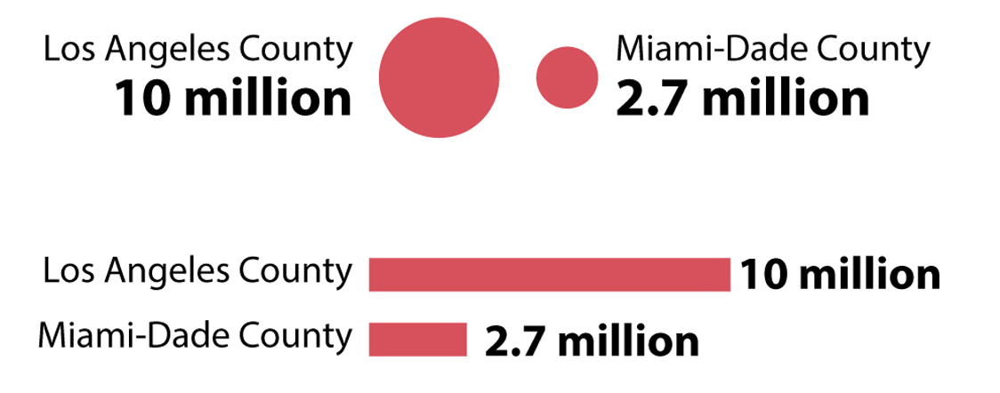

2. Truncated vertical axis
   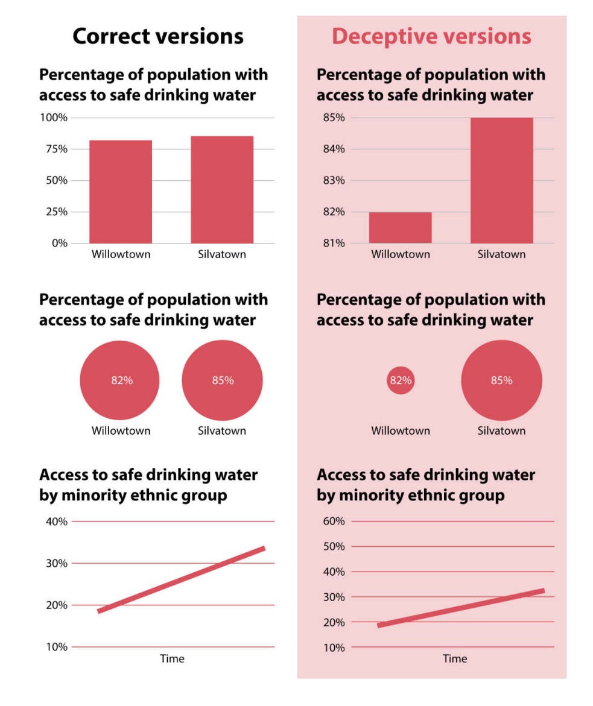

3. Aspect ratio

4. Write correct numbers but make visualizations deceptive

5. Mistakes:
  * A very common mistake designers make when picking bubbles to represent data is to vary not their area but rather their height or length—their diameter—as if they were bar charts.

4. Funny conventions:
  * Cone of uncertainty in weather: According to rates of successes and failures at predicting the path of tropical storms and hurricanes, we know that the cone isn’t designed to contain the central location 95% of the time---but just 67%!

5. Sins of omission
  * Not plotting the entire time series (missing years at start/end)
  * Not plotting intervening years (ala Bill Bishop/Big Sort)
  * Not plotting all categories (ala this abortion thing)
  * Solution: plot comprehensively if interpretation changes dramatically. show missing data with dashed lines or something.
  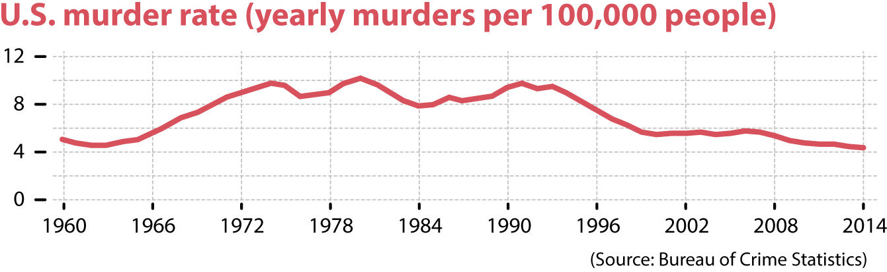
  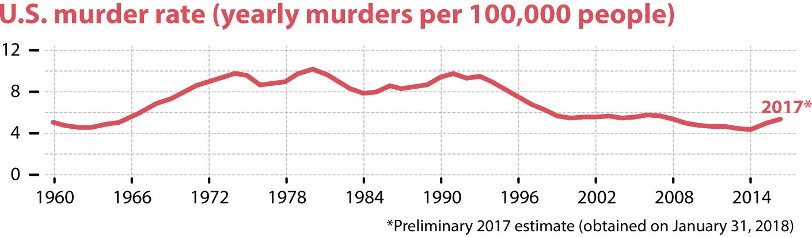
  
  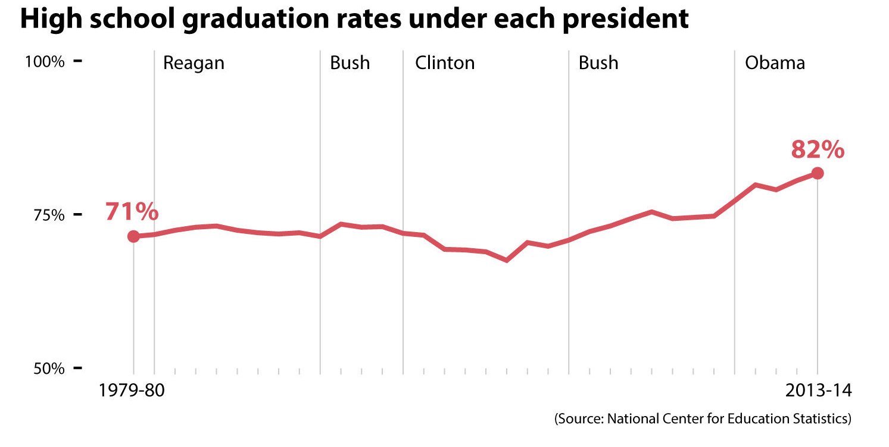

6. Playing with encoding:
  * visual encoding of color can be done in a way that top-end is truncated --- maps with colors. poverty rate top-end could be 54% or it could be 10%.
  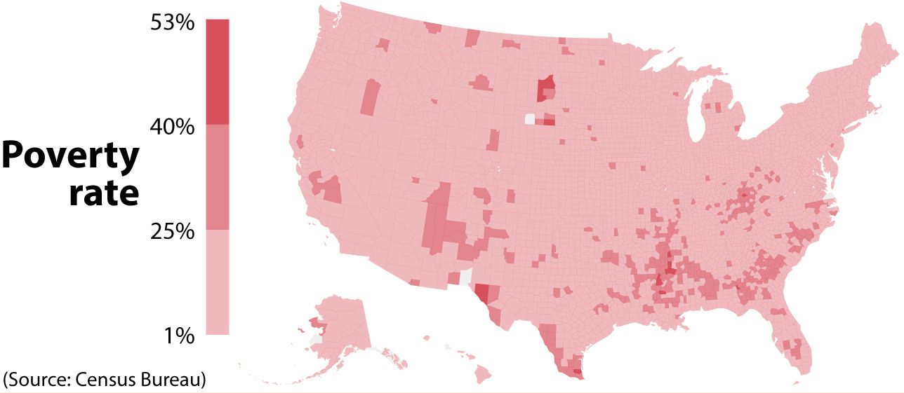
  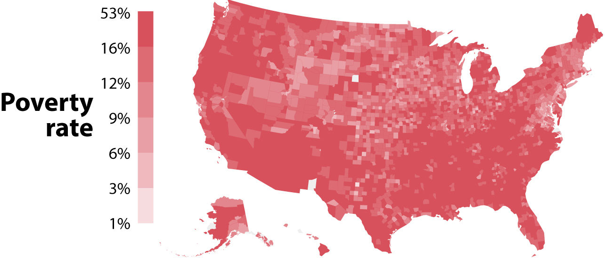
  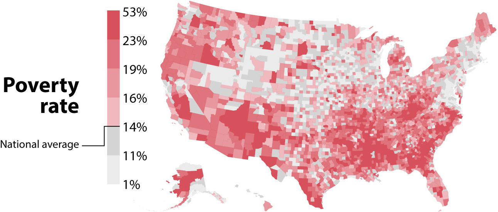

7. double y-axes with misleading scales

  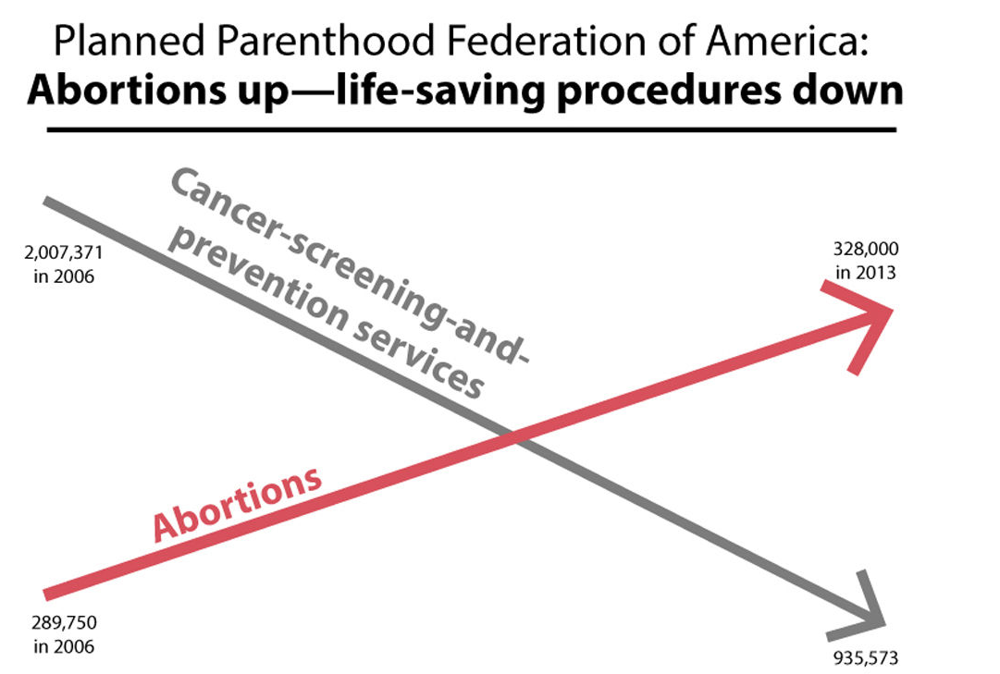
  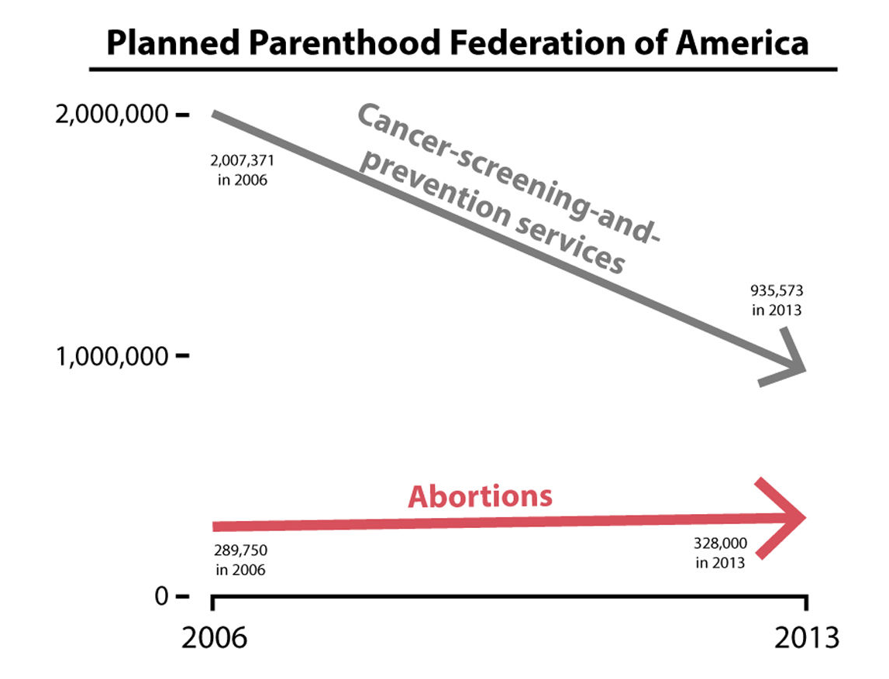
  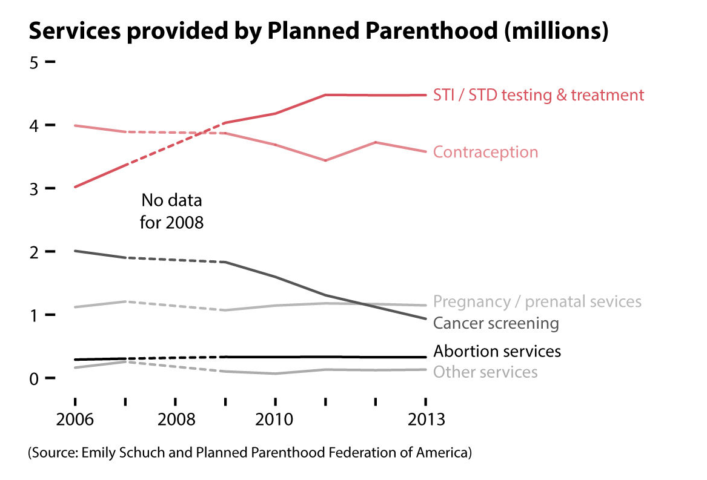

### Plausibly interesting point

* Not just look at % but also raw counts. So if people plot percentage of people who are poor decreasing, raw count can still be useful.

### Miscellanea

1. Around 50% of people who have never smoked or who stopped smoking several years ago were still alive by 80, but just a bit more than 25% of cigarette smokers survived to that point. According to several studies, **cigarette smoking shortens life by around seven years.**

2. Crimean War/Nightingale:
  * Around one out of five soldiers sent to the Crimean War died, a crushing majority of them because of diseases such as dysentery and typhoid fever, not because of wounds

  * Nightingale's arrival, then dropped following the winter of 1854–1855, although not as fast as the legend that surrounds her often suggests. The reason, according to recent historians, is that even if Nightingale improved cleanliness, she didn’t pay enough attention to ventilation or sanitation. She focused much more on the hygiene of individual patients than on the hygiene of their environment.

  * **physicians feared that their profession would be undermined if it was somehow shown that sanitation and ventilation were more important than medical care**

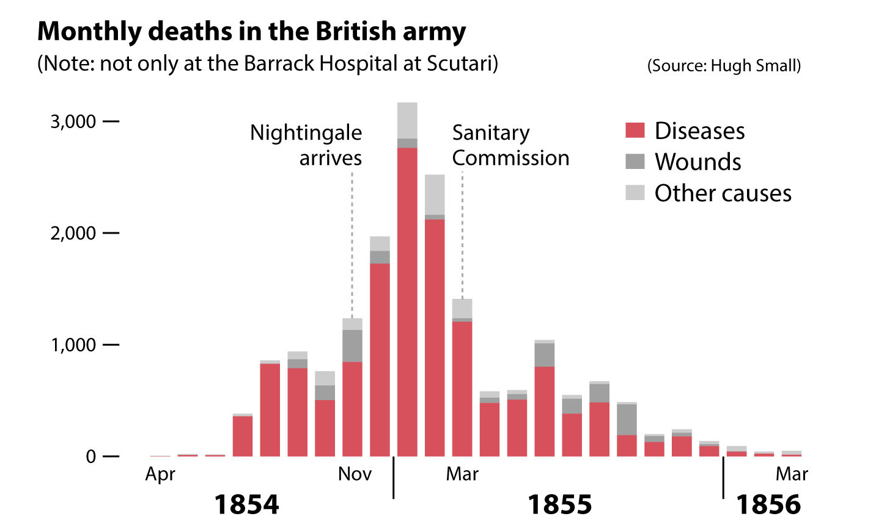
