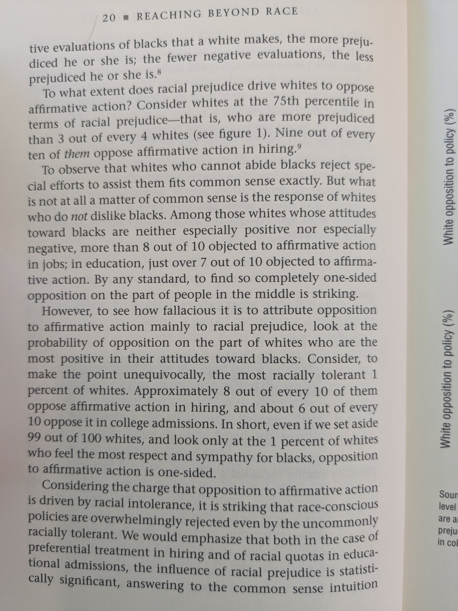
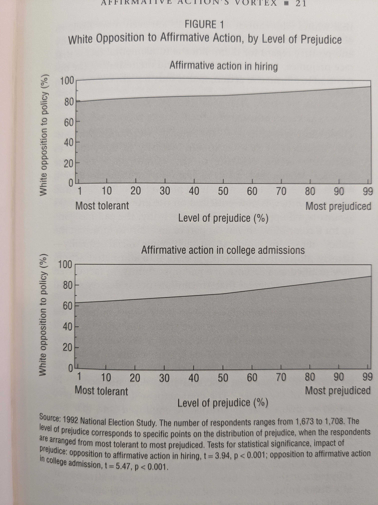
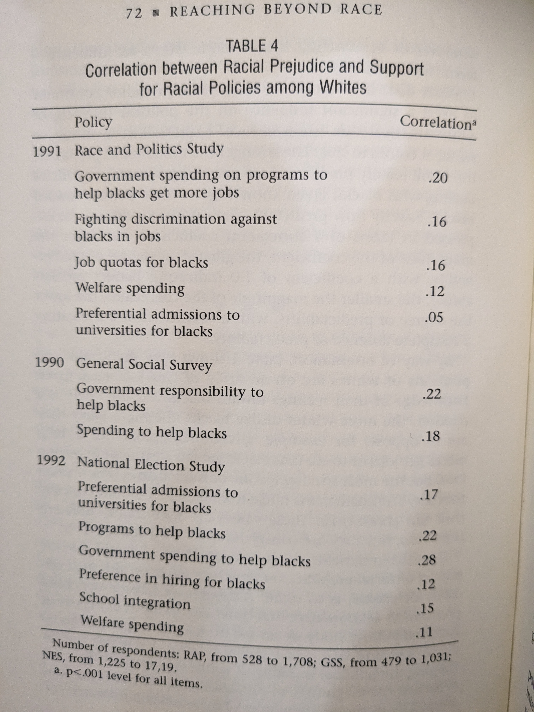
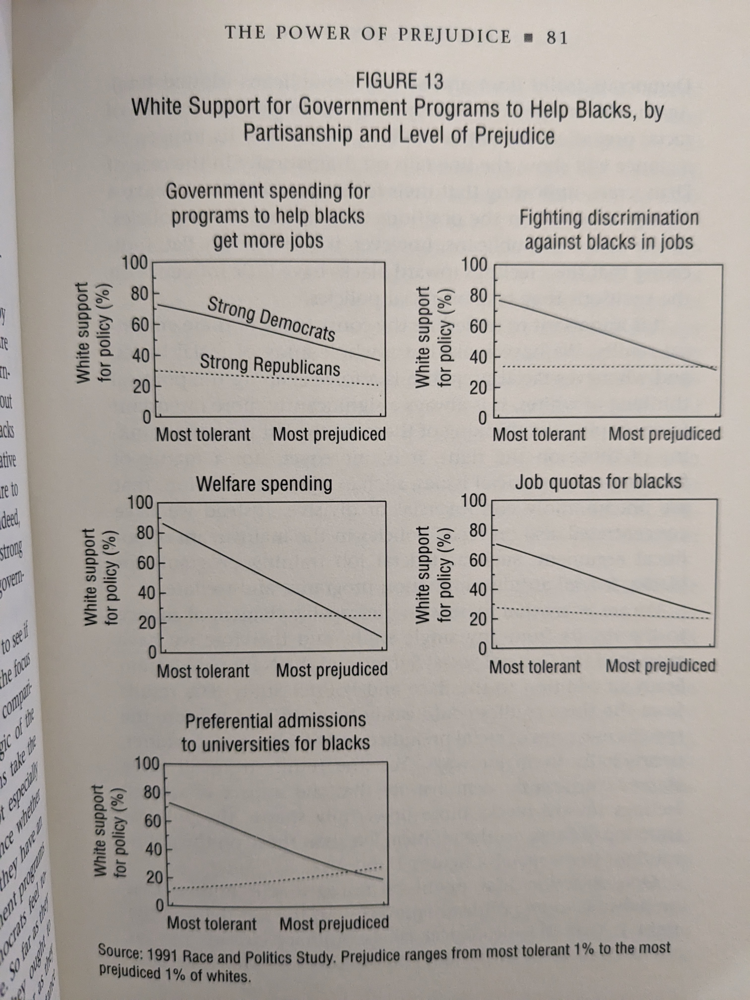
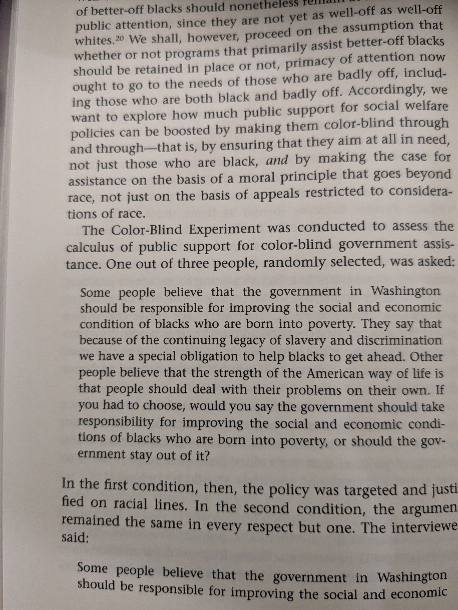
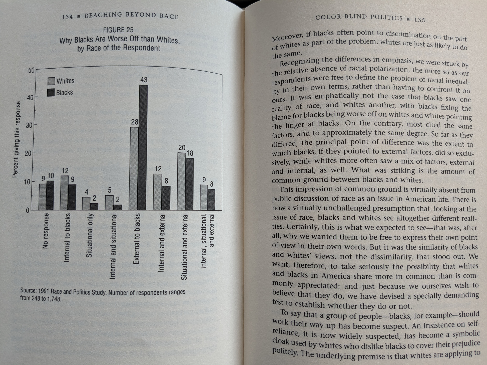
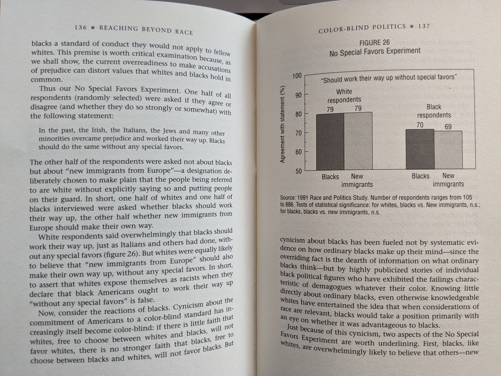

## Reaching Beyond Race

### Correlation Between Affirmative Action and Racial Prejudice
  
  
  

### Correlation Between Other Racial Policies for Advancement and Racial Prejudice

The correlation between prejudice and racial policies is also weak, e.g., support for programs to get blacks jobs (the average correlation is .16).

  

### Cor(Racial prejudice, support for policies) by Liberal/Conservative

  

### Support for Race Neutral Policies vs. Race Specific Policies

  
  

### Reasons Why AA Behind

  

### Support for Special Favors

  

see also: https://osf.io/preprints/socarxiv/qwusz/

"We investigate whether these attitudes predict anti-Black discrimination and evaluations of the fairness of intergroup inequality.Study 1 used the Ultimatum Game (UG) to obtain a behavioral measure of racial discrimination and found whites engaged in anti-Black discrimination. Explicit prejudice explained which whites discriminated whereas resentment did not. In Study 2, white third-party observers evaluated intergroup interactions in the UG and explicit prejudice explained racially biased fairness evaluations, but resentment did not"
