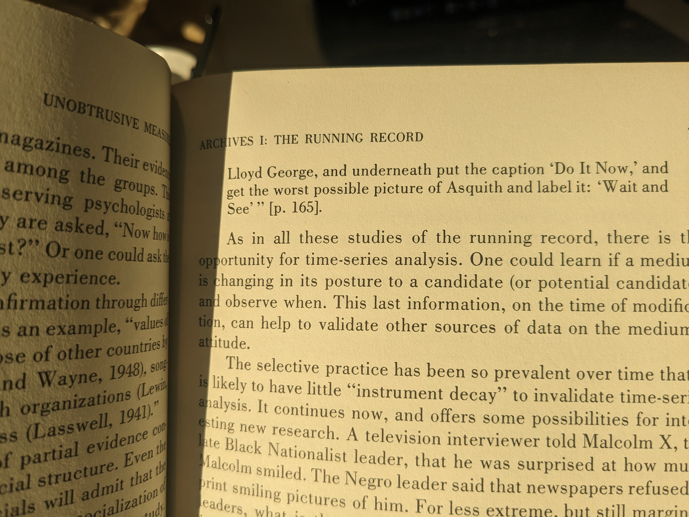

## Unobtrusive Measures

The benefits of obstrusive measures ~ replicability

Limitations of obtrusive measures like surveys: 

1. Guinea Pig Effect (Hawthorne Effect)

2. role selection, e.g., feeling compelled to offer a view because you think of yourself as an expert having been `scientifically selected'

3. Measurement causing change, e.g., merely asking a question about politics plausibly causes people to look up political content making over time measurements problematic

4. response bias, e.g., acquiescence bias, which across multiple items can induce correlations where none exist

5. interviewer effect

6. lack of effort

7. sampling bias, which may vary over time because of seasonal employment

8. can't study taboo topics

9. confounding factors, e.g., say we want to estimate proportion of conversation devoted to race but bad weather may dominate and any change in time devoted to race may be an artifact, etc.

Benefits of unobtrusive measures ~ can get a lot of data + see above

Problems of unobtrusive measures:

1. selective deposits to archives and selective survival---of unobtrusive methods. 

Webb et al. discuss a wide array of unobtrusive methods: 

1. Erosion and Accretion, e.g., Holmes concluding Watson had chosen the office wisely as the stairs on his side were more worn, wear of library books, etc. 

2. Defaults, e.g., radio dials to study the popularity of different radio stations, 

3. Trash analysis, 

4. Soft gluing pages together to estimate which pages are read, 

5. Tombstones

### Mosteller
  
  

### Webb Journalist Ideology

  

### Photos/Bias

  
  
