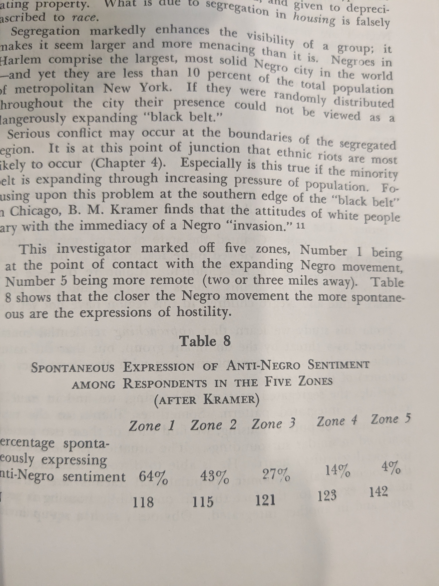

## Nature of Prejudice

### Theories of Prejudice (Dramatically Supplemented and Organized.)

* Authoritarian Personality (Adorno et al.)

* Minimal Group (Tajfel et al.)

* Exploitation Theory of Prejudice + Need for status
	* Narratives to justify power and exploitation, e.g., certain groups are stupider, unholy, etc. Classic examples are colonialism and slavery

	* Scapegoat theory —- why are we doing badly —- see this group —- Blacks, Muslims, Jews, etc. 

	* Why data is unchallenged?
		* Self-interest. Classic case is women. Plenty of opp. to learn they are smart. 

* Jealousy

* Realistic Group Conflict
	* Resources
	* Cultural/Socio-psychological
	* May be aided by zero-sum thinking

* Cross-cutting cleavages
	* Can be applied to ‘minimal’ and ‘realistic’ theories.

* Cognitive Theories
	* Unthinking Generational/Cultural Transmission/Conforming to norms
		* It can be founded in religion, e.g, the caste system
		* The genesis of the narrative may be in power but it can be self-replicating
		* We can connect to Millgram but already widely talked about in the context of WW 2

	* Principled Affect
		* The group believes in violence, subjugation of women, etc. I oppose it.
		* Group is seen as endorsing the views and actions of the ancestors. 
			* Plus resentment that people are not being contrite about their ancestor’s actions, e.g., slavery, demolition of temples, etc. Historic hostilities in Europe.

	* Misinformation and Disinformation
		* Mistakenly believe that the group believes in violence, subjugation of women, etc.
		* Mistakenly believe that economics is a zero-sum game, ala the Mariel Boatlift, etc.
		* Accessibility bias w.r.t. media, which may just have incentives to show sensationalist news which can lead people to be misinformed. Why airline safety record is probably doubted more than it should. 
		* Representativeness
	
	* Why data is unchallenged?
		* Conversation social circle …market of interlocutors is to not bring up conflicting information

	* Social learning (Bandura)
		* It is a theory of persuasion and not of prejudice. If it has to explain things like more liberal attitudes toward the LGBT, etc., it needs a theory of what is produced, why people can be ‘forcibly’ exposed to it, why they wouldn’t make a fuss when exposed and in fact change their attitudes, etc. Or is it the case that elites can get people to believe in anything.
		
		* Intra-person heterogeneity ~ humans are a bundle of contradictions so plenty of opportunity …
			* Gunnar Myrdal ~ moral uneasiness b/w American values and practice

	* Generational replacement — what’s the theory? Don’t transmit well?

--------

### Definition of Prejudice

~ 'unjustified' affect/beliefs.

  

### Prejudice Against Women Among Intellectuals in the 18th and 19th Century

  
  

### Prejudice Against Women Among Intellectuals in the 18th and 19th Century

  
  

### Prejudice Toward Various Racial Groups is Strongly Correlated

  

### Correlates of Prejudice

#### Social Mobility

  
  

#### Parental Education**

  

#### Values
  

### Contact

#### Army
  

#### Competition
  
  

#### Occupation and Status
  

