## Politics and Economics in the Eighties

A unique book in many ways with essays by political scientists and commentaries by economists. The TL;DR is that conventional wisdom about Reaganomics is wrong---under Reagan the welfare spending didn't decline much, tax rates flip flopped, deficits increased by 3x, 

### Wise and Moderate Voters By Fiorina

  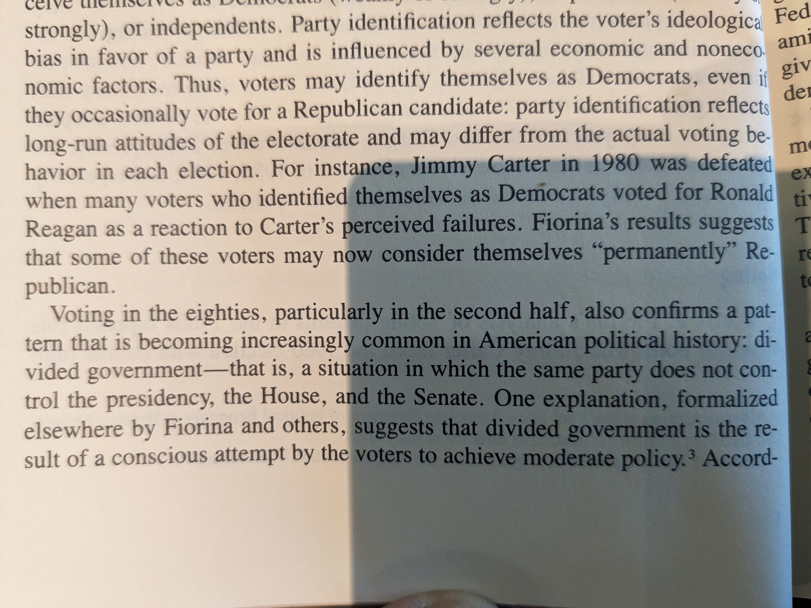
  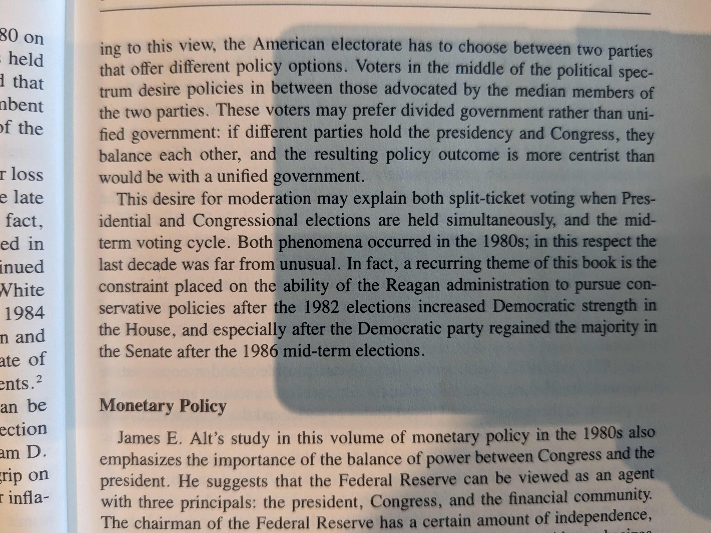

### Forecast Error + Relationship b/w Money Supply and Inflation (Jim Alt and Commentary by Ben Friedman)

  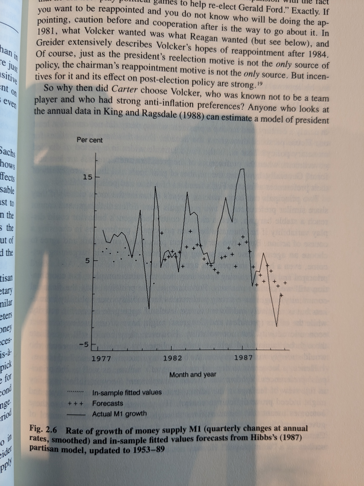
  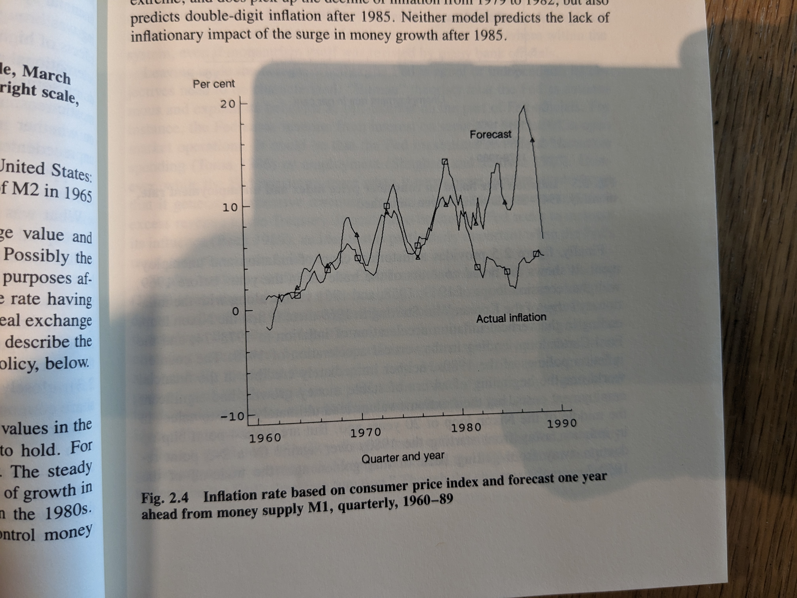
  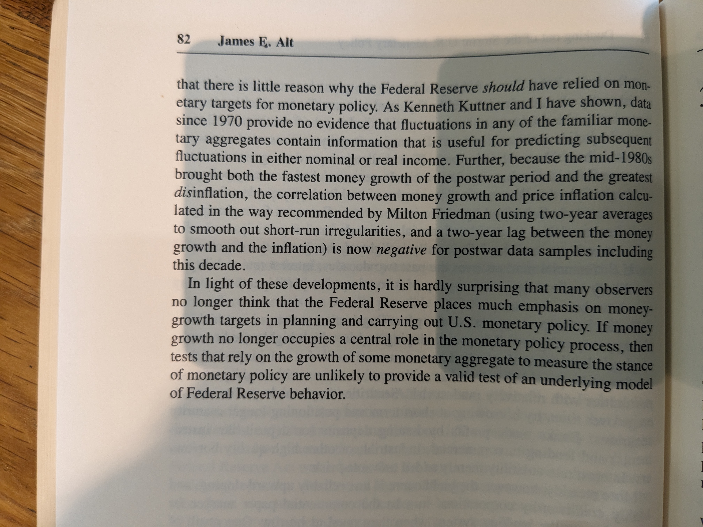

### No Holds-Barro (McCubbins)
	
  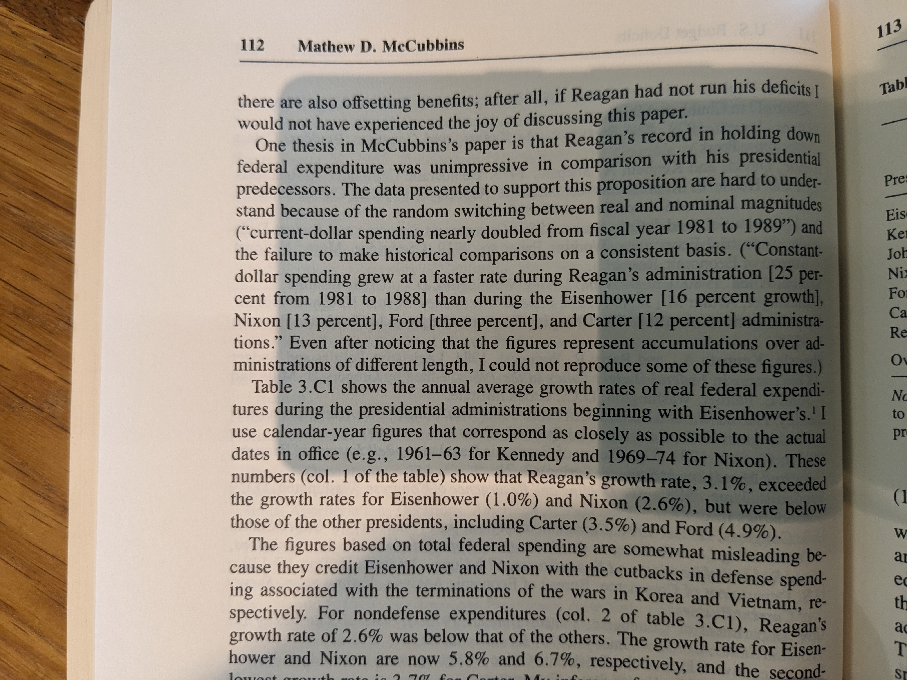
  
  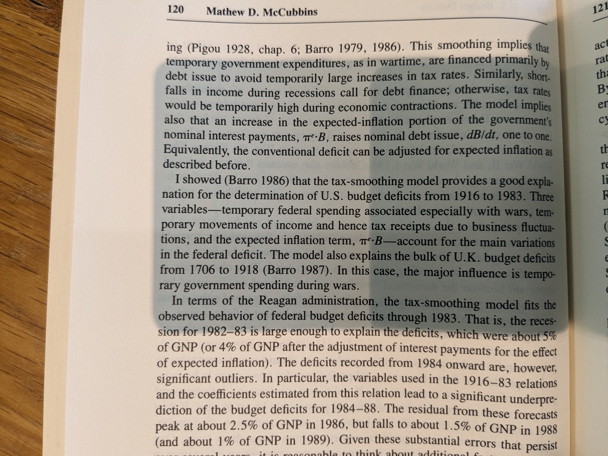
  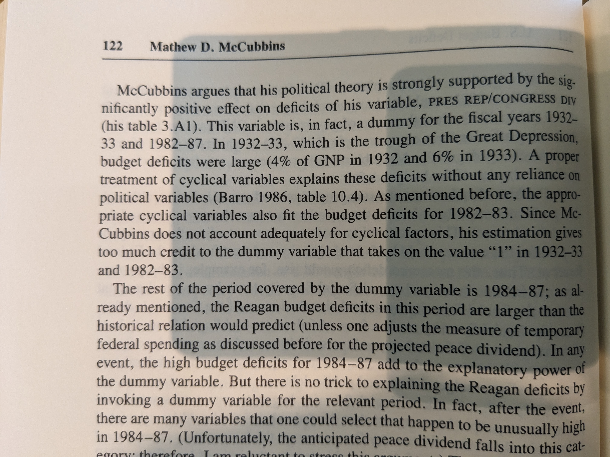

 
  As the editors point out, the debt/GNP almost doubled over the decade w/o major wars. So there is a puzzle here.

### Reaganomics

#### Welfare Spending (Ferejohn)

  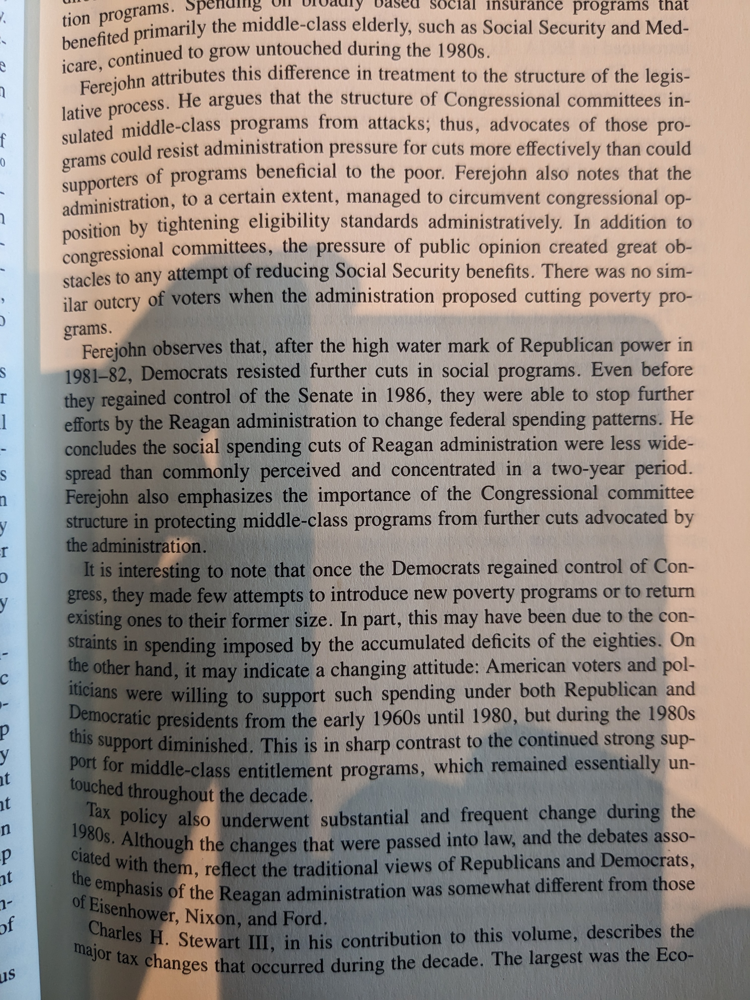
  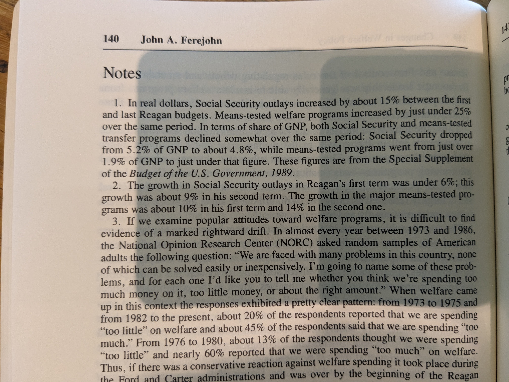

#### Tax Policy

  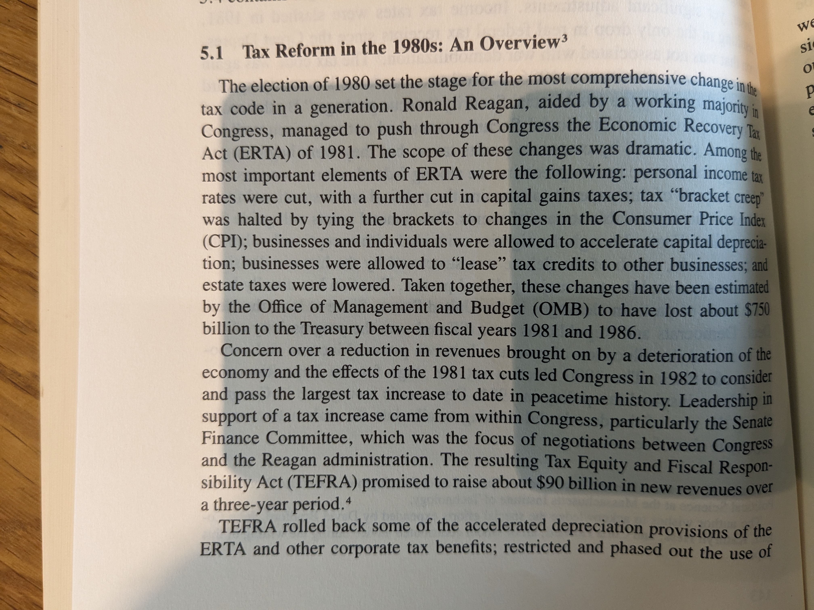
  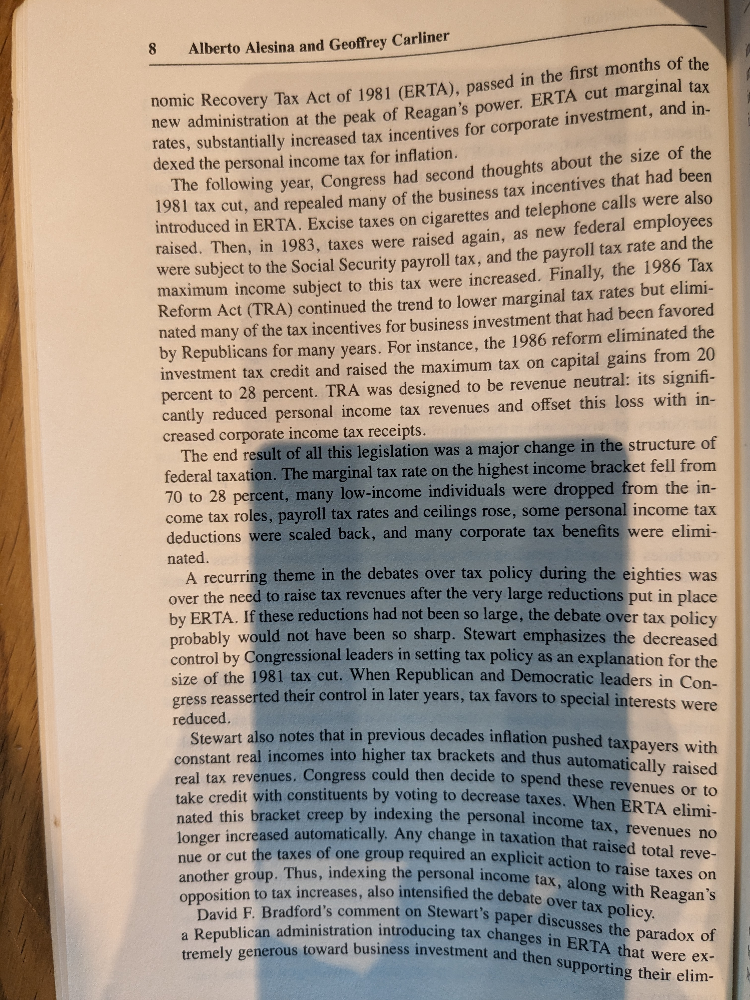

