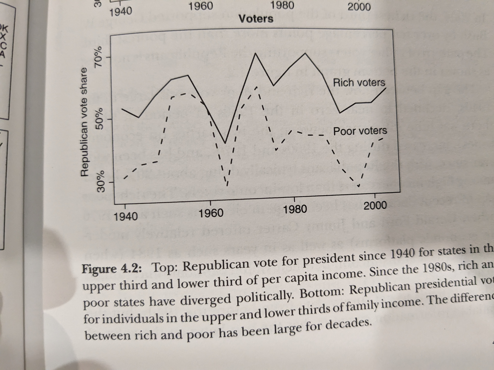
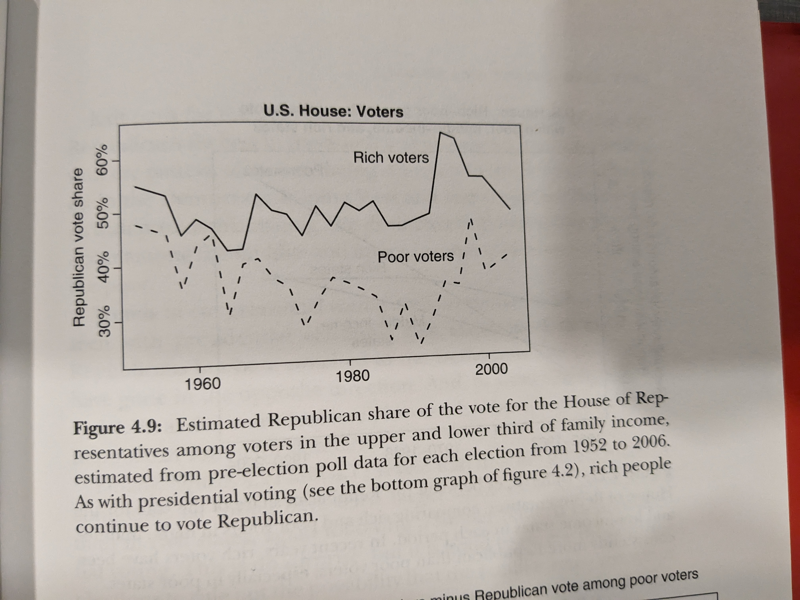
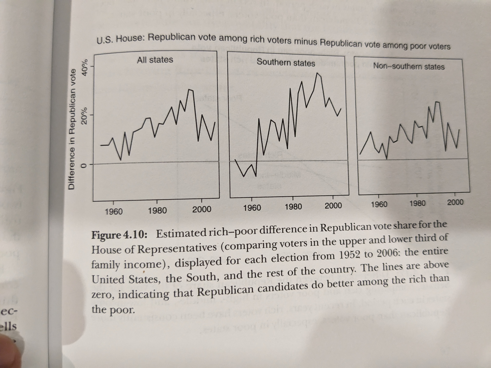
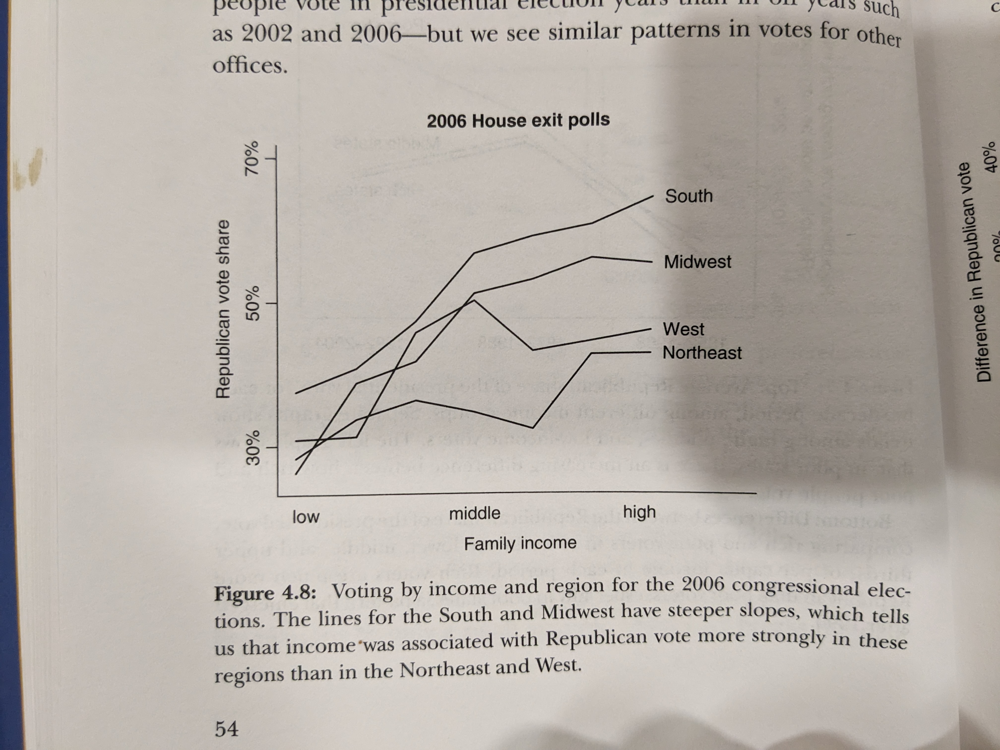
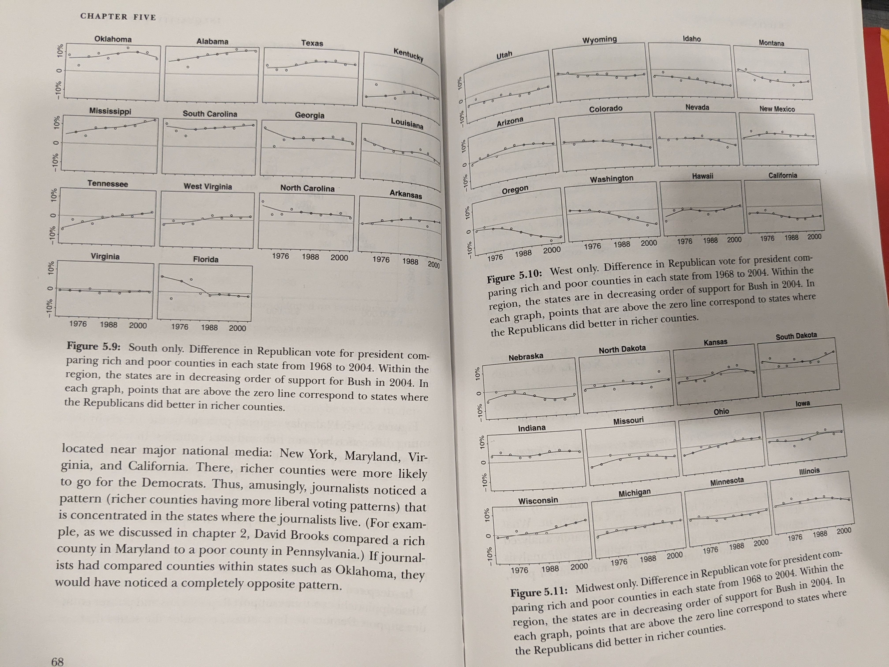
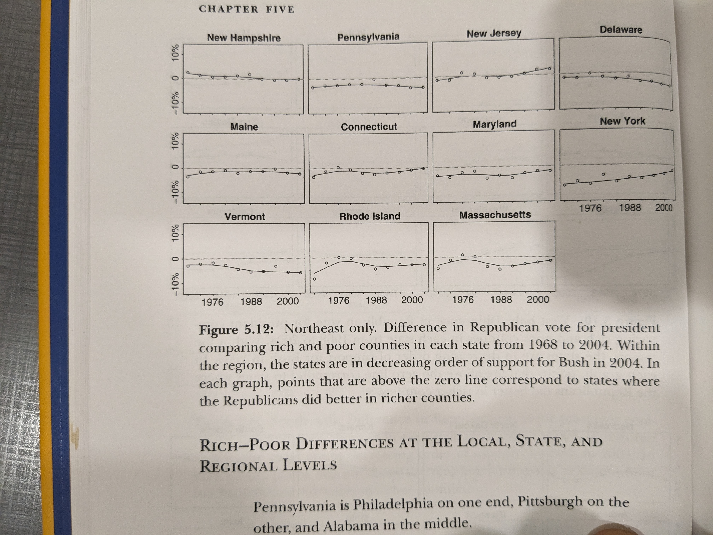

## Red State Blue State

"Paradoxes"

1. Rich states vote Democratic but rich people vote Republican.
2. Richer counties in rich states vote Democratic (also causes <a href = "../src/red_state_blue_state/rich_rich_availability_bias.jpg">the second order availability bias</a> --- a claim about absolute levels not trends.) but the rich vote Republican.

Key Claims

1. Rich people in rich states have increasingly become socially liberal and they are voting against their class interests.  (Would have been nice to see how the rich in blue states have become more socially liberal. Could be some version of #2 where socially liberal rich people vote Dem. as R becomes more socially conservative.)
  (GS: Rich people in rich states are also becoming economically liberal. see also: https://twitter.com/wpmarble/status/1703798638693212364  
2. Parties have moved such that there is greater cor(social, economic) within the party. Poor in poor states (more socially conservative to begin with) plausibly vote more R because of that.

### Rich Vote More R

At an individual level, the richer people are likelier to vote R. Though see <a href = "https://github.com/soodoku/anes_inc_pid_cor">2020 (and there seems to be a downward trajectory in the cor among NH Whites)</a>. GS: There is a dramatic ecological shift (among NH Whites) toward R in the South but also in places like UT. **Majorities of poor people vote R in a bunch of states.** 

  
  
  
  

### Rich/Poor County-Level Polarization 

OR, WA, and ID show strong over-time patterns of rich counties becoming increasingly D (or poorer counties becoming increasingly R) or both. KY, AK, AL, MS, TN (AL and WI less so) show strong over-time patterns of R-D diff. becoming larger. See NY also.

  
  

### Party By Income Across States (+ Something Was The Matter W/ Kansas in 2004)

  

### Cor. Econ. and Social Ideology and Income by State 

TL;DR = low corr. and +ve cor. b/w social ideology (more conservative is higher) and income in some of the red states. GS: I expect cor. to become negative everywhere.

  

### Income and Rep. Vote Gradient is Smaller in the Blue States Than in the Red States

  

### Rich People in Rich States More Dem. Over Time 

  

### Normal Vote by Ideology

GS: since re-election rates are correlated with ideology (safe districts elect ideologues), the people who will end up with seniority-based committee positions would be more extreme also.

  

### Benefits of Moderation

  
  

c.f. with "When an extremist—as measured by primary-election campaign receipt patterns—wins a “coin-flip” election over a more moderate candidate, the party’s general-election vote share decreases on average by approximately 9–13 percentage points, and the probability that the party wins the seat decreases by 35–54 percentage points."

though remember what's being compared = "In primary races with two major candidates, the race is tentatively identified as being between an extremist and a relatively moderate candidate if the difference between their estimated ideological positions is at or above the median in the distribution of ideological distances between the top two candidates in all contested primary elections.  This median distance translates to roughly one-third the distance on the DWNOMINATE scale between the medians of the two parties in the 112th Congress, and it is approximately two to three times as large as the average distance between representatives and their own party’s median."

https://www.andrewbenjaminhall.com/Hall_APSR.pdf

### Economic Voting to Partisan Retrospection

  
  

### Split Ticket

  
  

### Partisan Gap in Support for Wars

  
  
  
