## Red State Blue State

### Cor. Econ. and Social Ideology and Income by State 

TL;DR = low corr. and +ve cor. b/w social ideology (more conservative is higher) and income in red states

  

### Income and Rep. Vote by Red/Blue

  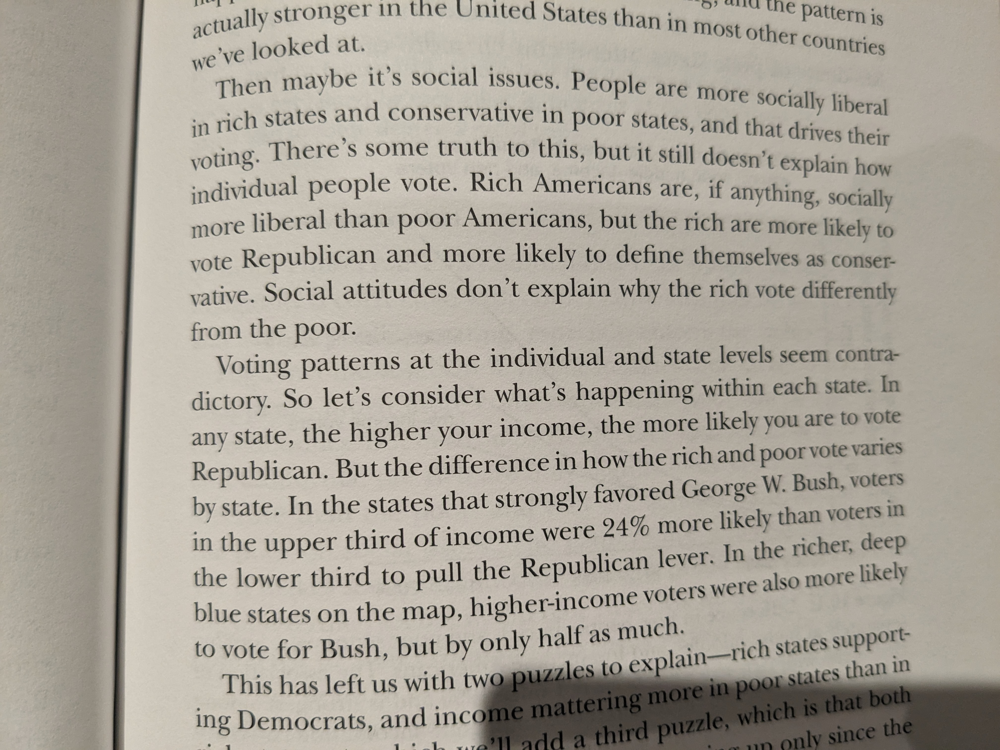

### Cor. County Income And Rep. Vote in Maryland/Texas

  

### Church Attendance Trends By State Income

  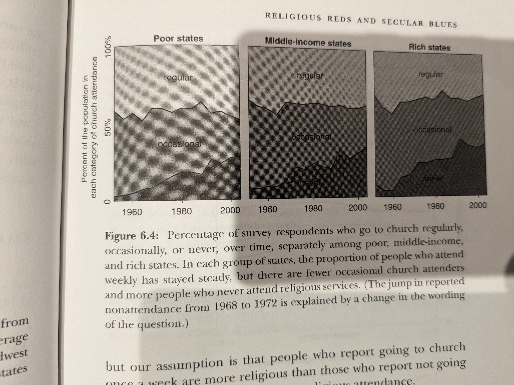

### Benefits of Moderation

  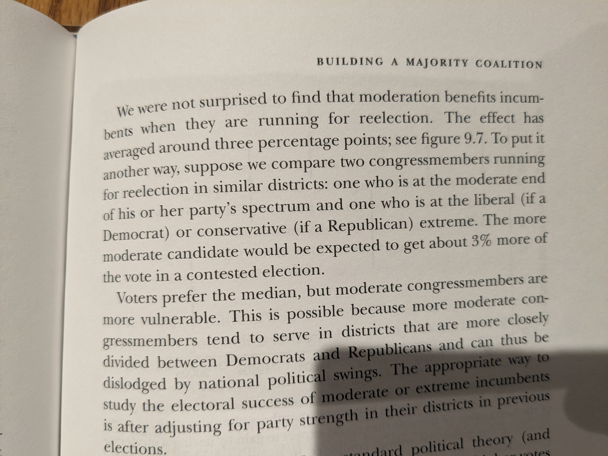
  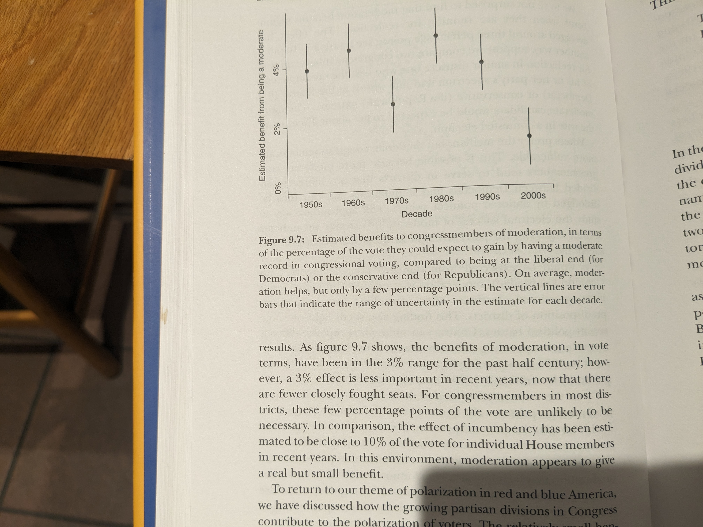

c.f. with "When an extremist—as measured by primary-election campaign receipt patterns—wins a “coin-flip” election over a more moderate candidate, the party’s general-election vote share decreases on average by approximately 9–13 percentage points, and the probability that the party wins the seat decreases by 35–54 percentage points."

though remember that what's being compared = 

"In primary races with two major candidates, the race is tentatively identified as being between an extremist
and a relatively moderate candidate if the difference between their estimated ideological positions is at or
above the median in the distribution of ideological distances between the top two candidates in all contested primary elections.  This median distance translates to roughly one-third the distance on the DWNOMINATE scale between the medians of the two parties in the 112th Congress, and it is approximately
two to three times as large as the average distance between representatives and their own party’s median."

https://www.andrewbenjaminhall.com/Hall_APSR.pdf

### Second Order Availability Bias

  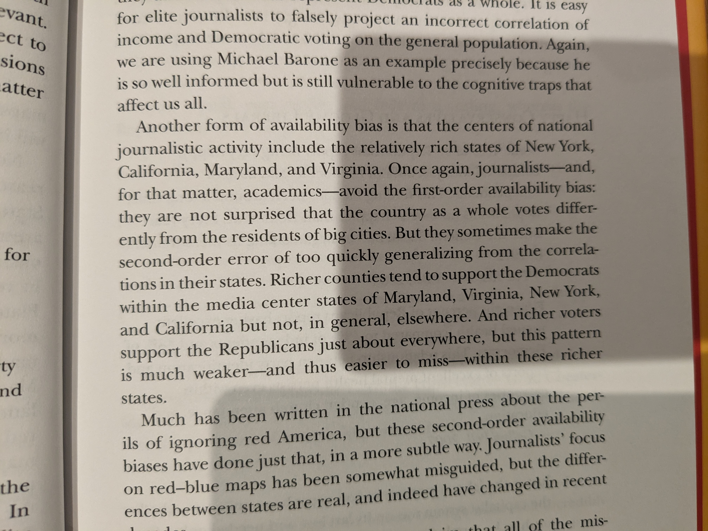

### Economic Voting to Partisan Retrospection

  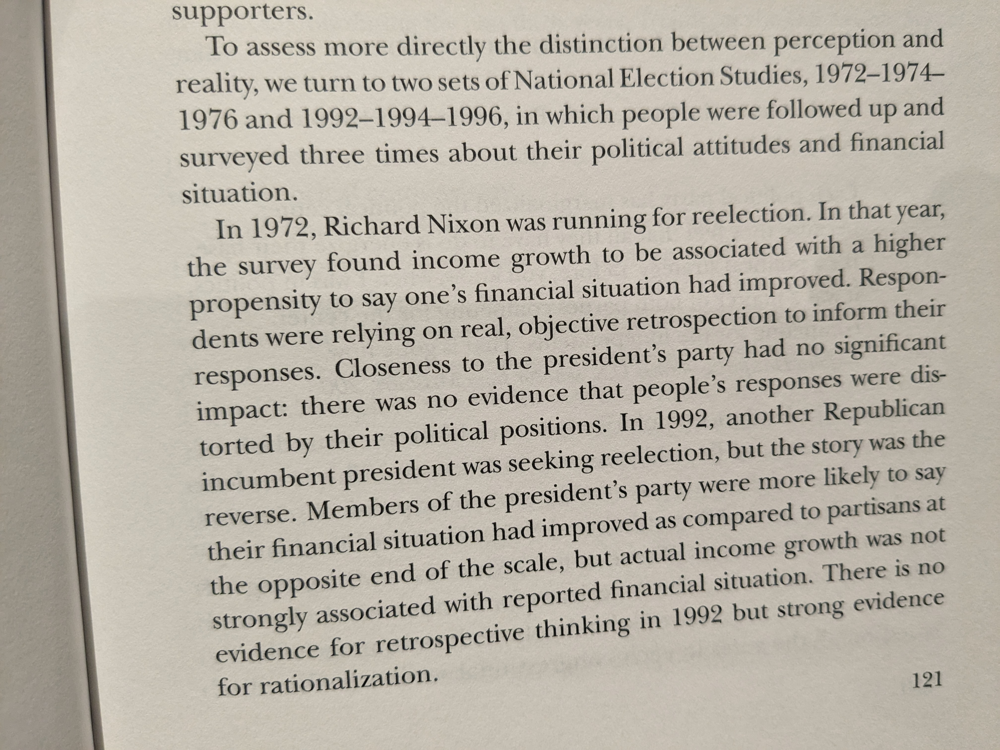
  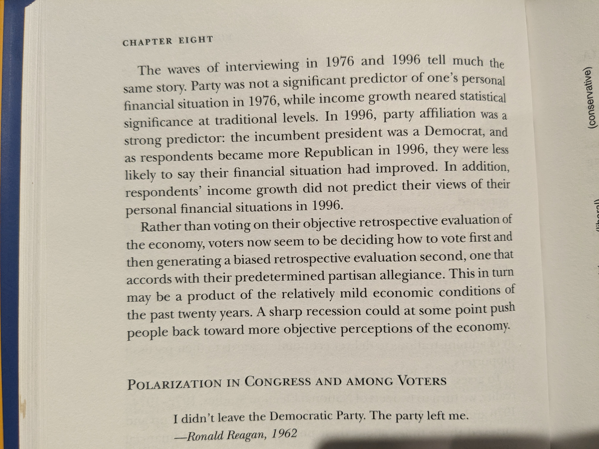

### Split Ticket

  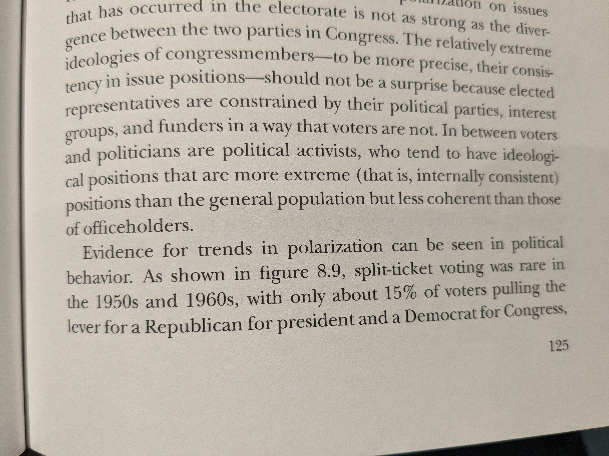
  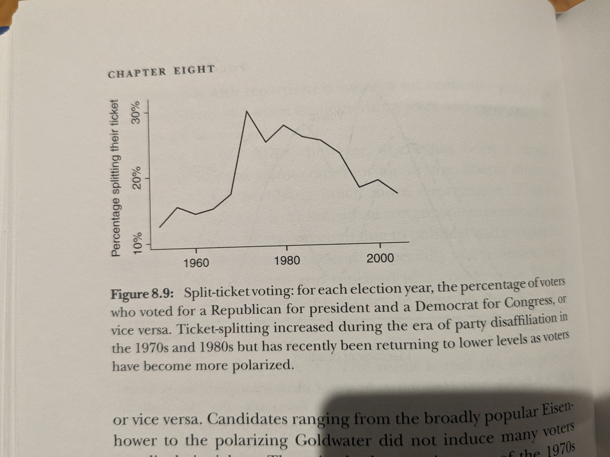

### Partisan Gap in Support for Wars

  
  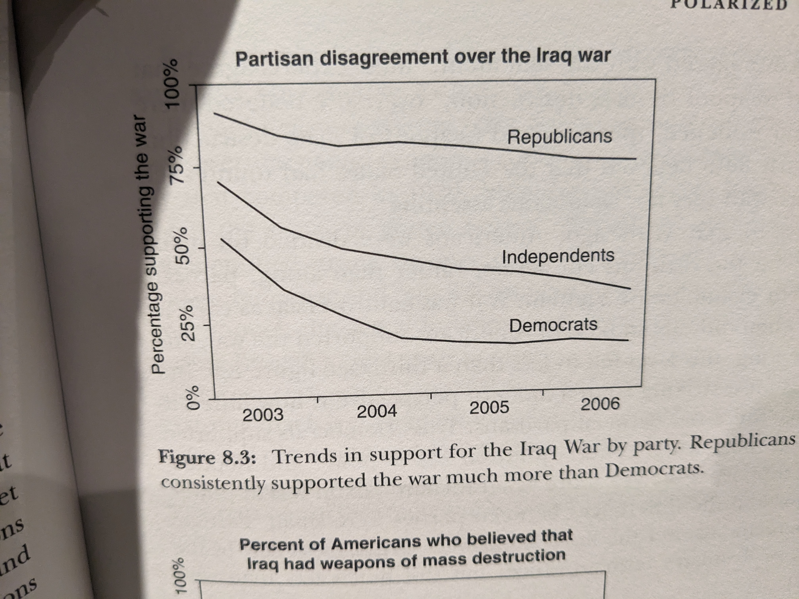
  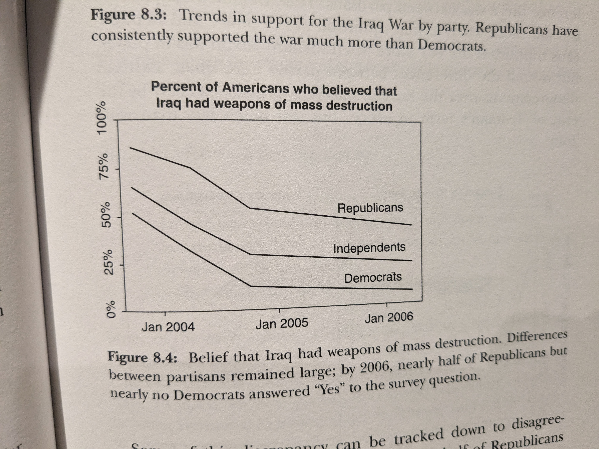

