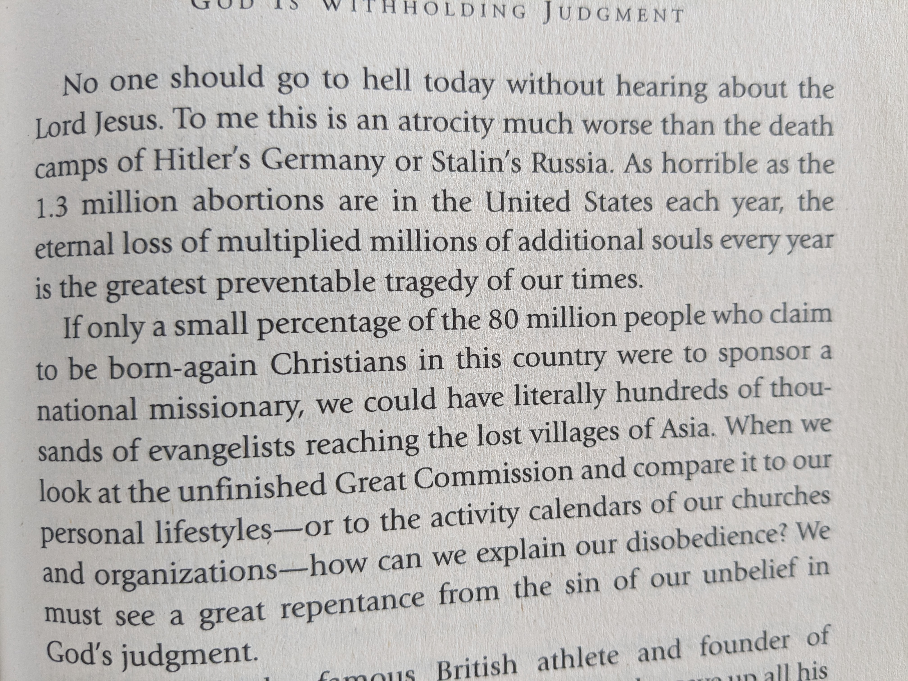
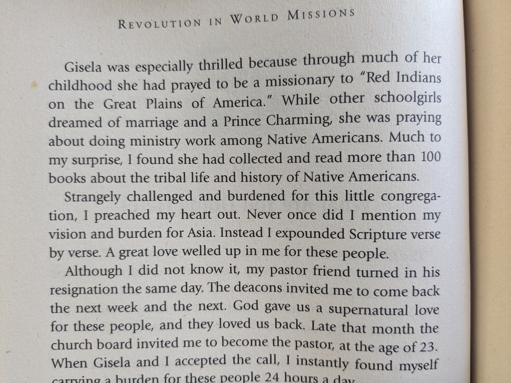
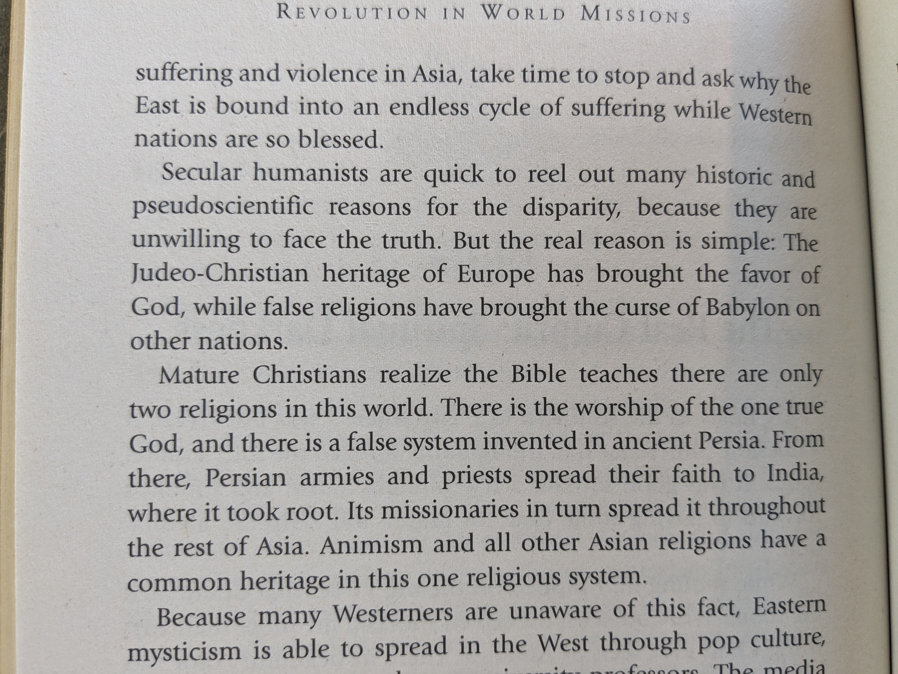

## Revolution in World Missions

TL;DR: 

1. The West should do more to evangelize in Asia. 
2. The primary purpose of the church is not social work but evangelism --- see pg. 107, 170 (Church's primary task), etc.
3. How to evangelize:   
   *  Let go of the idea of solely supporting White missionaries. Within country (South India to North, etc.) more effective
   * Evangelize in a way that is 'native' (see pg. 147)

### Worse That The Holocaust

  
  
### Childhood Dreams

Gisela is from Germany ...

  

### Why The West is Rich And The East Poor

  
