## Is Anyone Responsible

### Research Method

### Content Analysis Details

Vanderbilt Television News Archive. Abstracts of all news stories aired by ABC, NBC, and CBS betweeen 1981 and 1986. Keyword search.

### Sample

* People from Suffolk county.

#### Realistic Lab-in-the-field

* Treatment stories were compiled using studio-quality editing equipment (with three-quarter-inch videotapes) so that participants could not detect the alterations to the news reports.

* Moreover, the manipulations were realistic in that the stories used were actual stories that had previously been broadcast by ABC, CBS, or NBC. 

* The use of open-ended questions to probe attributions of responsibility made it relatively difficult for participants to infer what the researcher was looking for.

* The aura of the research laboratory was reduced (and the economic incentives to participate were raised) by encouraging prospective participants to come in pairs with a spouse, friend, or colleague. The average session size of two meant that, typically, participants watched the videotape in the presence of a companion. In addition, participants could sip coffee or browse through newspapers and magazines.

#### In(credible) Inf. w/ Exp.

A trifecta of issues makes experimental inference a bit suspect:

1. Small Data (n of 10--20 per condition is common)

2. Multiple comparisons (w/o any FDR adjustments)

3. Treatments that likely vary on more than 1 dimension, e.g., in a study on effects of episodic vs. thematic framing, the video for episodic frames is on beirut hostage release, videos for thematic frames are on US foreign policy (Israel is an ally and Lebanese demand for releasing Lebanese prisoners) and Local turmoil (turmoil in lebanese politics) (page 32-33). (**The author acknowledges the point up front.**)

* One reason for small n per condition and multiple comparison was the sheer number of conditions. For Povery Exp. 2, there are 13 exp. conditions.

### Framework

* The episodic news sentation) as either frame takes the form of a case study or vent-oriented report and depicts public issues in terms of concrete instances (for example, the plight of a homeless person or a teenage drug user, the bombing of an airliner, or an attempted murder). The thematic frame, by contrast, places public issues in some more general or abstract context and takes the form of a "takeout," or "backgrounder," report directed at general outcomes or conditions. Examples of thematic coverage include reports on changes in government welfare expenditures, congressional debates over the funding of employment training pro-grams, the social or political grievances of groups undertaking terrorist activity, and the backlog in the criminal justice process.

* Following research by Brickman and his associates, these combinations were labelled as follows:

  1. Societal model: societal conditions cause the problem; societal efforts are the treatment.

  2. Individual model: individuals are responsible for both cause and treatment.

  3. Guardianship model: individuals are causally responsible; society is responsible for treatment.

  4. Compensatory model: to compensate for handicaps imposed by society, individuals must extend increased effort.

### Thematic Vs. Episodic of Crime Vs. Terrorism

#### News

  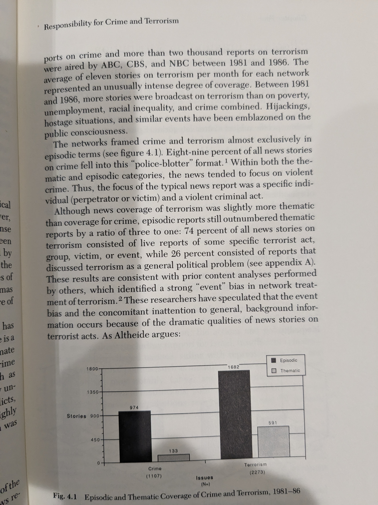

#### Responsible

  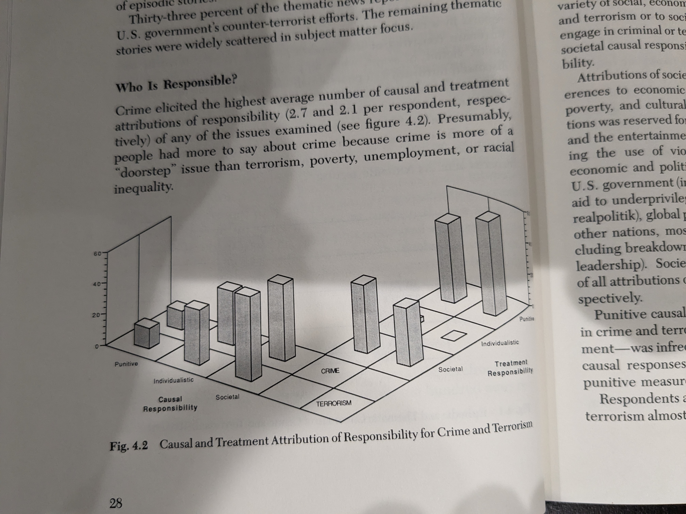

### Exp.

The claim (with some support from data) = thematic framing causes people to attribute problems to societal causes and leads them to move away from punitive model (penalize the individual) of how to fix the issue. Variance: (thematic/episodic) framing matters more for terrorism than crime. 

  
  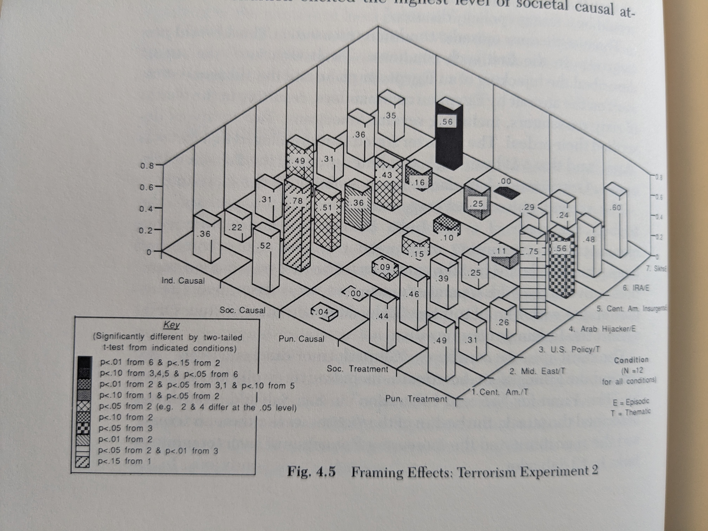

### Poverty, Unemployment, and Racial Inequality

* Key Points

  * Unemployment and racial inequality coverage is primarily thematic.
  
  * Most people think the government is responsible for solving all three---unemployment, poverty, and racial inequality. Most people think racial inequality is caused by government. Unemployment seen by most as caused of general economic conditions (plausibly contextual given 1980s. Attribution may be diff. during good times.)
  
  * GS: With poverty, unemployment, etc., I expect episodic coverage to be of sympathetic individuals. (This itself is a kind of a bias perhaps.) And the general hypothesis is that news people resort to these portrayals to elicit greater support for government intervention. It is like the hungry kid in donation for African videos and the idea that sympathetic one is more persuasive than statistical many. Anyhow, it appears support for government intervention is unresponsive to framing with most people in all conditions supporting gov. intervention (poverty exp. 1 and 2). Whatever effects we see on who people think is responsible seem mostly around the homelessness (which features 2 black teenagers and it may be a case of unsympathetic portrayal or race) (Poverty Experiment 1). 

  * Unemployment unaffected by framing. 2 exp. No diff. by race.

#### News

  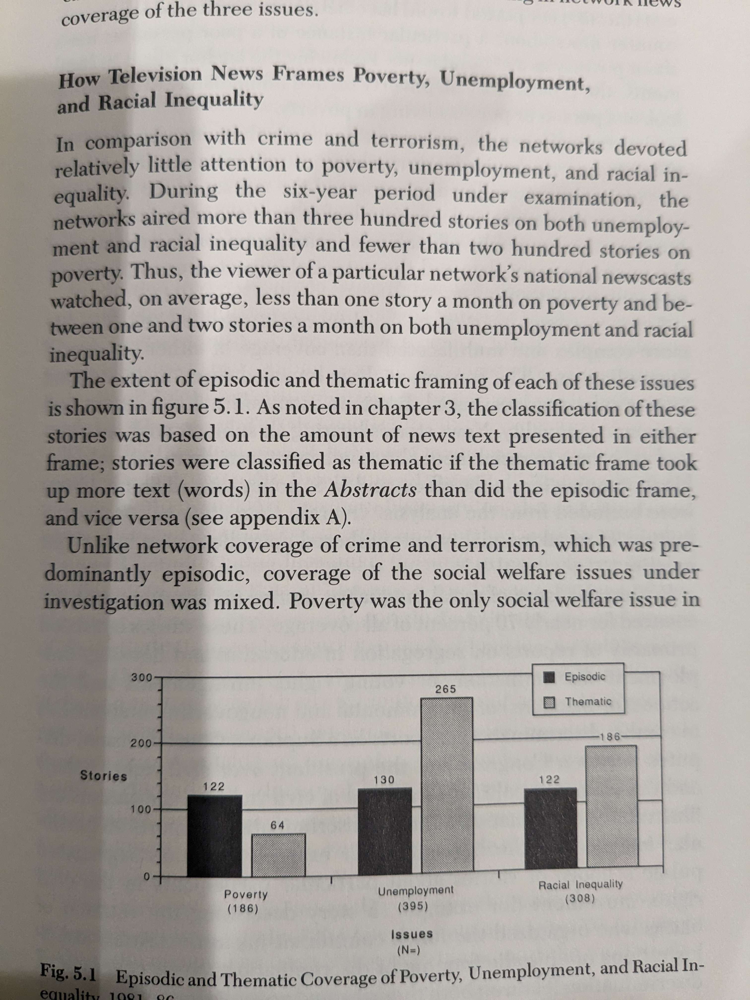

#### Responsible

  
  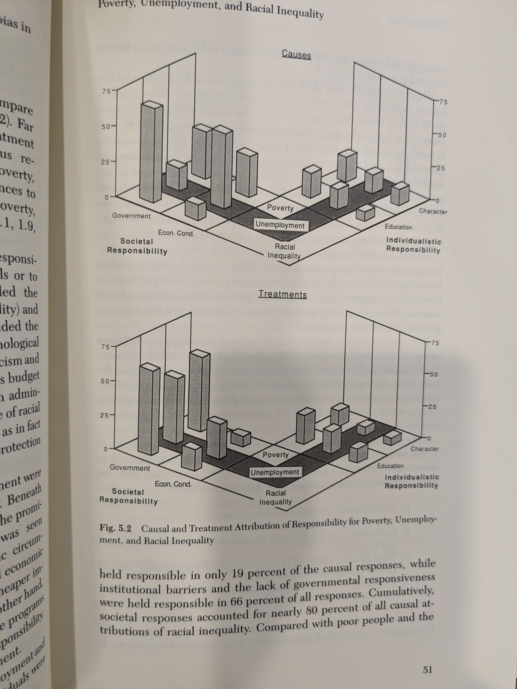

#### Exp.

**Poverty**

  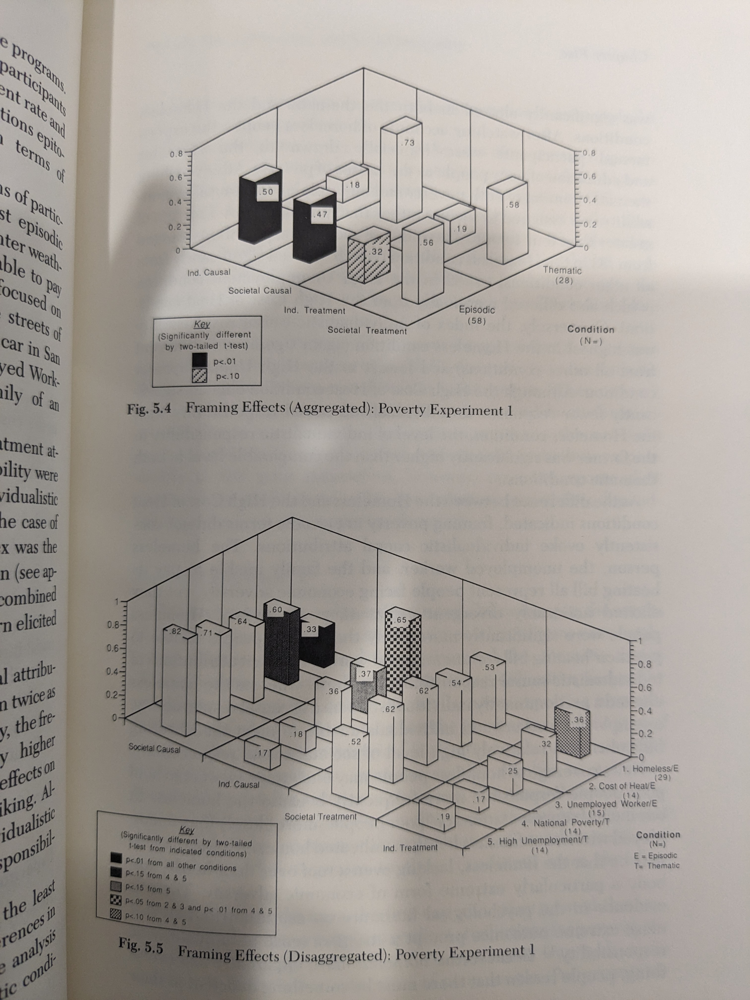
  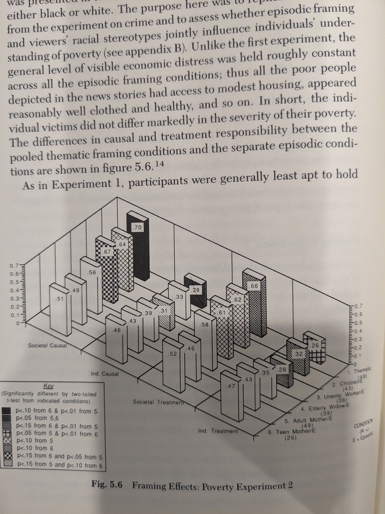

**Unemployment**

  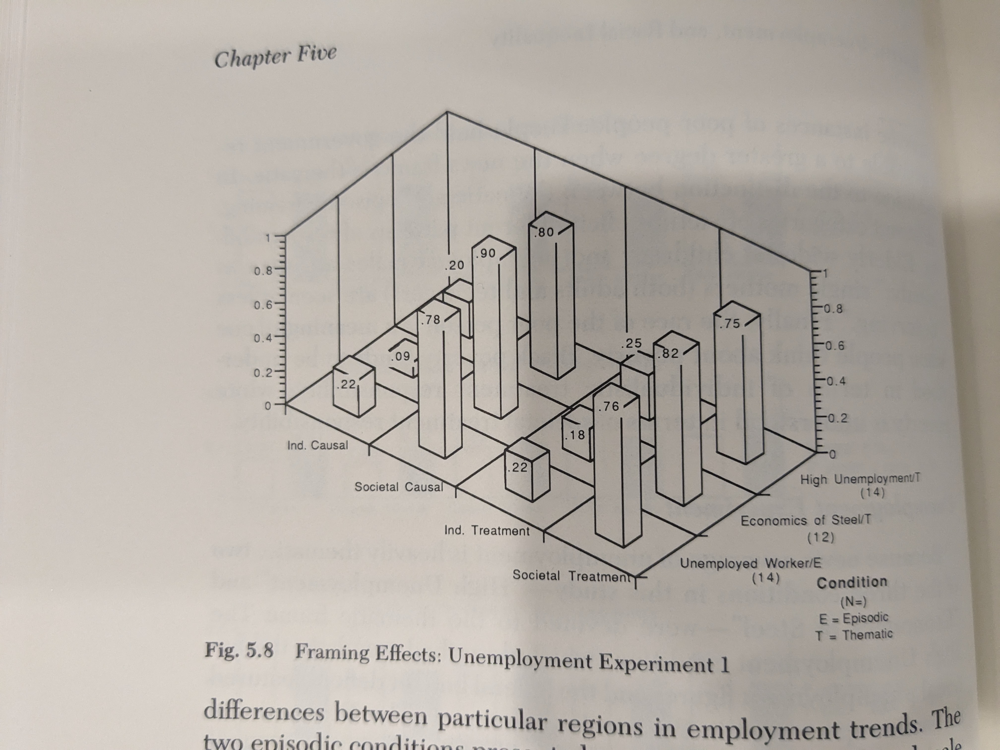
  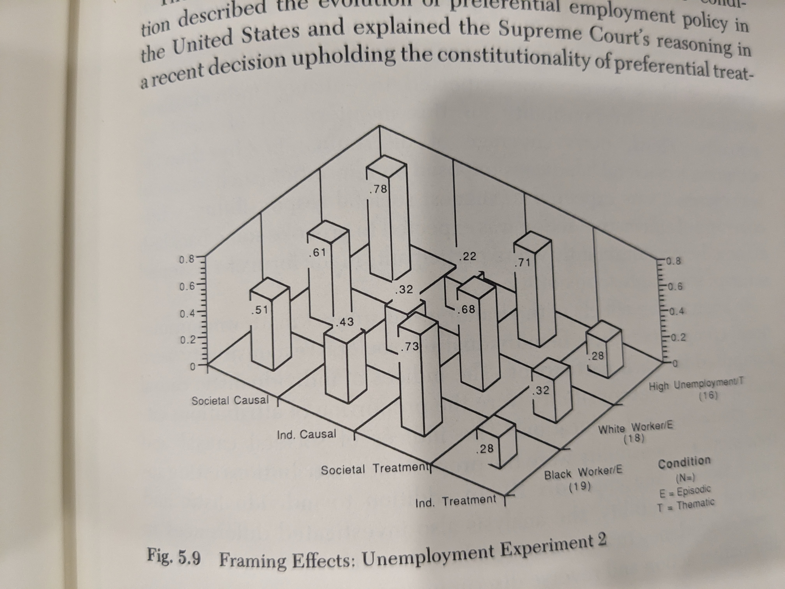

**Racial Inequality**

  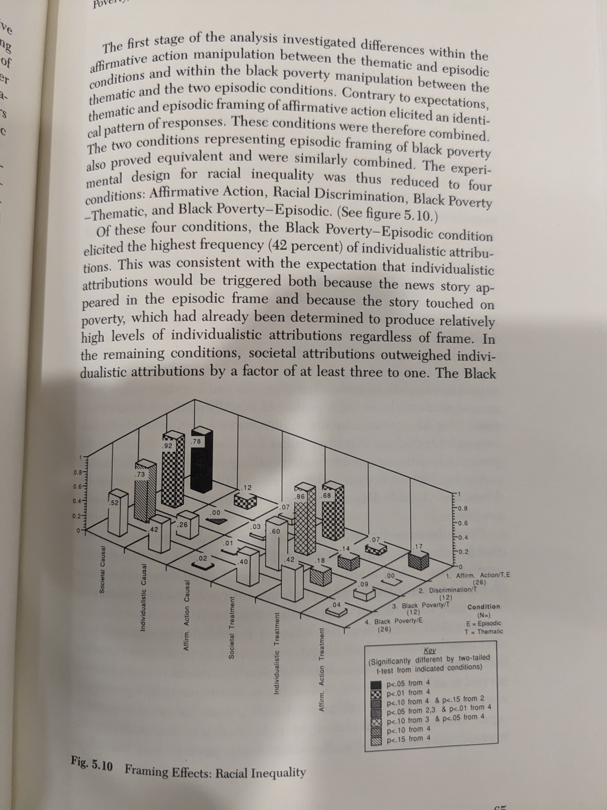

### Iran Contra

#### News

  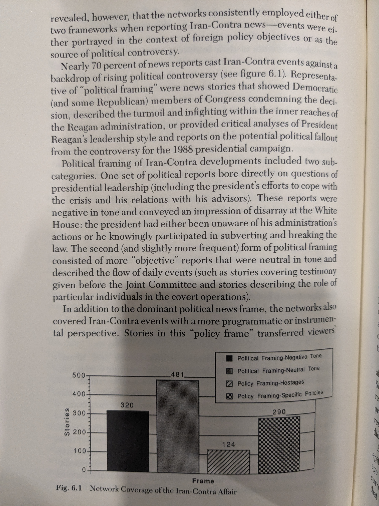

c.f. with quote earlier in the book: "Altheide has observed that television news coverage of the Iran hostage crisis as reduced to one story—the freeing of the hostages-rather than coverage of its background and context, of the complexities of Iran, of alternative American policies, and of contemporary parochial politics in a world dominated by superpowers."

#### Partisan Bias
  
  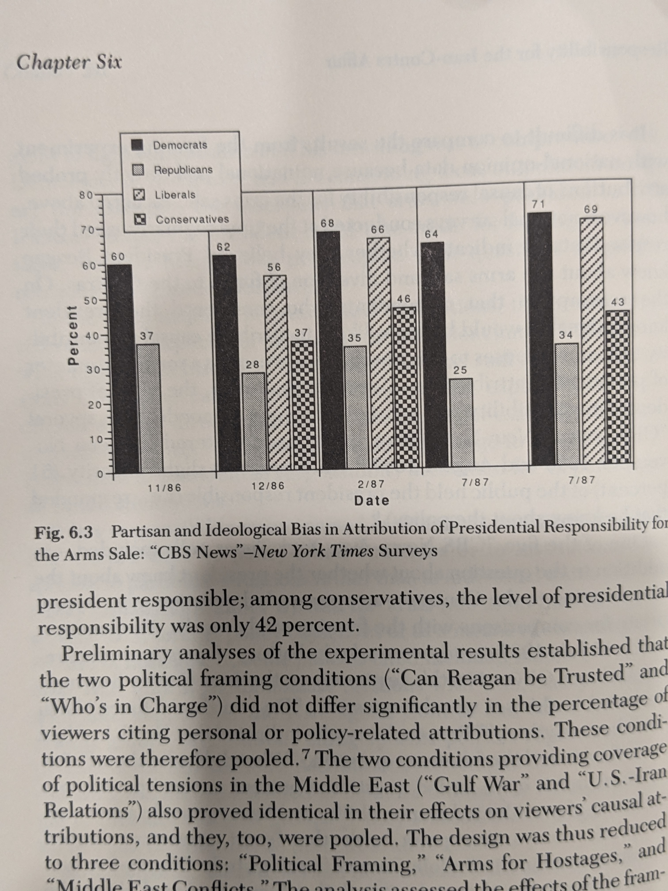

#### Exp.

  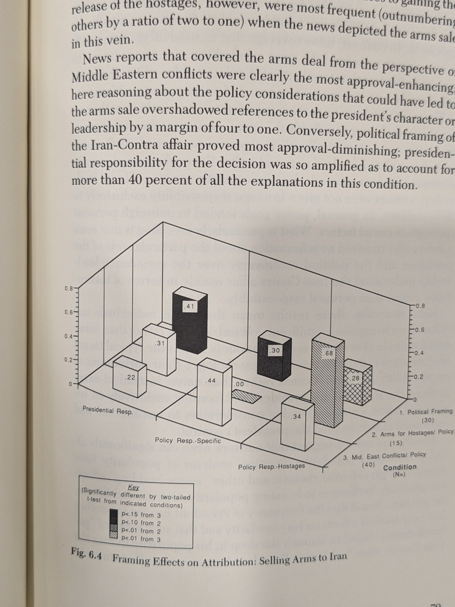

### Regressions

Show large "effects" of people's understanding of who is responsible (for the state of affairs and fixing stuff) and approval (presidential, civil rights leaders), funding of social welfare, policing, etc.

Context = "How do people manage to express opinions about such issues as civil rights legislation, economic assistance for the newly freed nations of Eastern Europe, or President Bush's performance at the international drug summit when these matters are so remote from matters of daily life and so few citizens are politically informed?" Can't be explained well by global things like ideology. Maybe how media frames and who people think is responsible explains their policy prefs.

