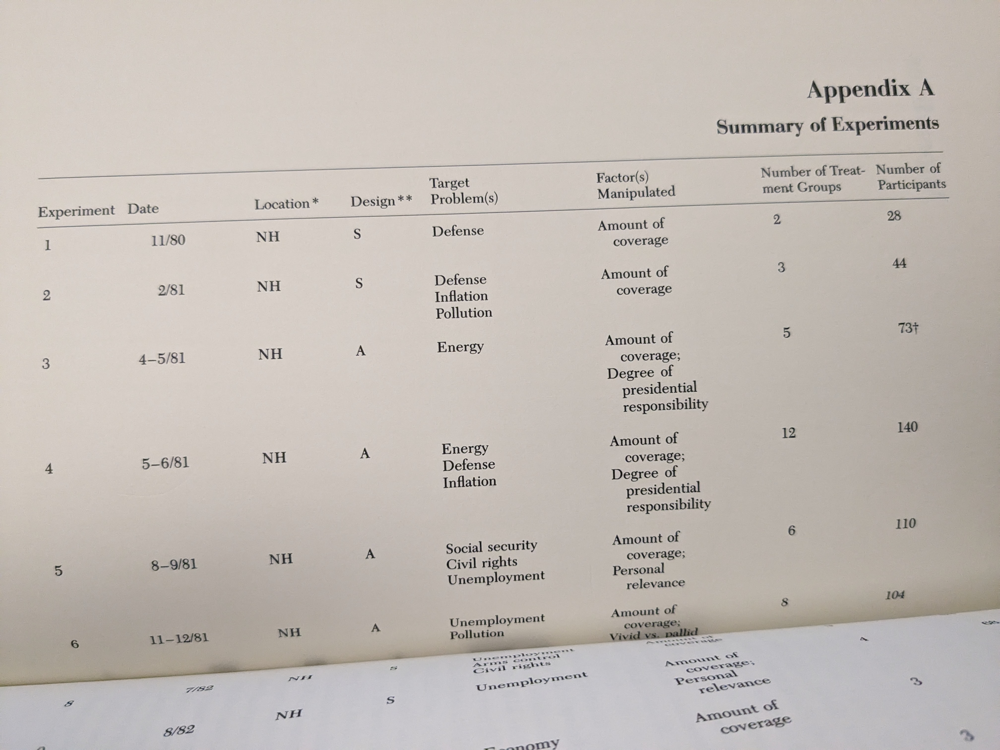
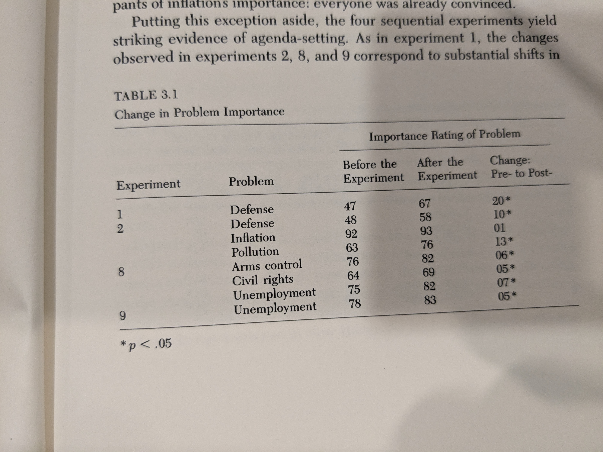
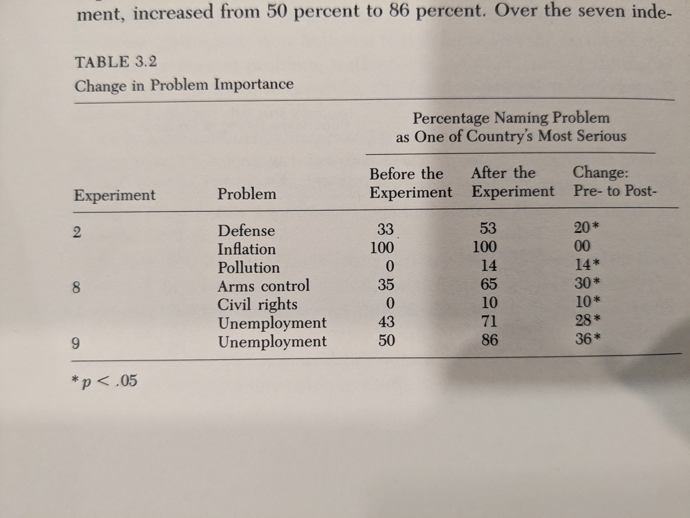
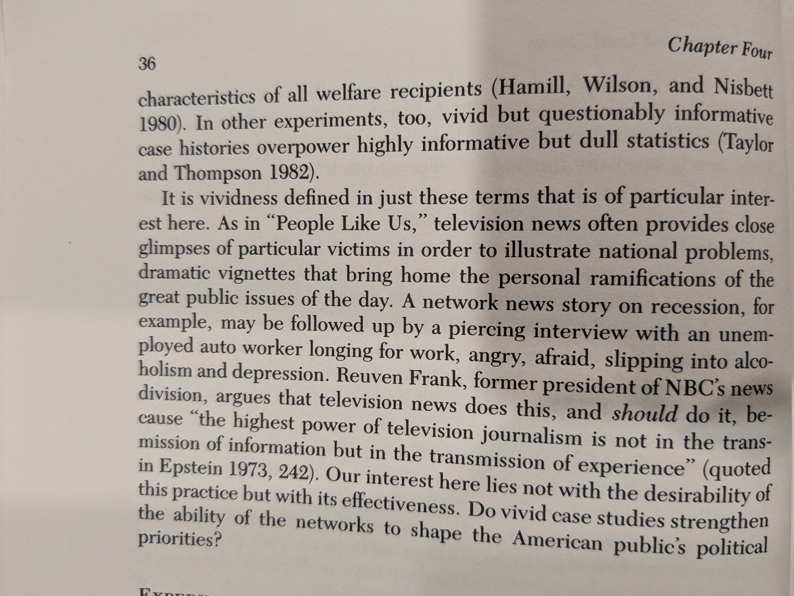
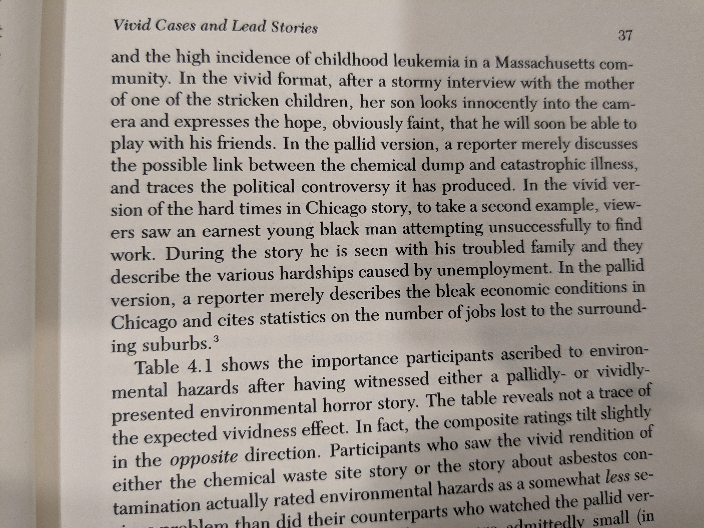
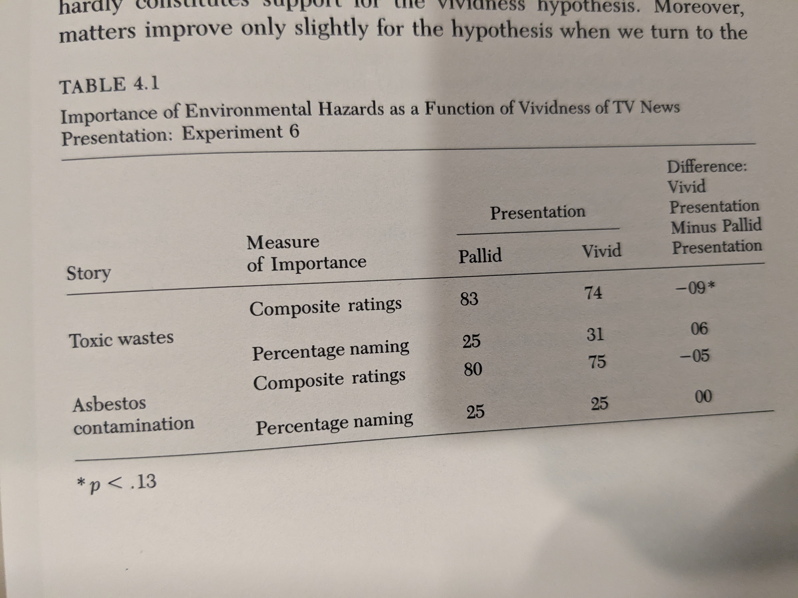
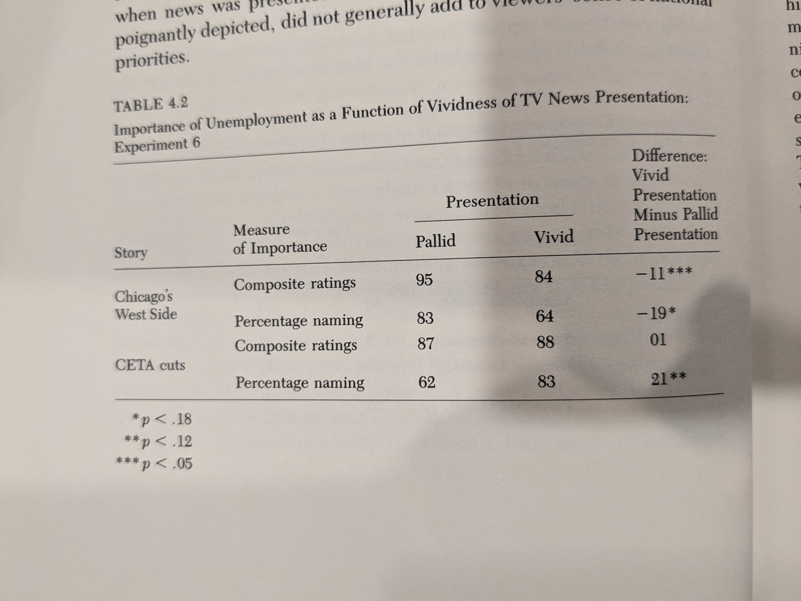
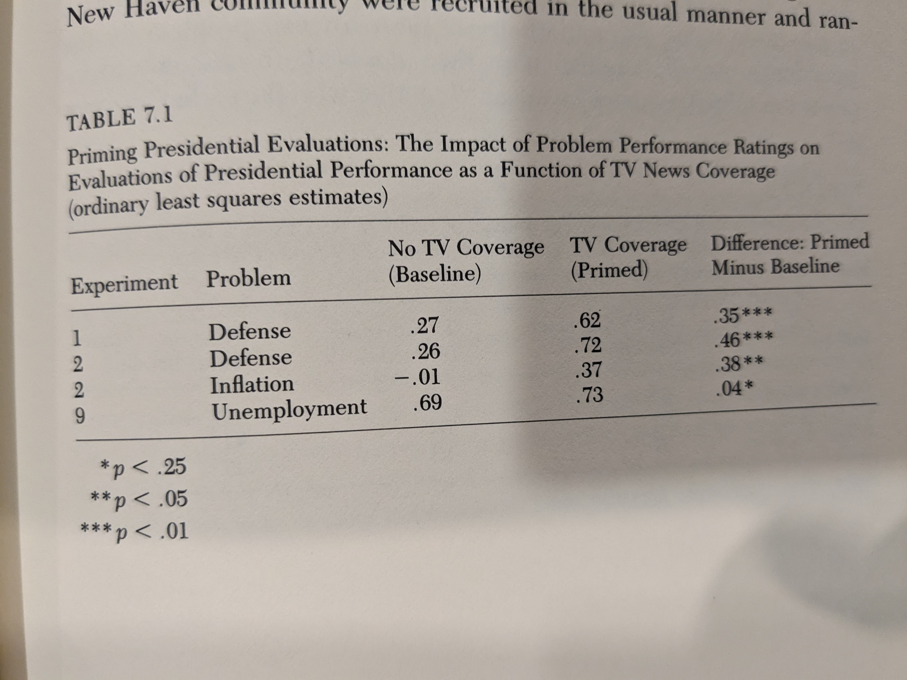
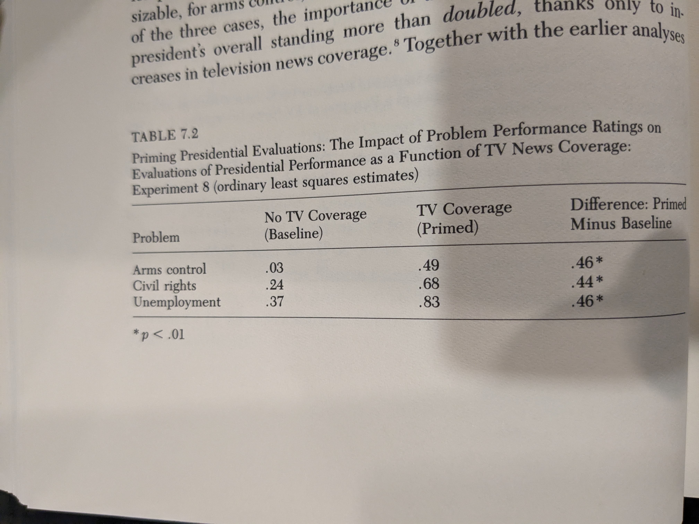
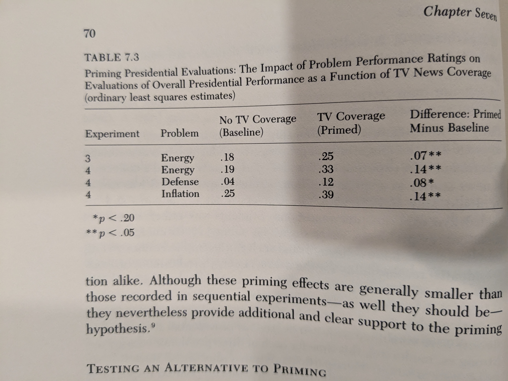

### News That Matters

TL;DR: Motivating question = how do people come to judgments about topics they have little experience and interest in. Experiments on agenda-setting and priming.

### Research Design

* **Sequential Exp.** A slightly altered 30 min. newscast for 5 days. Asked people to not watch the evening news and then showed last night's (edited) newscast --- added footage while deleting innocuous stuff of equal length. One group saw news stories highlighting pollution, another economic problems, another about issues w/ defense. Treatment: "Each condition was charactertized not only by sustained coverage of the target population but also by the systematic exclusion of news stories dealing with the other two." **Each group served as the control group for the other.** (pg. 9)

* **Assemblage Exp.** One sitting but multiple news stories.

#### n that matters

#### Issues
	
* Small n per cell. See ^^
* Treatment is complex so hard to uniquely attribute it to X
* Lack of adjustment for multiple comparison
* Lack of clustered s.e. by respondent if there are multiple DV per respondent

### Agenda Setting

### Vividity Bias

1. Single example > Stats.
2. In exp. 6, vivid and pallid versions of the same story. 
3. Exp. 11 is with Umich. undergrads. Exp. 11 conditions = Stats, Stats + interview with White unempoyed, Stats. + interview with Black unemployed

### Lead Story

### Personal Situation 

### Priming

### Who is Responsible?

