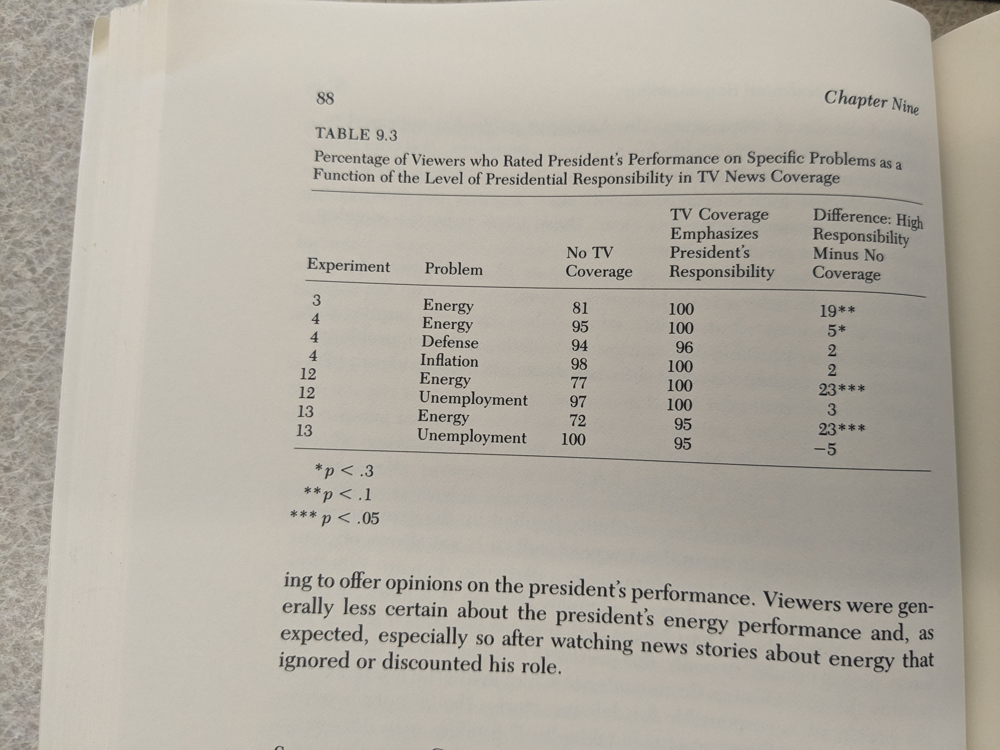

### News That Matters

TL;DR: Motivating question = How do people come to judgments about topics they have little experience and interest in? Experiments on agenda-setting and priming.

### Research Design

* **Sequential Exp.** A slightly altered 30 min. newscast for 5 days. Asked people not to watch the evening news and then showed last night's (edited) newscast --- added footage while deleting innocuous stuff of equal length. One group saw news stories highlighting pollution, another economic problem, and another about issues w/ defense. Treatment: "Each condition was characterized not only by sustained coverage of the target population but also by the systematic exclusion of news stories dealing with the other two." **Each group served as the control group for the other.** (pg. 9)

* **Assemblage Exp.** One sitting but multiple news stories.

#### n that matters

#### Issues
	
* Small n per cell. See ^^
* Treatment is complex so hard to uniquely attribute it to X
* Lack of adjustment for multiple comparisons

### Agenda Setting

* combined n for exp. 1, 2, 8, and 9 = 203, 12 treatment conditions in total, so ~ 17 per cell. poor man's est. ~ 10. 
* 0 story condition for topic a = stories on other topics.

### Vividity Bias

1. Single example > Stats.
2. In exp. 6, vivid and pallid versions of the same story. 
3. Exp. 11 is with Umich. undergrads. Exp. 11 conditions = Stats, Stats + interview with White unemployed, Stats. + interview with Black unemployed. TL;DR here is perhaps 

### Lead Story

* Exp. 14 --- lead story or midway during 30 min. newscast. 2 topics, so 4 conditions in all.
* Mixed results --- ~ 14 pts on education but two on education. A week later, 83 of 121 responded, and apparently, an effect on both topics.

### Het. Treat. for Agenda Setting: Personal Situation 

* Exp. 5. 6 conditions 
	- 2, and 4 stories by 3 topics.
	- 0 story condition on topic a = 2 or 4 stories on other topics. this seems like a bad idea.

* The analysis here seems weird. Not the classic interaction term. The hypothesis is that the less informed are more prone to agenda-setting.

### Priming

Post-treatment measures = performance in each area + general performance
post-treat general performance ~ post-treat performance in each area * treatment
hypothesis = beta for the topic covered is higher. seems like multiple things could explain the change in beta? What is the right s.e. for this?
* beta could be higher because of projection --- people adjust their topical ratings to be more consistent with their general eval. of the pres. solve with 2sls with pre-treatment topical ratings as an instrument (not clear what's going on). Could you not solve it by regressing post-treat general eval. on pre-treat topical * treatment?

* in exp. 8 --- stories chosen to highlight a high degree of pres. responsibility. in others, not so.

* affects performance ratings more than assessments of competence and judgments of integrity. 

### Priming Responsibility

* Exp. = manipulate who is responsible (pres., no one, not the pres.)
* The pres. is seen as responsible for energy, inflation, defense, and unemployment by most (see the first col.):

See Lenz's "Learning and Opinion Change, Not Priming" for evidence to the contrary (in the 'real world'). He finds that people learn about parties' positions and also adapt their positions to match the position of the favored party. https://www.jstor.org/stable/20647953

### Het. Treat for Priming

* Apparently, it doesn't vary that much by political sophistication but the same issues with the analysis. 

### Electoral Consequences of Priming

* Can affect who wins, who runs for (re-)election, etc.

