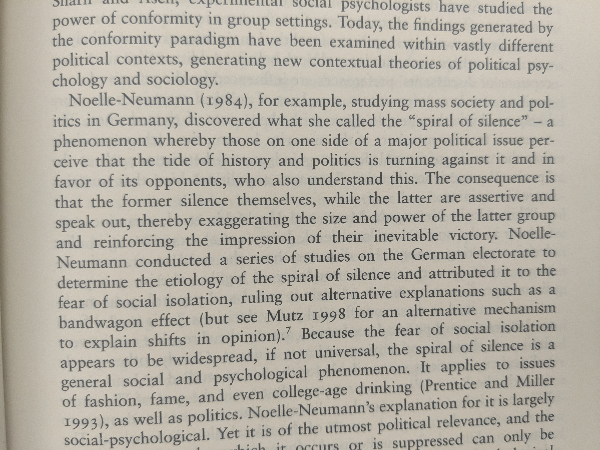
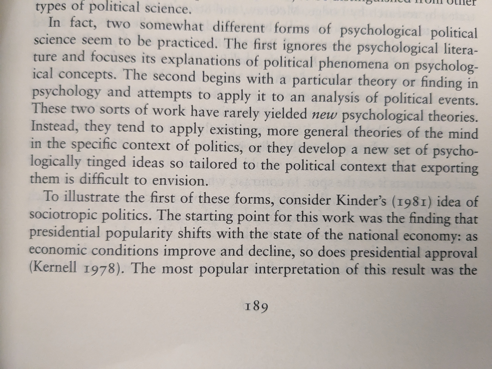
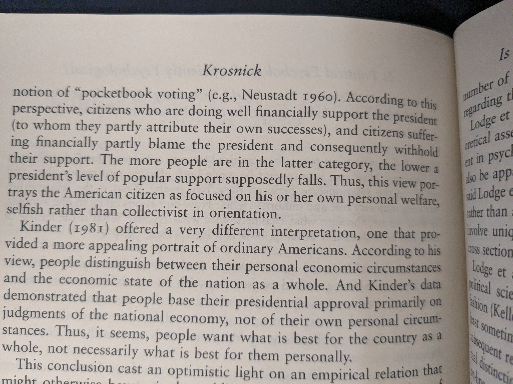
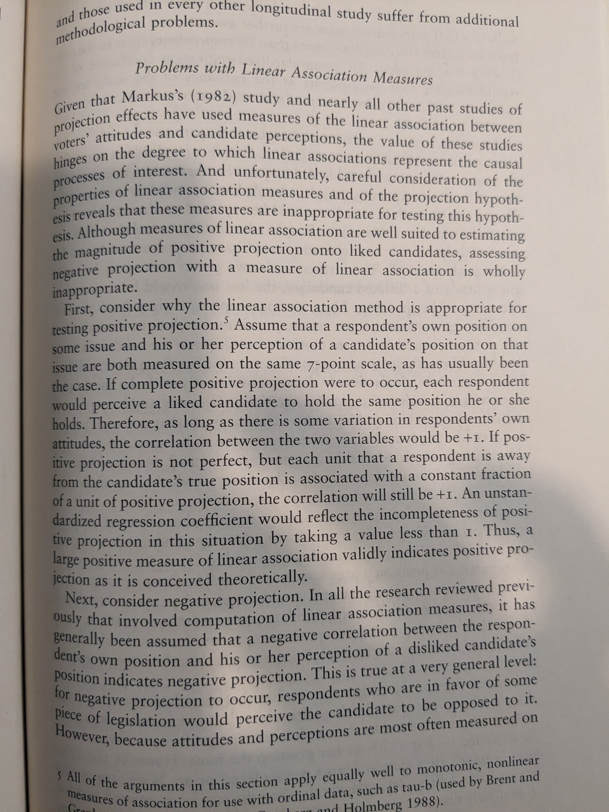
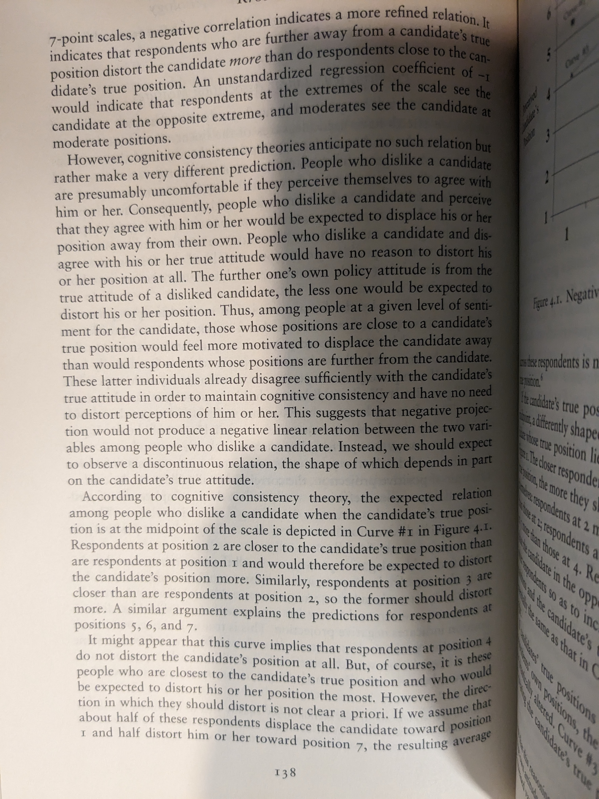
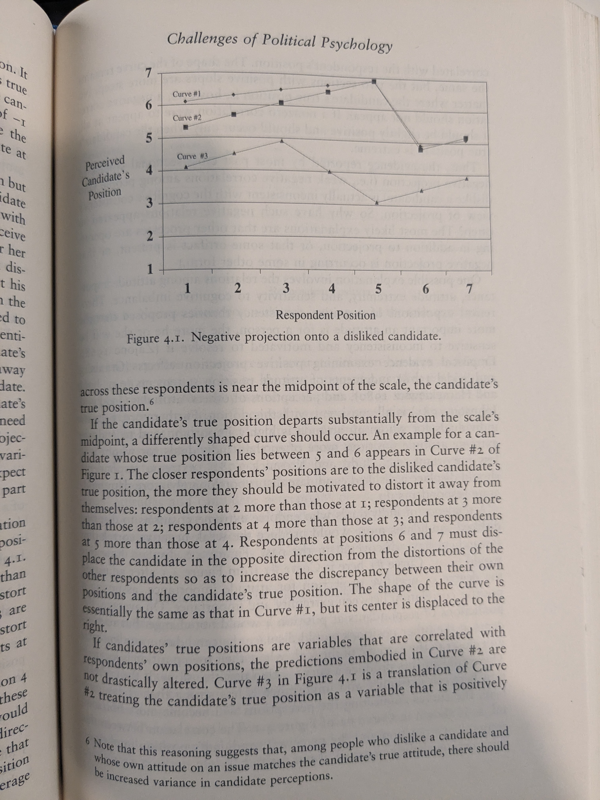
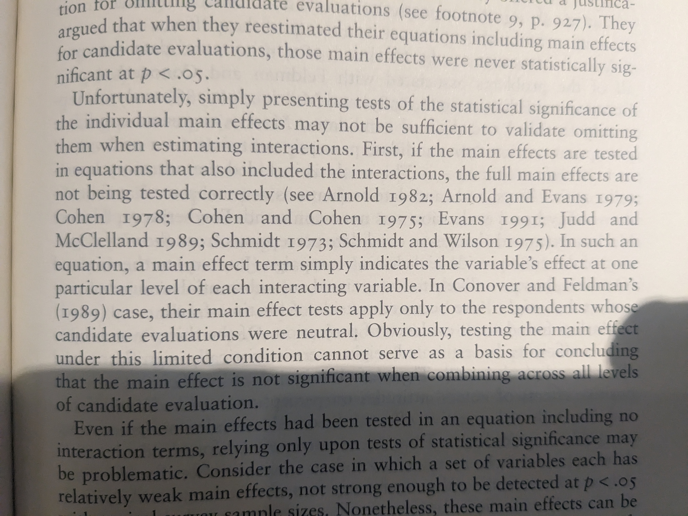
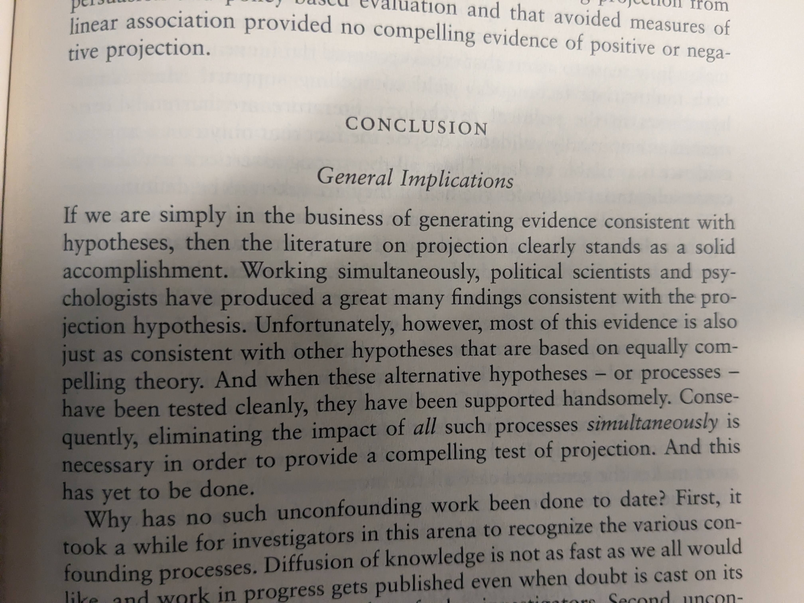
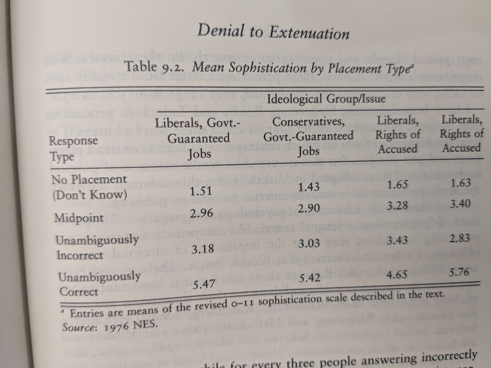

## Thinking About Political Psychology

### Spiral of Silence

From: https://www.hup.harvard.edu/books/9780674707580

### Pocketbook Vs. Sociotropic (via Krosnick)

### Krosnick Projection

#### Linear

#### Main Effect W/ Interaction

#### Projectile

### Luskin on Brady/Sniderman

