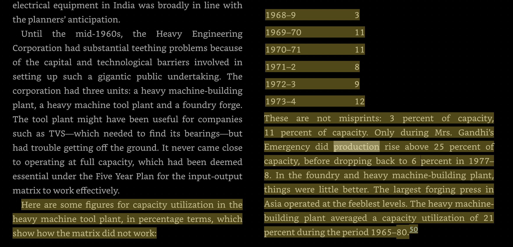
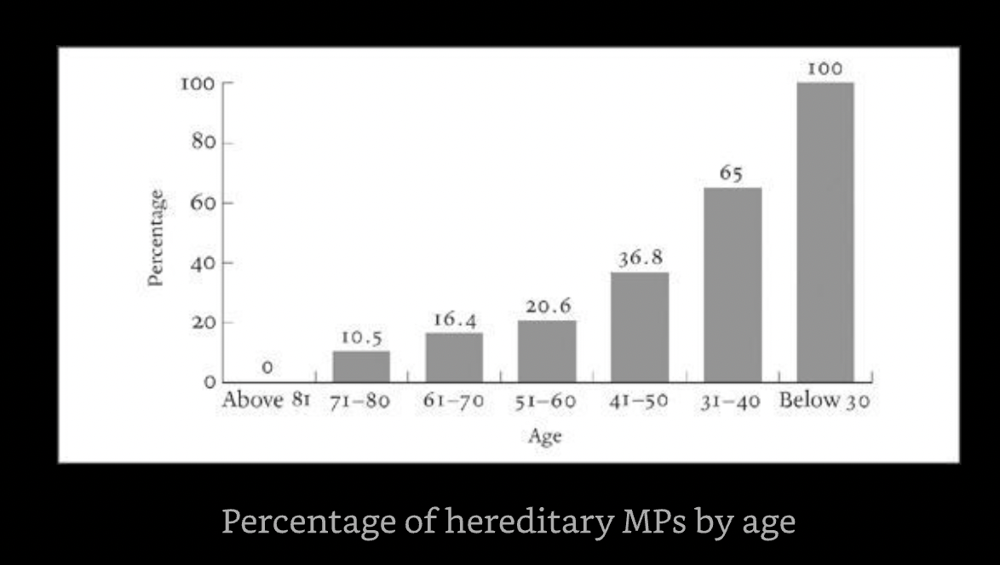

## India: A Portrait

### People

* Sanjay Gandhi
	* The boys were brought up in large part by servants, including a stern Danish governess who insisted on cold showers and raw vegetables.
	* Sanjay was more outgoing, though at the age of six he had not yet learned to speak.
	* by his late teens, Sanjay was being accused of stealing and joyriding cars around Delhi.
	* Previously, he was famous only for getting a licence to run a car factory which was unable to produce cars. ... The Maruti project sucked in money for years from nationalized banks and private investors
	* A friend of the family, the writer Khushwant Singh, remembered arriving at a meeting with him and watching a pair of supplicatory businessmen deliver two suitcases full of banknotes. “I found it hard not to like Sanjay,” he admitted, “but I have to say he was a thug, and he was corrupt.”
	* Sanjay Gandhi crashed while performing aerobatics over Delhi—illegally, one morning—in a Pitts S-2A light aeroplane.

* Indira Gandhi
	* if highly dubious swami named Dhirendra Brahmachari, who ran a gun factory, did yoga performances on national television and knew how to perform some of the more obscure Tantric rituals.
	* Superstitious + overtly religious (rudraksh etc.)
	* The root cause was a conflict she and the late Sanjay had sparked in Punjab by attempting to influence a state election. To break a local coalition in Punjab, Sanjay had set up and sponsored an obscure Sikh preacher, Sant Jarnail Singh Bhindranwale, as an alternative political force.
		* The assassin’s widow, Bimal Kaur Khalsa, became a martyr by proxy. She led a procession through Amritsar, was sent to jail on a charge of attempted murder and after her release was elected as an MP from Punjab.
	* Sheikh Abdullah, his fun-loving son Farooq took over as chief minister, and in state elections in 1983 his party triumphed over Congress. In response, Mrs. Gandhi sent a governor to Kashmir who had a reputation as an enemy of Muslims, and arranged payments of Rs200,000 each to legislators who defected from Farooq Abdullah’s party.

* Rajiv Gandhi
	* His government passed a law allowing discrimination against Muslim women during divorce in order to woo conservative elements, which infuriated many Hindus; this was balanced by a court decision regarding a disputed mosque—the Babri Masjid...
	* From elsewhere: "In 1989, Rajiv Gandhi, as outgoing PM, had launched his Lok Sabha campaign on the bank of the river Saryu in Ayodhya, promising ‘Ram rajya’. Rajiv and his team had even performed shilanyas at the ‘disputed’ site, as pointed out by Rao in his book."
	* The prime minister’s office functioned in a haphazard and amateurish fashion, with the cabinet frequently being reshuffled. Rajiv Gandhi ignored corruption among his colleagues, and the payment of financial incentives became a growing part of Indian public life. 

* Sonia
	* Her father, Stephano, was a successful builder who had fought alongside the Wehrmacht against the Russians on the Eastern Front (he gave each of his daughters a Russian pet name, hence Sonia) and her mother, Paola, was a traditional housewife. Stephano remained an unrepentant fascist until his death, like many of his generation of Italian men, and kept a leather-bound edition of Mussolini’s

	* Sonia's 'shatruvinash yog'
		* In June 2000, Rajesh Pilot died when his car collided with a Rajasthan State Road Transport bus
		* in October 2000, Sitaram Kesri passed away following a heart attack
		* in January 2001, the 62-year-old Jitendra Prasada suffered a sudden and fatal brain haemorrhage
		* in September 2001, Madhavrao Scindia was flying to Kanpur in an industrialist’s Cessna

	* Modi: “Has James Michael Lyngdoh come from Italy?” he wondered. “I don’t have his janam patri [horoscope], I will have to ask Sonia Gandhi. Do they meet in church?”

	* Sushwa Swaraj: announced she would begin a fast and fight the forthcoming battle as a sanyasin: “If I see Sonia Gandhi take the oath as prime minister ...I will shave my head, sleep on the floor and eat roasted grams [chickpeas].”

* Pramod Mahajan
	* Despite being an RSS man, he was known for having an extravagant life.
	* Rahul Mahajan settled into the Jacuzzi in his father’s sprawling official residence, a short drive from the prime minister’s house. With him in the bathroom were his father’s secretary, Bibek Moitra, and several bottles of champagne. Later, they came out and had a small party accompanied by a bag of cocaine.

* Vajpayee
	* he had lived happily for many years with his college sweetheart, her husband and their daughters.

* Mahalanobis
	* Mahalanobis came to economics only in his forties, and had spent the 1920s pursuing subjects such as the pseudo-science of eugenics (he wished to discover the racial origins of Bengalis). He had written a paper, “Analysis of Race-Mixture in Bengal,” in which he recounted how by using “anthropological measurements such as stature, head-length, head-breadth, nasal length, etc. of 300 Anglo-Indians in Calcutta,” he had discovered that Anglo-Indians were taller than Bengalis and had variable head-lengths.
	* He invented a mathematical formula of “caste-distance” to determine the eugenic gap between Anglo-Indians and specific caste groups by contemplating variables, measurements and pooled variance."
	* Behind most of the catastrophic econ. decisions early on under Nehru
	* Here are some figures for capacity utilization in the heavy machine tool plant, in percentage terms, which show how the matrix did not work: ... These are not misprints: 3 percent of capacity, 11 percent of capacity.

	

* Ambedkar
	* At school he was not allowed to touch a tap, and could only have water when a peon turned one on for him. He had to bring a piece of gunny cloth, or sacking, to class each day and sit or squat on it during lessons, while the upper-caste children sat at desks. At home, the family would cut each other’s hair and wash their own clothes,
	* His Mahar community was at the upper end of the scale of untouchability, respected in the region around Bombay for military service; he had won a scholarship sponsored by the Maharaja Gaekwad of Baroda ...
	* 2nd marriage to a Saraswat Brahmin

* Mayawati
	* “Chamari hoon, kunwari hoon, tumhari hoon,”
	* she ruled in a shockingly unconventional way, appointing Dalits to key positions in the state’s administration and police service, erecting thousands of statues of Dr. Ambedkar 
	* Raja Bhaiya, a prominent Thakur politician and gangster who kept alligators in a lake in front of his palace to intimidate the locals, was imprisoned under anti-terrorism legislation, and for good measure Mayawati confiscated his family’s properties, sealed his bank accounts and handed over the lake of gators to the forest department.
	* While politicians were slapped, beaten and in some cases temporarily kidnapped, she and others retreated to a suite and locked the door. “Drag the Chamar woman out from her hole,” men and women shouted from outside, along with other more offensive remarks.24 Even by the rough standards of north Indian politics, the attack in Lucknow was unprecedented.
	* In 2005 she held a huge ceremony in Lucknow where men with vermilion caste marks and shaved heads, bar a braid of hair at the back, paraded in rows and touched her feet in homage. “Behenji, bachao!” they said as they stooped—“Respected sister, save us!”38 It was, again, a scene that would have been unimaginable only decades before, the Brahmins bending down before the former

### Special Topics

* Colonial
	* This whole mechanism, along with civil and military salaries and pensions, was paid for by the Indian taxpayer: Indians had, without being asked, outsourced the running of their government to Britain.
	* At this point, only 6 percent of entrants to the civil service in India were Indian, since many practical obstacles stopped them from joining. A proposal by the Indian National Congress that the entrance examination be held not only in London but in Bombay, Calcutta and Madras was rejected; one British official inadvertently undermined the idea of racial superiority when he wrote that “half the service would be Bengali” if it were opened to this sort of competition, since Indian students were “infinitely quicker” at exams than Europeans.
	* Now, at the close of business nearly 350 years later, Britain was indebted in sterling to India to the tune of £1.3bn, through circumstances nobody had anticipated. In 1939 the debt had been running in the opposite direction, as the Indian government paid for the machinery of empire controlled in London.

* Effect of Violence
	* the Hindutva movement would for decades be tarred as violent and extremist. 
	* after Indira Gandhi was murdered, the campaign for a Sikh homeland was suppressed in a counter-insurgency campaign that left tens of thousands dead
	* Indian sympathy for the Tigers—which had never been very strong in the first place—evaporated after Rajiv Gandhi was blown up by a suicide bomber; it took until 2009 for the Tamil Tigers to be annihilated, but this was inevitable from 1991.

* Caste
	* Omprakash Valmiki (author of Joothan), a Dalit, stated that during the 1960s he never once heard Ambedkar’s name “from a teacher’s or a scholar’s mouth.” ...  
	* Kanshi Ram: "Brahminism had such poisonous germs in it, that it effectively killed the desire to revolt against the worst form of injustice."
	* Can't understand caste prejudice as 'It is unlike other forms of prejudice, where antipathy is linked to envy or desire; an anti-Semite will ask why “they” do so well in business, and a white racist will fear and envy apparent black physical prowess.'
	* An article published in 2009 mentioned that childless couples were asking sperm banks to label the donations by caste.
	* Southern Brahmins: "After the First World War, 72 percent of Brahmin men in the region were literate, against less than 4 percent of Paraiyars (or pariahs—this was the origin of the word)." Unlike in the north, where Brahmins were often poor despite being of high caste, here they had also been landowners ...

* Indian Muslims
	* In 1947 the Muslim intellectuals and civil servants went to Pakistan.

	* Indians, many of whom were Muslim, were working in the Middle East. They brought money and a new religious feeling to India, having developed a sense of commonality ... traditionally dressed young men began to propagate the idea of Islamic revival in Bombay, which in turn revived Hindu fears of Muslim fanaticism

	* Yusuf Ansari, UP MLA, “It was summer,” he said, “April, very hot. I was given Mahmudabad, a backward, rural constituency, and had to find workers, set up an office, organize the campaign. It was not long after the execution of Saddam Hussein, and the Shias were being blamed for this. I am Sunni, and about one quarter of the Muslims in the constituency are Shia. The imams and maulanas, my core vote, came to me and said they had decided to tell their people to go with the Samajwadi Party, because otherwise a Shia—the BSP candidate—might win. So my campaign was sunk by tensions produced in Iraq.

	* Mukhtar had a nominal advantage: although his family traced their lineage to Medina and were thought to have been the standard-bearers of the prophet Mohammed, most Ansaris in India were poor weavers who were classified as OBCs. The forebears of these low-caste Muslims would probably have taken the name of the local ruler, perhaps on conversion.

	* 0 female qazis

	* Come election time, the assumption was that if you wanted Muslim votes, you needed to secure the support of a cleric by any means necessary. I

* Pakistani Terrorism

	* One of General Zia’s achievements had been to establish hardline madrasas, Islamic schools, along the Pakistan–Afghanistan border and elsewhere in order to turn out students who believed it was their religious obligation to kill communists and infidels.15 When the war was over, the military did not wish to tame them: they were needed to fight in Kashmir. While the world turned aside in the 1990s to concentrate on the perceived peace dividend at the end of the Cold War, the problem ...

	* Over at the Jewish centre in Nariman House, other militants were torturing and killing Rabbi Gavriel Holtzberg and his wife, Rivka, who was five months pregnant. The irony here was that none of the young Pakistani men would ever have met a Jew, but had been conditioned as part of their training, or indoctrination, to hate them.

	* Hafiz Saeed, a “professor” who lived on a ranch outside Lahore and went about his business with minimal interference from the Pakistani government: "“There can’t be any peace while India remains intact. Cut them, cut them—cut them so much that they kneel before you and ask for mercy."

* Hindus
	
	* * Originally from Central Asia, Al-Biruni noticed the concentration on philosophy and mathematics, the emphasis on the purity of fire and water, the throwing away of earthen plates after use and the avoidance of touching between communities; he commented ... flexibility, observing that “at the utmost, they fight with words, but they will never stake their soul or body or their property on religious controversy"

	* When Nehru’s attempts to pass a new Hindu civil code into law were rebuffed, he decided to implement the legislation piecemeal, over time. Ambedkar believed the prime minister was capitulating to reactionary upper-caste Hindu forces in Parliament, and he resigned as law minister in 1951. He was underestimating Nehru’s determination, the subtlety of his strategy and how important he believed these changes to be. By the late 1950s most of the original civil code bill had been pushed through Parliament, and Hindu traditionalists were dragged, kicking and struggling, to social reform.

* Political Inheritance

	* 156 MPs of 545 with family background but problem esp. acute w/ young MPs + women MPs

	* Young MPs != Evidence of something that is not sclerotic. Every MP in the Lok Sabha under the age of thirty had in effect inherited a seat, and more than two thirds of the sixty-six MPs aged forty or under were HMPs. ... In the Congress party, the situation was yet more extreme: every Congress MP under the age of thirty-five was an HMP.

	

	* Were women MPs more likely to have reached their position through a family link? Yes: 69.5 percent of women MPs fell into the family politics column.

	* India’s next general election was likely to return not a Lok Sabha, a house of the people, but a Vansh Sabha, a house of dynasty.

* Massacres W/o Accountability
	* in West Bengal, communist cadres had set upon lower-caste Bangladeshi settlers with the support of the police, burned and looted huts, raped women and murdered several hundred people, throwing their bodies into the river—Jyoti Basu, the veteran communist chief minister, did not express regret.
	* 1984
	* Gujarat

* Economics of Peace
	* “Traders need communal harmony more than anybody else, because trade depends on cross-community work.” What did he mean? “Look at my business. Who is doing the transporting? Sikhs. Our shopkeepers are all Hindu. Who does the weaving and embroidery for us? All Muslims.”

* History
	* "Historical elision was required too: it became necessary to say the Muslim invasions of earlier centuries had been part of a give and take, a contest for political space which had brought new food and music to India, and did not mark any real cleavage with the Hindu majority."

* Conservative Immigrants
	* the ideology of religious absolutism was finding more takers in Britain—a consequence of the refusal of successive postwar governments to promote the active integration of immigrants. 

	* The more traditional or regressive members of a community were presumed by many Europeans to be the most convincing representatives of their people.

	* I’ve noticed the Indians here become a lot more conservative too. They start going to Hindu temples, which they would never have done at home, and attending community stuff and south Indian cultural events. They say things to me like, ‘Mmm, you have a daughter, you need to be careful.’

### Misc.

* "It did not escape the makers of the Constitution that other countries, such as Turkey, were seeking to promote unity by preventing minorities from using separate languages"

* "Walter Crocker, wrote: “If India is not run by dictators, Rightist, or Leftist, or Militarist, she will be run by politicians, more and more drawn from, or conditioned by, the outcastes and the low castes."

* When the French writer André Malraux asked the agnostic Nehru late in life what had been his most difficult task, he replied, “Creating a secular state in a religious country.”

* "After Nehru’s death, the democratic structures he had put in place came right: he had refused to groom or nominate a successor as prime minister, but it took Congress MPs only a week to choose a new leader, by consensus. He was Lal Bahadur Shastri, a small, impressive, scholarly man who had been born to a poor ..."

* BJP 2009 election manifesto
	* ancient India grew volumes of rice which outshone even the bogus statistics used during Mao’s Great Leap Forward: The Thanjaur (AD 900–1200) inscriptions record 15 to 20 tons per hectare production of paddy. Now, even after the first green revolution, according to Government statistics, Ludhiana [in Punjab] in the late-20th century recorded a production of 5.5 tons of paddy per hectare. It is, therefore, imperative that India rediscovers an agricultural technology 

	* Best rice yield today ~ 10 tons per hectare

* while the Democratic Indira Congress (Karunakaran), or DIC(K)

* There was even such a thing as the “RSS honeymoon,” when bride and groom, in an inoculation against Western decadence and purportedly un-Indian values, would set off on a holiday after their wedding accompanied by the groom’s extended family.

* P. Chidambaram, who in 2009 outraged the officials in the home ministry by introducing fingerprint scans to ensure everyone reached their office by 9 a.m. and only left at 5:30 p.m.

* The two largest south Asian communities in Britain came from Sylhet and Mirpur, two impoverished parts of rural Bangladesh and Pakistani Kashmir. Between them, people of Bangladeshi and Pakistani origin made up nearly 2 percent of the UK’s population and had some of the worst indicators...

* I noticed Hindu Military Hotel—“military” meant they served chicken and mutton.

* Kashmiri Muslim/ex-terrorist: “I want to marry a non-Muslim woman and convert her to Islam,” he said. “I have been told that if I can convince a non-Muslim woman to marry me—but not convert her by force—there will be a place for me in heaven.”"

