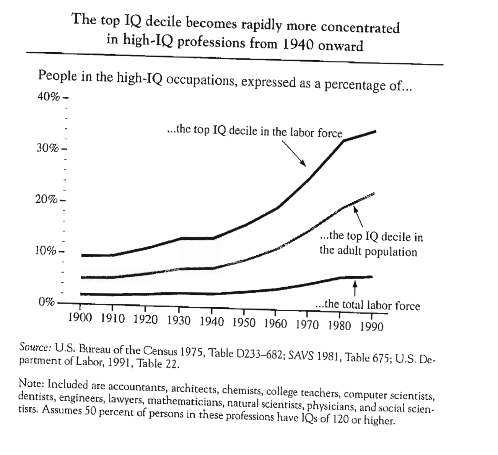
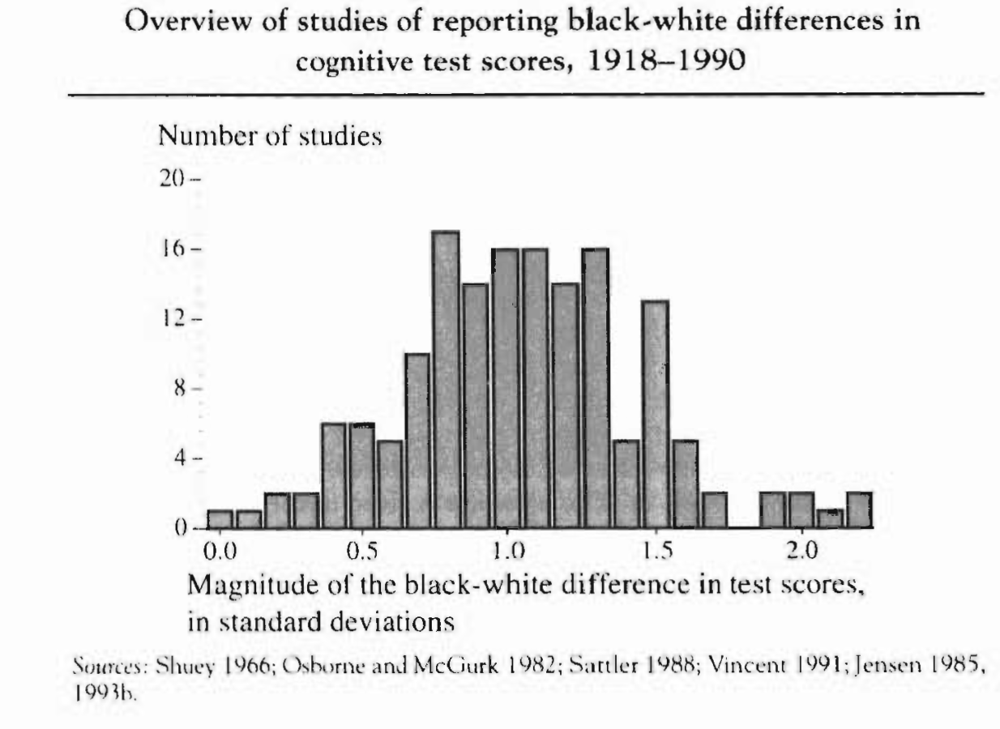
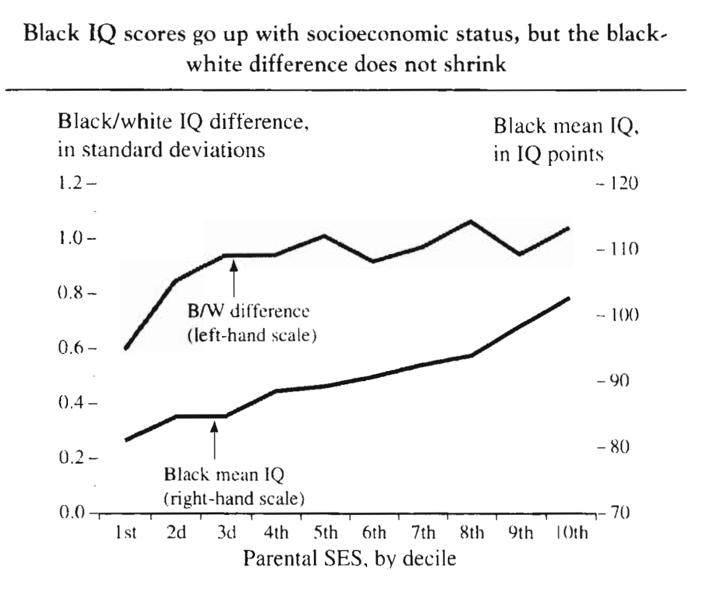

### Bell Curve

* **Communicating self-selection:** "Think of your twelve closest friends or colleagues. For most readers of this book...will be college graduates. Does it surprise you to learn that the odds of having even half of them be college graduates are only six in a thousand, if people were randomly paired off?"

### IQ and Education (Over Time)

* cor(iq, begin college), and cor(iq, ba completion)

	

* IQ and college over time (1920 vs. 1960s)

	

* Potential Causes of Higher IQ Entering Harvard in the 1960s
	* More people with $ -> more competition
		* Using the 20-percent-of-family-income rule, the number of families that could affordHarvard increasedby 184,000from1950to 1960.Usinga 10per- cent rule, the number increased by 55,000
		* Cars/Highway -> more people from across the US applying
		* TV

* 1990 Cor(iq, college)

	

* 1990:  Consider the list of schools that were named as the nation's top twenty-five large universities and the top twenty-five small colleges in a well-known 1990 ranking. Together, these fifty schools accounted for just 59,000 out of approximately 1.2 million students who entered four-year institutions in the fall of 1990- fewer than one out of twenty of the nation's freshmen in four-year colleges. But they took in twelve out of twenty of the students who scored in the 700s on their SAT-Verbaltest. They took in seven out of twenty of students who scored in the 600s.

### Concentration of High IQ in High IQ Professions

### IQ and Professional Success

Heckman blows a straw man here: https://www.journals.uchicago.edu/doi/10.1086/262014

### Data

* And so the NLSY became the beneficiary of an expensive, well-designed set of cognitive and aptitude tests that were given under carefully controlled conditions to almost 94 percent of the 12,686 young men and women in the NLSY sample.

### Homogamy

*  Robert Mare ...The increase in homogamy was most pronounced among college-educated persons. Specifically, the odds of a college graduate's marrying someone who was not a college graduate declined from 44 percent in 1940 to 35 percent in Mare's most recent data (for 1985 to 1987).

### What Solutions Won't Work

* For example, national surveys still indicate that fewer than 60 percent in the top quartile of intelligence actually complete a bachelor's degree
	- This would suggest that AA should work. But then there is a bit of a manouvre to get to: "At a practical policy level, the most obvious is that programs to expand opportunity for the disadvantaged are not going to make much difference in getting the most talented youths to college. An extremely high proportion of those who want to go are already going."
		* In the NLSY, for example, 81 percent of those in the top 5 percent of IQ had obtained at least a bachelor's degree by 1990, when the youngest members of the sample were 25 years old. When we examine the remaining 19 percent who had not obtained college degrees, the efficiency of American society in pushing the most talented to the top looks even more impressive. For example, only a small portion of that 19 percent were smart students who had been raised in a low-income family and did not get to college for lack of opportu- nity. Only 6 percent of persons in the top five IQ centiles did not have a college degree and came from families in the lower half of socioeconomic status

### IQ and Poverty

* A white youth reared in a home in which the parent or parents were chronically unemployed, worked at only the most menial of jobs, and had not gotten past ninth grade, but of just average intelligence--an IQ of 100-has nearly a 90 percent chance of being out of poverty by his or her early 30s. Conversely, a white youth born to a solid middle-class family but with an IQ equivalently below average faces a much higher risk of poverty, despite his more fortunate background.

### Racial Diff.

* Jews: In the NLSY, ninety-eight whites with IQ scores identified themselves as Jews. The NLSY did not try to ensure representativeness within ethnic groups other than blacks and Latinos, so we cannot be sure that the ninety-eight Jews in the sample are nationally representative. But it is at least worth noting that their mean IQ was .97 standard deviation above the mean of the rest of the population and .84 standard deviation above the mean of whites who identified themselves as Christian.

* Latinos: test results generally fall about half to one standard deviation below the national mean. In the NLSY, the disparity with whites was .93 standard deviation. This may be compared to an overall average difference of .84 standard deviation between whites and Mexican-Americans found in the 1960s on the tests used in the famous Coleman report

* AA: The usual answer to this question is one standard deviation.  In discussing IQ tests, for example, the black mean is commonly given as 85, the white mean as 100, and the standard deviation as 15. 

	* In a regression equation in which both race and socioeconomic background are entered, the difference between whites and blacks shrinks to .76 standard deviation.

### Birth Rates by IQ By Agg. Trend in Fertility Rates

* More data needed: "data from the National Longitudinal Survey cohorts selected in 1966 and 1968 (the predecessors of the much larger 1979 NLSY sample that we have used so extensively) supporting his hypothesis that people with higher intelligence tend to have fertilty rates as high as or higher than anyone else's in periods of rising fertility but that in periods of falling birth rates, they tend to have lower fertility rates."

