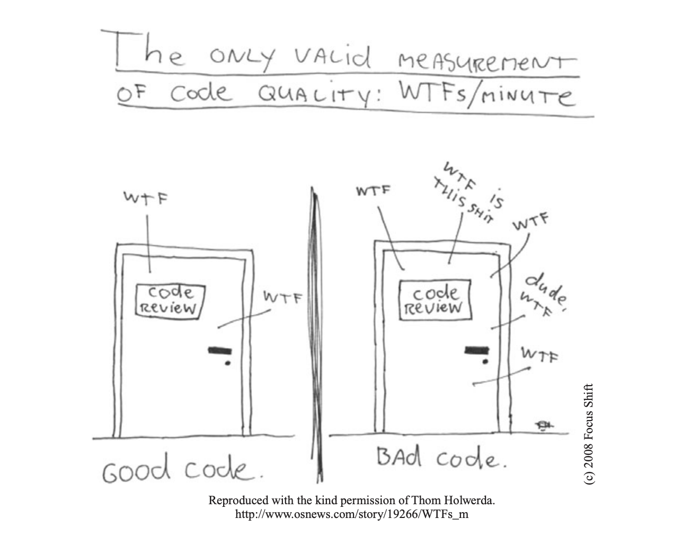
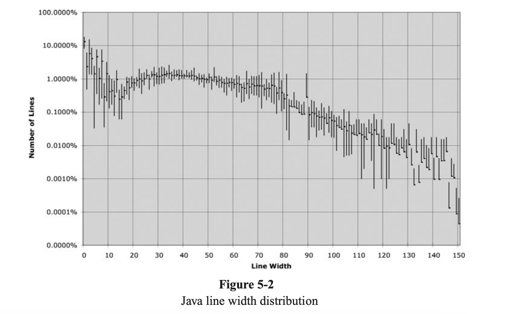
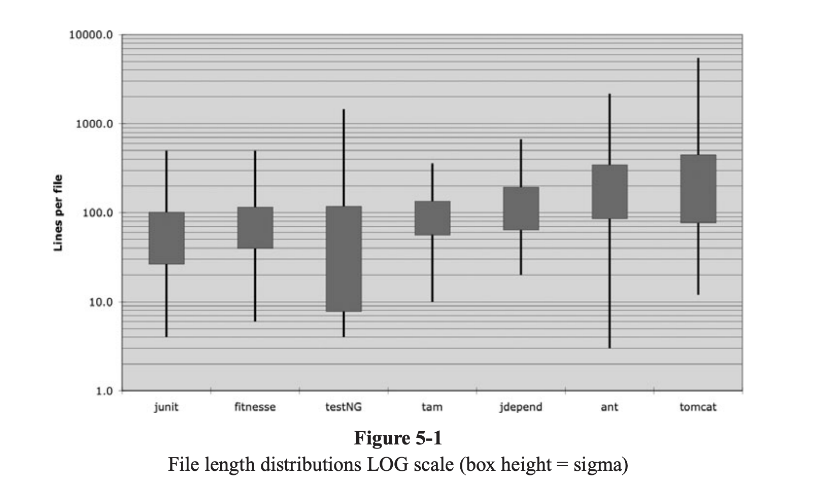

### Clean Code

#### Definition

* Why?
	* Most software development is maintainence. So aim for code where maintainence costs are low, i.e., code that is easily modifiable by others.

* Features that help...
	* Readable
	* No duplication
	* Does one thing well
	* Minimizes the number of entities such as classes, methods, functions, etc.
	* Smallest codebase with ^^ constraints

Abtracting out~ cognitively less complex, readable, and 'clean' (duplication, for instance, will make it harder to make a change as you have to now change in two places, which may not be optimal)

#### 5S

* Seiri, or organization (think “sort” in English). Knowing where things are—using
approaches such as suitable naming—is crucial. 

* Seiton, or tidiness (think “systematize” in English). A piece of code should be where
you expect to find it—and, if not, you should re-factor to get it there.

* Seiso, or cleaning (think “shine” in English): Keep the workplace free of hanging
wires, grease, scraps, and waste. What do the authors here say about littering your
code with comments and commented-out code lines that capture history or wishes for
the future? Get rid of them.

* Seiketsu, or standardization: The group agrees about how to keep the workplace clean.
Do you think this book says anything about having a consistent coding style and set of
practices within the group? 

* Shutsuke, or discipline (self-discipline). This means having the discipline to follow the
practices and to frequently reflect on one’s work and be willing to change.

#### Sociology

* Broken windows theory may apply to code. Seeing bad practices may cause more bad code.

#### Names

* Intention Revealing Names
	* What's Being Measured + Units

* Avoid Disinformation
	* Do not refer to a grouping of accounts as an accountList unless it’s actually a List

* Avoid Using Easily Misread Words. A truly awful example of disinformative names would be the use of lower-case L or uppercase O as variable names

* Avoid Close synonyms
	* Imagine that you have a Product class. If you have another called ProductInfo or ProductData

* Avoid Redundant words. The word variable should never appear in a variable name. The word table should never appear in a table name.

* **One word per concept.** For instance, it’s confusing to have fetch, retrieve, and get as equivalent methods of different classes.

* Searchable Names
	* Can't be too short. 
	* Can't be a constant. Semantic meaning.
	* single-letter names can ONLY be used as local variables inside short methods

* Pronounceable Names.

* Avoid encodings as part of names, e.g., PhoneString

* Method names
	* Methods should have verb or verb phrase names like postPayment, deletePage, or save. Accessors, mutators, and predicates should be named for their value and prefixed with get, set, and is according to the javabean

* Don't be cute. whack() vs. kill()

* Add context where needed. You can add context by using prefixes, e.g., addrFirstName, addrLastName, addrState

#### Comments

* The proper use of comments is to compensate for our failure to express ourself in code. 

* 
// Check to see if the employee is eligible for full benefits
if ((employee.flags & HOURLY_FLAG) &&
 (employee.age > 65))

Or this?
if (employee.isEligibleForFullBenefits())

* Bad use of comments
	* Redundant
	* Mandated --- autogenerate from type --- probably not useful for most internal codebases.
	* Attribution

* Good uses?
	* Regular expressions --- super cryptic --- so comments may be useful
	* Intent --- not easily grokkable
	* Warnings to other programmers, e.g., Running this is super expensive.
	* TODO
	* Amplification: why something is v. important.

* Write comment next to the issue so that comment is updated when the code is

#### Formatting

* Organization within file: 
	* The topmost parts of the source file should provide the high-level concepts and algorithms. Detail should increase as we move down.
	* Conceptual affinity
	* "That is, a function that is called should be below a function that does the calling." --- Notebooks reverse this pattern.

* Horizontal alignment. "If I have long lists that need to be aligned, the problem is the length of the lists, not the lack of alignment."

* Variables should be declared as close to their usage as possible. Because our functions are very short, local variables should appear near the top of each function

* Instance variables, on the other hand, should be declared at the top of the class.

#### Error Handling

* Use try-catch-finally to deliver to the user what they expect in either case
* Don't return NULL
* Don't pass NULL

#### Unit Tests

* "It is unit tests that keep our code flexible, maintainable, and reusable. The reason is simple. If you have tests, you do not fear making changes to the code!"

* TDD
	* First Law You may not write production code until you have written a failing unit test.
	* Second Law You may not write more of a unit test than is sufficient to fail, and not compiling is failing.
	* Third Law You may not write more production code than is sufficient to pass the currently failing test. 

* Single Concept per Test

* Clean Tests
	* Fast
	* Independent (don't rely on other tests, etc.)
	* Should be able to run in any environment --- test/dev/prod
	* Clear indication of pass/fail

#### Classes

#### Functions

* DRY

* Make them very small
	* Functions should hardly ever be 20 lines long. 

* Shouldn't be doing hidden things

* Do one thing
	* If a function does only those steps that are one level below the stated name of the function, then the function is doing one thing.
	* Can you get another function with a name that isn't a restatement of the core job

* One level of abstraction per function

* Stepdown rule: We want the code to read like a top-down narrative. We want every function to be followed by those at the next level of abstraction so that we can read the program, descending one level of abstraction at a time as we read down the list of functions.

#### Futher Reading

1. Kent Beck. Implementation Patterns.
2. Kernighan and Plaugher, The Elements of Programming Style
3. Robert C. Martin, Agile Software Development: Principles, Patterns, and Practices
4. Gamma et al. Design Patterns: Elements of Reusable Object Oriented Software
5. Andrew Hunt, Dave Thomas. The Pragmatic Programmer 
6. O.-J. Dahl, E. W. Dijkstra, C. A. R. Hoare. Structured Programming.
7. Kent Beck. Test Driven Development.

