## Ambedkar: Pakistan or the Partition of India

### Forecast

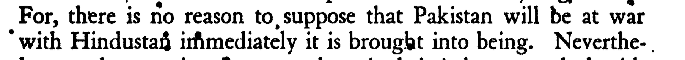

### Ethnic and Religious Composition of the Military

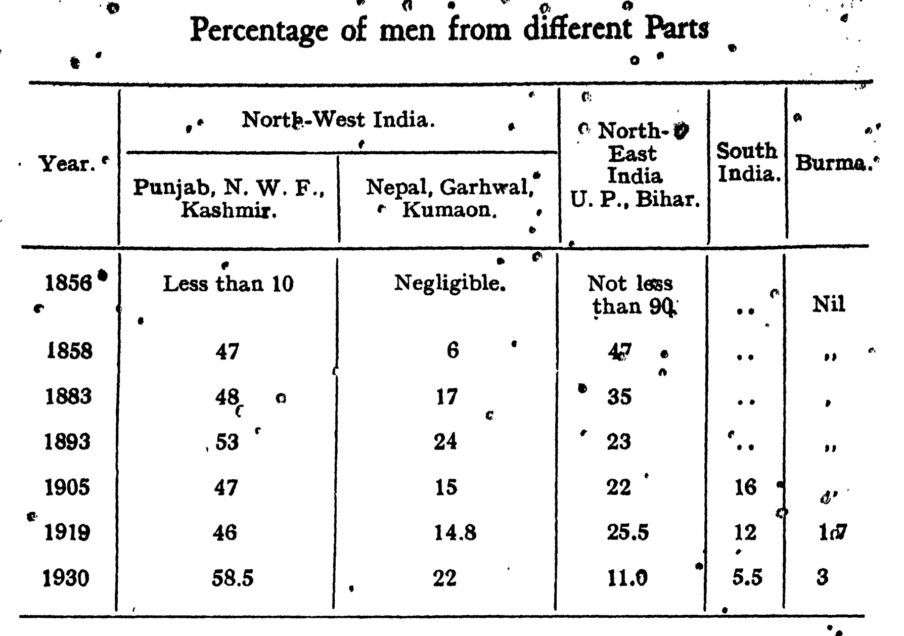
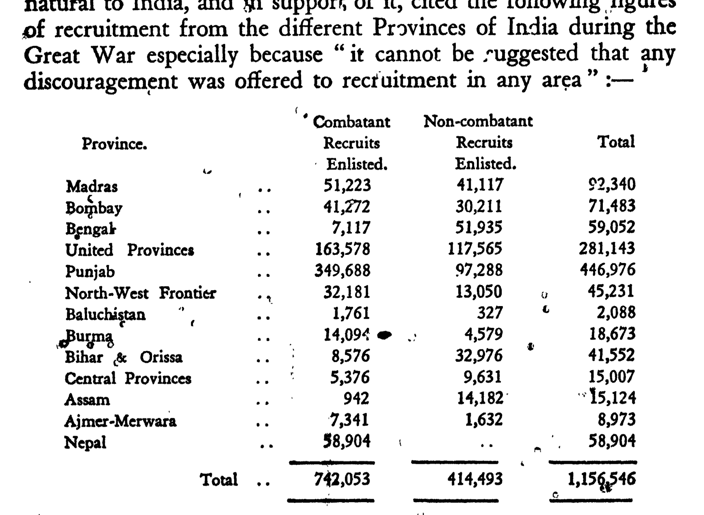
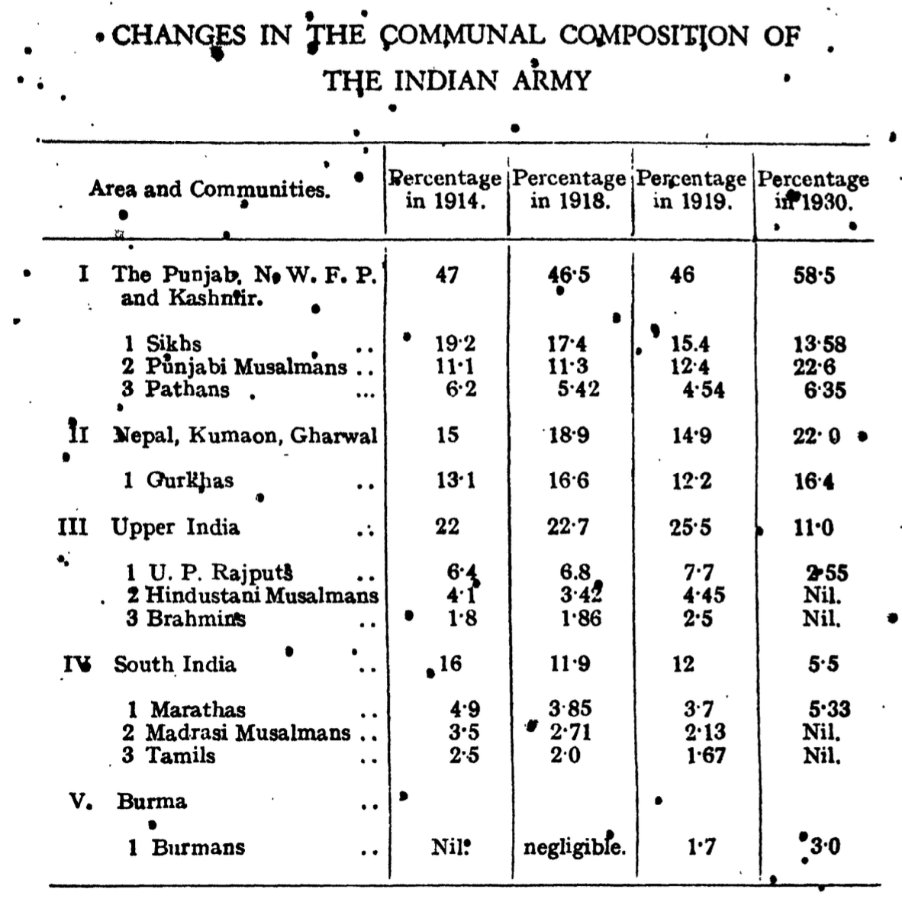
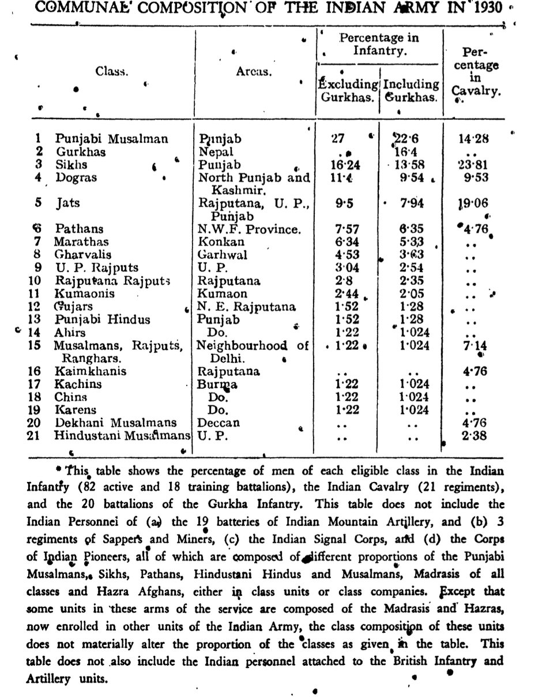
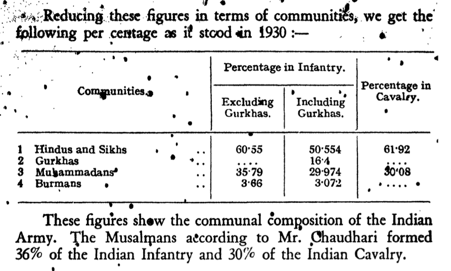
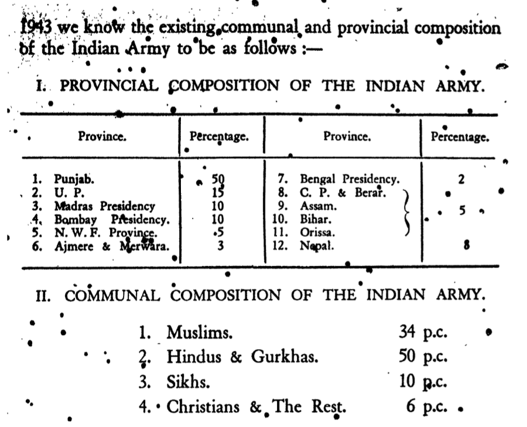

### Caste Among Muslims

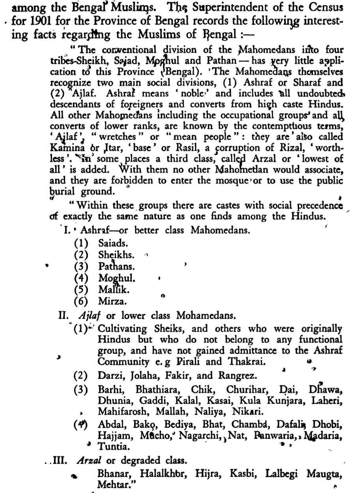

### Lucknow Pact

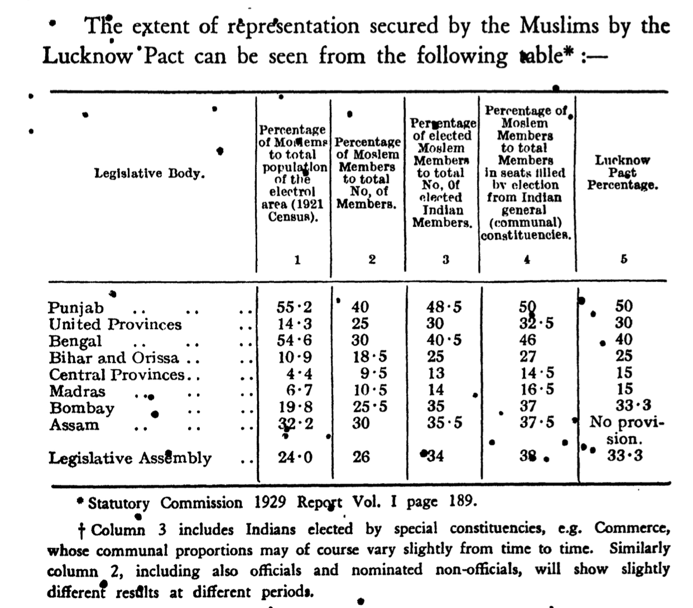
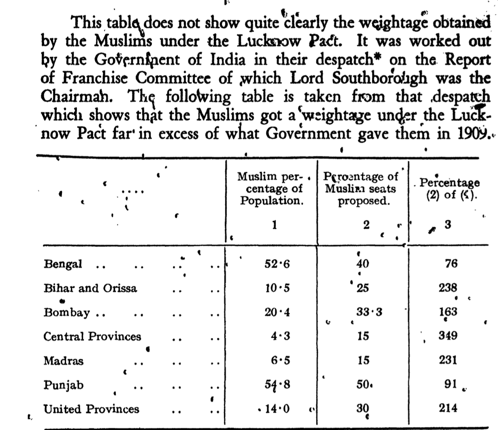

### Percentage of Muslims Speaking Urdu

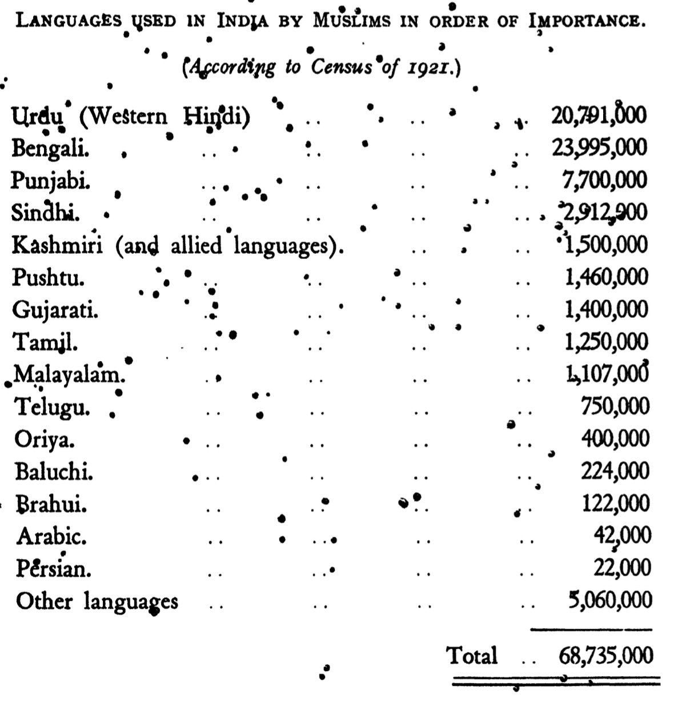
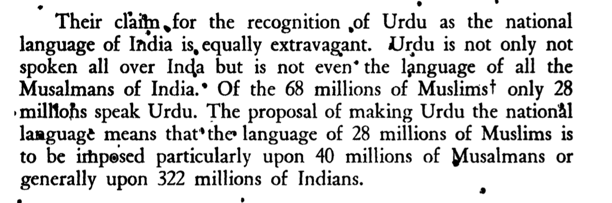

