## Discrimination and Disparities 

### Discrimination (Private/Public)

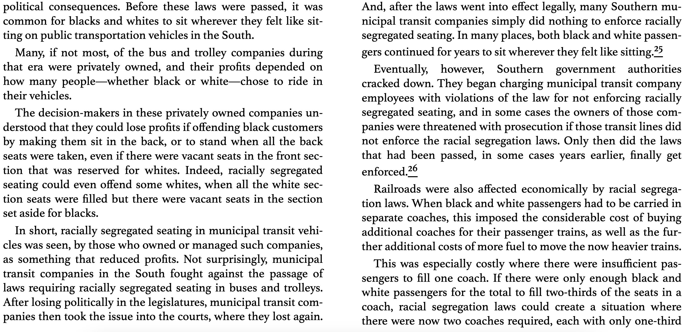
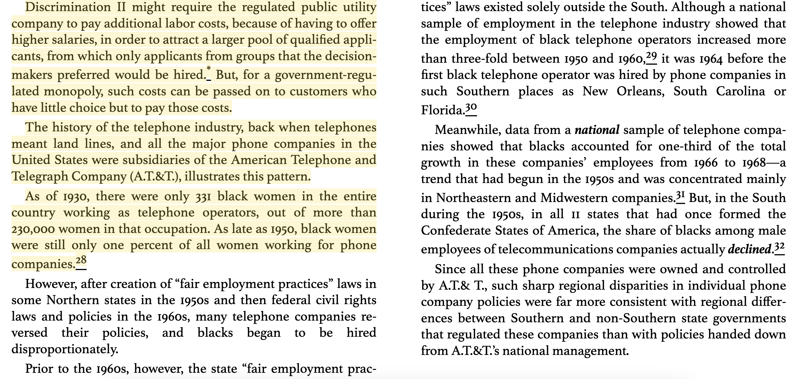
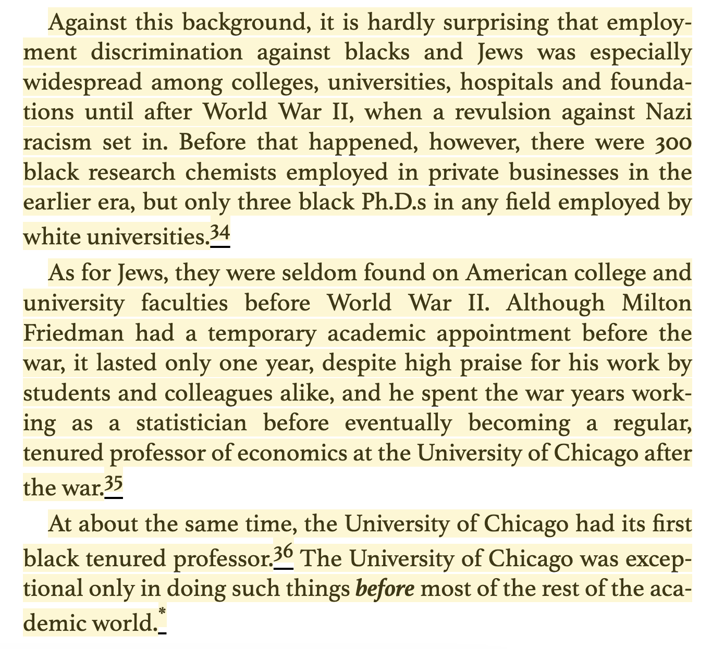

### Zoning Inequality

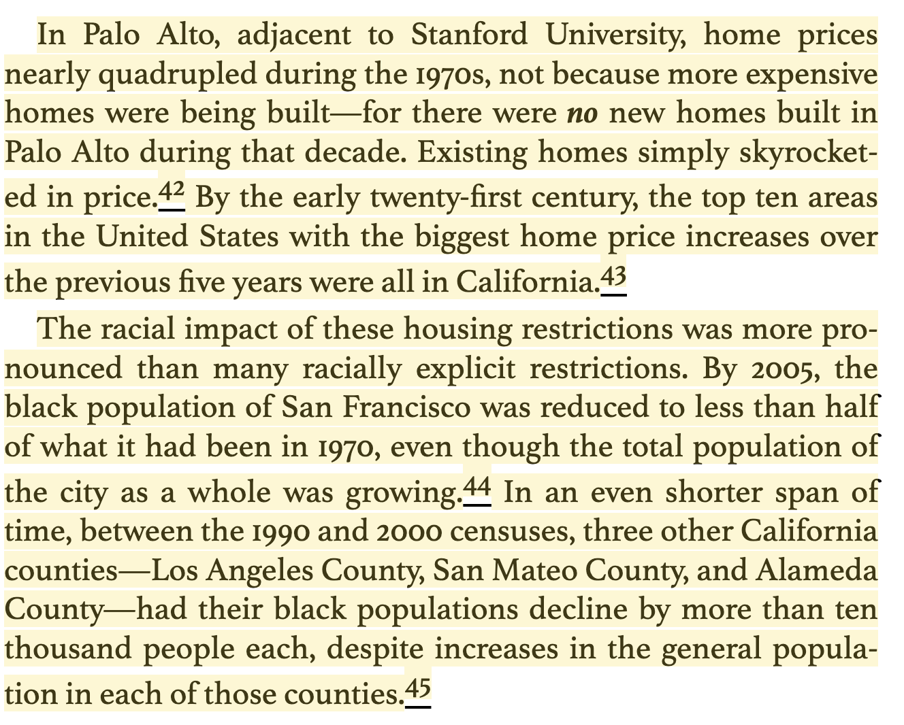

### Household Vs. Personal Income (+ Interpreting Historical Comparisons)

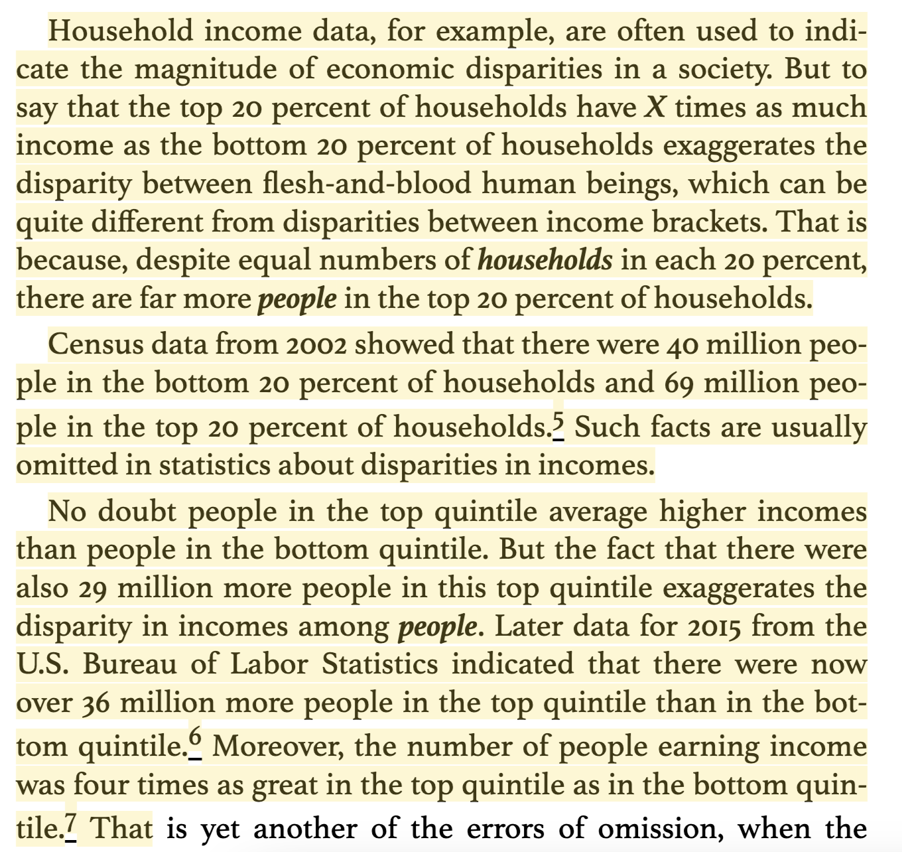
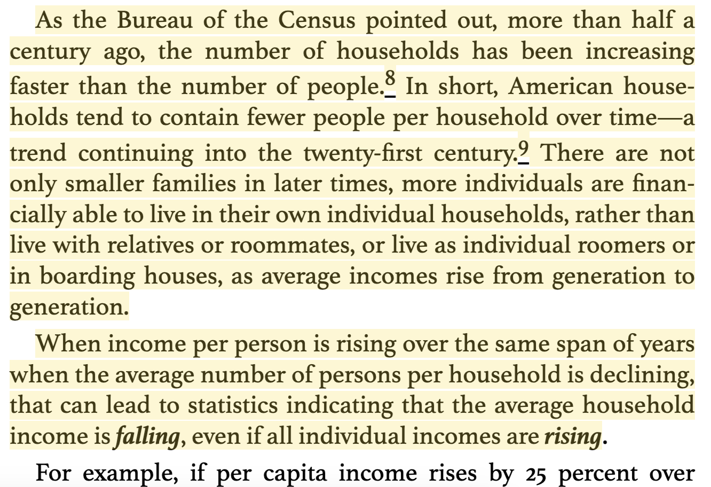
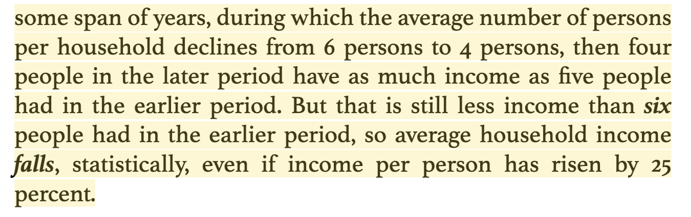

### Income Var. 

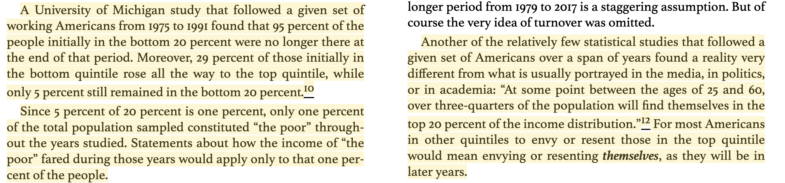

### Cap. Gains As Income

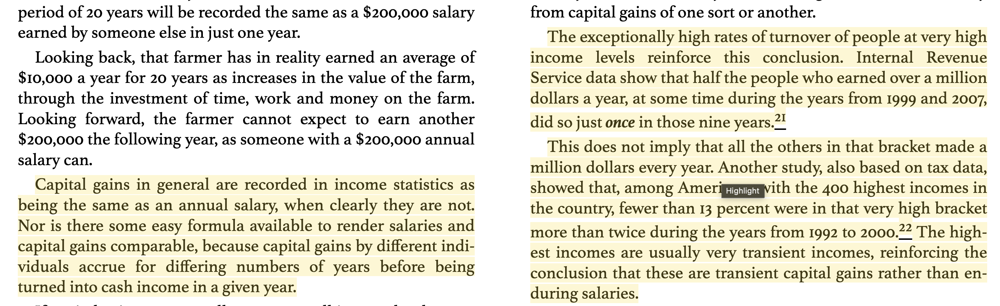

### US Poverty

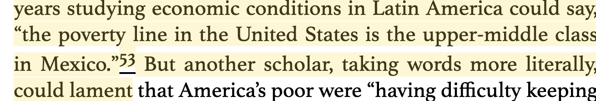

### Inter-Racial Stats. Should Account For Diff. in Age, etc.

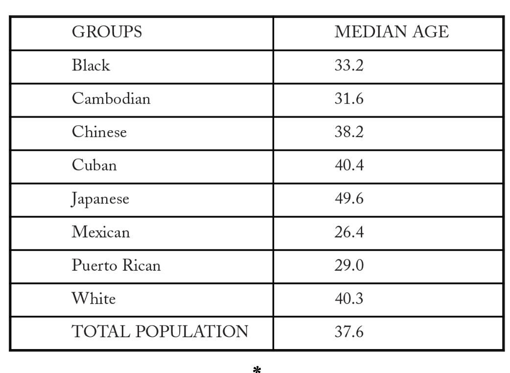

### Birth Order and IQ

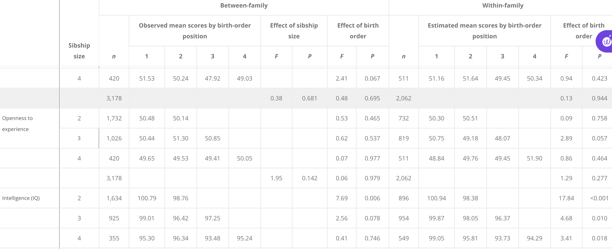

https://www.pnas.org/doi/full/10.1073/pnas.1506451112

Seems like numbers are small. (Sowell acknowledges as much in the end note but argues that it may still be consequential in the tails where a bunch of the dramatic evidence for first born comes from.)

### No Constant 'Superior' Group

Scotts were considered the poorest and the least literate. It was said that no Scottish Baron could write his own name. ... To Adam Smith, Hume, etc. 

Japanese ...

