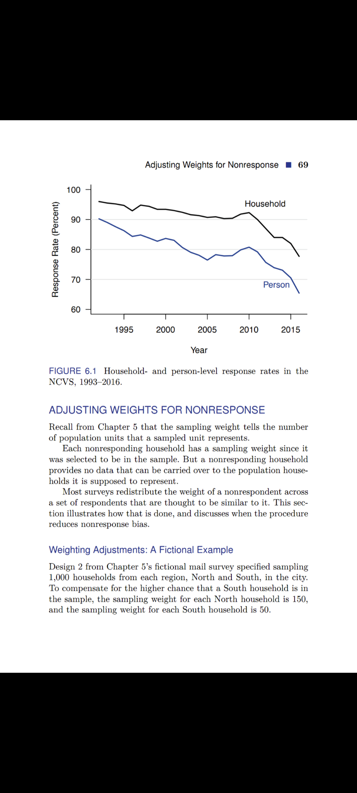
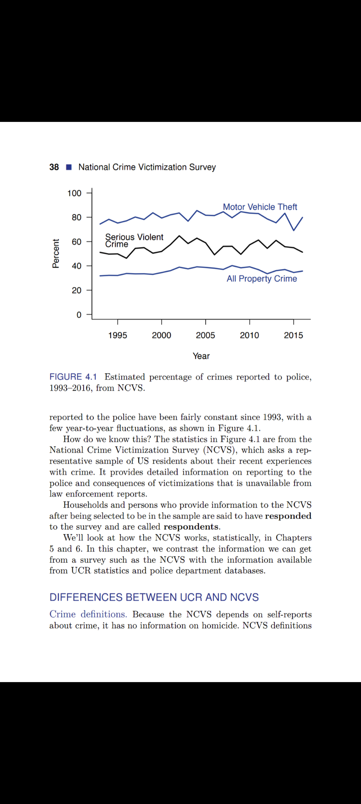
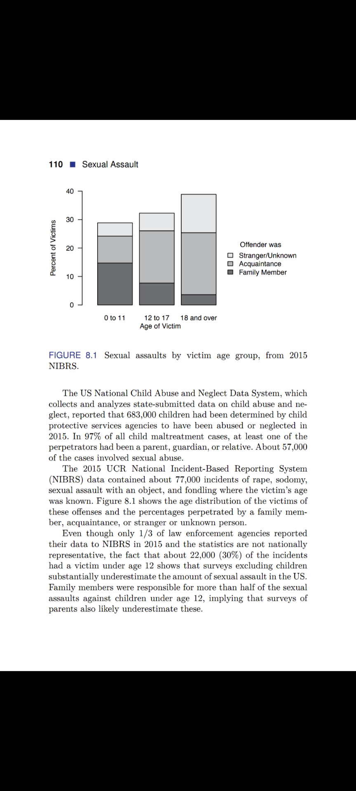
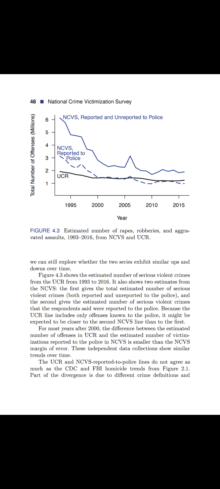

## Measuring Crime

### Defining Homicide Under Violent Crime

* The FBI’s UCR program considers three types of homicide. Murder and nonnegligent manslaughter, the “willful (nonnegligent) killing of one human being by another,” is the only type counted in the violent crime statistics. Negligent manslaughter, the “killing of another person through gross negligence,” and justifiable homicide, which includes killings in self-defense and killings by a law enforcement officer in the line of duty, are tallied separately. 

* The CDC does not use the term “justifiable homicide,” but it has a separate classification, called legal intervention, for deaths caused by law enforcement actions. Killings by private citizens in self-defense are considered justifiable homicides by the FBI but are not considered legal interventions by the CDC.

### Location of Crime

* The FBI and CDC use different rules for where to count a homicide. The FBI counts it in the state and city where the homicide occurred, while the CDC counts it in the state and county where the victim resided. Thus, a New York resident who is murdered in Vermont is counted as a Vermont murder in the UCR but as a New York homicide victim by the CDC. A tourist from Canada who is murdered in Vermont is counted in the UCR statistics for Vermont but does not appear in the CDC statistics. 

* the NCVS (like the CDC homicide statistics) counts it at the victim’s residence. 

* In the UCR (FBI) statistics, however, visitors to a city can be crime victims but are not part of the resident population used as the denominator for the crime rate. A city with a large number of tourists or commuters may have a higher UCR murder rate because the population “at risk” for murder is much larger than the number of residents in the denominator. 

### Race

* Law enforcement personnel determine a homicide victim’s race for the FBI statistics, and funeral directors determine it for the CDC statistics. 

* Mistakes in Identifying Race in Death from All Causes: Elizabeth Arias and colleagues investigated how well the race on death certificates matched self-reported race. They could not ask decedents their race, but they could discover what race some of them had reported while alive. Arias and her team compared the race and ethnicity reported on a person’s death certificate with the race and ethnicity that the person had previously reported on the Current Population Survey. The Current Population Survey has collected data about unemployment from large representative samples of households since 1940. Enough decedents would have participated in the survey to be able to compare the self-reported race and ethnicity with that on the death certificate. 
	* **While almost all blacks and whites had the same classification in the survey as on the death certificate, only 88% of the persons who reported they were Hispanic in the survey were listed as Hispanic on the death certificates. Only 51% of the persons who reported that they were American Indians or Alaska Natives in the survey, and 91% who reported they were Asians or Pacific Islanders in the survey, had the same race on the death certificate. Arias’s investigation considered deaths from all causes.**

### Missing Data

* The FBI reported for 2015: “Of the 18,439 city, county, university and college, state, tribal, and federal agencies eligible to participate in the UCR Program, 16,643 submitted data.” 

* "The FBI imputes values for the months and years in which agencies have missing data." The FBI’s imputation method assumes that: (1) for an agency with between 3 and 11 months of reported data, the murder rate for the missing months is the same as for the months reported, and (2) the murder rate for nonreporting agencies is the same as for reporting agencies in the same group. 

### Response Rate for NCVS

### NIBRS

"NIBRS asks law enforcement agencies to report each incident in as many offense categories as apply (up to 10). The NIBRS data allow researchers to count offenses in multiple ways. The hierarchy rule can be applied to NIBRS data by counting only the most serious offense in each incident. Alternatively, each of the separate offenses in an incident can be tallied. The FBI has estimated that between 8% and 15% of incidents involve multiple offenses."

### Percentage of Reported Crime

In the US, it is estimated that only about 55% of serious violent crimes (rape or sexual assault, robbery, and aggravated assault) and 35% of property crimes (including burglary, motor vehicle theft, and theft but excluding fraud) came to the attention of the police in 2015. Motor vehicle theft typically has one of the highest rates of being reported to the police (usually greater than 75%), and is thought to be high because most insurance companies require a police report to reimburse a claim.

### Estimates of Sexual Violence

* 2016 STUDY BY THE US Government Accountability Office identified 10 separate data collections about sexual violence conducted by federal agencies since 2010. The estimates for 2011 “ranged from 244,190 rape or sexual assault victimizations to 1,929,000 victims of rape or attempted rape.” The estimate of 244,190 came from the 2011 National Crime Victimization Survey (NCVS). This was not the lowest estimate for the year: the FBI Uniform Crime Reports (UCR) recorded 84,175 rapes known to law enforcement agencies in 2011. The estimate of 1,929,000 came from the 2011 National Intimate Partner and Sexual Violence Survey (NISVS). The Centers for Disease Control and Prevention (CDC) launched the NISVS in 2010 to study sexual violence, stalking, and intimate partner violence. The NISVS asks about past-year and lifetime experiences of sexual violence, and the health consequences of that violence. It is the source of the oft-quoted statistic that 1 in 5 women and 1 in 71 men have been raped at some time during their lives.

* In 2010–2012, according to the NISVS, 1.2% of women age 18 and over had been raped in the previous 12 months— more than six times as large as the NCVS percentage of women age 12 and over who had been raped or sexually assaulted during each

### Misc.

* Violent Crime: "Homicide, rape, robbery, and aggravated assault are violent crimes; an FBI statistic about the number or rate of violent crime includes these four, and only these four, offenses."

* A national survey of nearly 8,000 police officers from large departments, conducted in 2016, estimated that 37% of officers reported formal or informal expectations to meet a predetermined number of tickets, arrests, citations, or summonses.

* Burglary Vs. Robbery: If someone broke into your house while you were out and stole your television, you were burgled, not robbed. 

* Every year since the NCVS began, the violent crime victimization rate has been more than five times as large for persons age 12 to 24 as for persons age 65 and over.

* 8 qs. to ask about a statistic

	1. What is the source of the statistic? 
	2. Is there a methodology report? 
	3. How were participants selected? 
	4. What is the sample size? 
	5. What is the response rate? 
	6. What was done about missing data? 
	7. How is crime defined and measured? 
	8. How do the results compare with other information?

