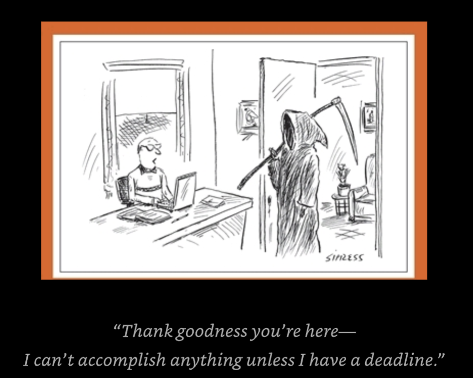

## Heidegger and a Hippo

-----

Millie accompanied her husband Maurice to the doctor’s office. 

After he had given Maurice a full checkup, the doctor called Millie into his office alone. He said, “Maurice is suffering from a serious disease brought on by extreme stress. If you don’t do the following, your husband will die. 

Each morning, wake him up gently with a big kiss, then fix him a healthy breakfast. Be pleasant at all times and make sure he is always in a good mood. Cook him only his favorite meals and allow him to relax after eating. Don’t burden him with any chores, and don’t discuss your problems with him; it will only make his stress worse. Don’t argue with him, even if he criticizes you or makes fun of you. Try to relax him in the evening by giving him massages. Encourage him to watch all the sports he can on TV, even if it means missing your favorite programs. And most importantly, every evening after dinner do whatever it takes to satisfy his every whim. 

If you can do all of this, every day, for the next six months, I think Maurice will regain his health completely.” 

On the way home, Maurice asked Millie: “What did the doctor say?” 

“He said you’re going to die.”

-------

So Ole died, and his wife Lena went to the local paper to put a notice in the obituaries.The gentleman at the counter, after offering his condolences, asked Lena what she would like to say about Ole. Lena said:“You just put ‘Ole died.’ ” Perplexed, the man said, “That’s it? There must be something more you’d like to say about Ole.You lived together fifty years, you have children and grandchildren. Besides, if it’s money you’re worried about, you should know that the first five words are free.” “Okay,” Lena said. “Put down, ‘Ole died. Boat for sale.’ ”

--------

Old Sol Bloom lay dying in his bed, when he suddenly smelled the aroma of his favorite strudel wafting up the stairs. He gathered his remaining strength and lifted himself from the bed. Leaning against the wall, he slowly made his way out of the bedroom and forced himself down the stairs, gripping the railing with both hands. With labored breath, he leaned against the door frame, gazing into the kitchen. If it weren’t for the pain in his chest, he would have thought he was already in Heaven. There, spread out on paper towels on the kitchen table, were literally hundreds of pieces of his favorite pastry. Sol smiled; this was one final act of love from his devoted wife, Sophie, seeing to it that he left this world a happy man. With quivering hand he reached for a piece of the strudel. Suddenly he felt the slap of a spatula. “Stay out of those,” Sophie said. “They’re for after.”

-----------

Fred and Clyde had had many conversations over the years about the afterlife. They agreed that whoever died first would try to contact the other and tell him what Heaven was like. Fred was the first to pass on. A year went by. One day the phone rang, and when Clyde answered, it was Fred! “Is that really you, Fred?” he asked. “You bet, Clyde. It’s really me.” “Great to hear from you! I thought you’d forgotten. So tell me! What’s it like there?” “Well, you won’t believe this, Clyde. It’s absolutely wonderful! We’ve got the most delicious veggies from the lushest fields you have ever seen. We get to sleep in every morning, have a fabulous breakfast, and then make love the rest of the morning.After a nutritious lunch, we go out in the fields and make love some more.Then it’s time for a gourmet dinner and some more love-making until bedtime.” “Omigod!” said Clyde. “Heaven sounds fabulous!” “Heaven?” said Fred. “I’m a rabbit in Arizona.”

--------------

When Bob found out he was going to inherit a fortune after his sickly father died, he decided he needed a woman to enjoy it with. So one evening he went to a singles’ bar where he spotted the most beautiful woman he had ever seen.

Her natural beauty took his breath away.“I may look like just an ordinary guy,” he said as he walked up to her, “but in just a week or two my father will die, and I’ll inherit twenty million dollars.”

Impressed, the woman went home with him that evening. Three days later, she became his stepmother.

--------------

Clara went to a psychiatrist and said, “Doctor, you’ve got to do something about my husband—he thinks he’s a refrigerator!” “I wouldn’t worry too much about it,” the doctor replied. “Lots of people have harmless delusions. It will pass.”

“But you don’t understand,” Clara insisted. “He sleeps with his mouth open, and the little light keeps me awake.”

-------

I was walking across a bridge one day, and I saw a man standing on the edge, about to jump off. So I ran over and said,“Stop! Don’t do it!” “Why shouldn’t I?” he said. “Well, there’s so much to live for!” “Like what?” “Well . . . are you religious?” He said yes. I said, “Me too! See? We’ve got lots in common already, so let’s talk this thing through. Are you Christian or Buddhist?” “Christian.” “Me too! Are you Catholic or Protestant?” “Protestant.” “Me too! Are you Episcopalian or Baptist?” “Baptist.” “Wow! Me too! Are you Baptist Church of God or Baptist Church of the Lord?” “Baptist Church of God!” “Me too! Are you original Baptist Church of God, or are you reformed Baptist Church of God?” “Reformed Baptist Church of God!” “Me too! Are you Reformed Baptist Church of God, reformation of 1879, or Reformed Baptist Church of God, reformation of 1915?” He said, “Reformed Baptist Church of God, reformation of 1915!” I said, “Die, heretic scum,” and pushed him off.

Phillips has an even shorter version (if you’re running out of time): Probably the toughest time in anyone’s life is when you have to murder a loved one because they’re the devil.

-----------

After twelve years of therapy my psychiatrist said something that brought tears to my eyes. He said, “No hablo inglés.”

------------

Marty goes to Doctor Lewis for a check-up. After extensive tests the doctor tells him, “I’m afraid I have some bad news for you, Marty.You only have six months to live.” Marty is dumbstruck. After a while he says, “That’s terrible, doctor. And I must admit to you that right now I can’t afford to pay your bill.” “Okay,” says Dr. Lewis, “I’ll give you a year to live.”

-----------

Tillich, an existentialist Christian theologian, believed that eternal life is not life that goes on and on with no end in sight, like Law and Order.

-----------

Reggie married one of a pair of identical twins. Less than a year later, he was in court filing for a divorce. “Okay,” the judge said, “tell the Court why you want a divorce.”

“Well,Your Honor,” Reggie began, “every once in a while my sister-in-law would come over for a visit, and because she and my wife are so identical-looking, every once in a while I’d end up making love to her by mistake.” “Surely there must be some difference between the two women,” the judge said. “You’d better believe there is a difference,Your Honor.That‘s why I want the divorce,” he replied.

-----------

Sean and Bridget had been seeing each other steadily for forty years.Then one day after a leisurely walk in the green hills of Kerry, Sean turned to Bridget and said, “You know, maybe we should get married.” Replied Bridget: “At our age, who’d have us?”

----------

