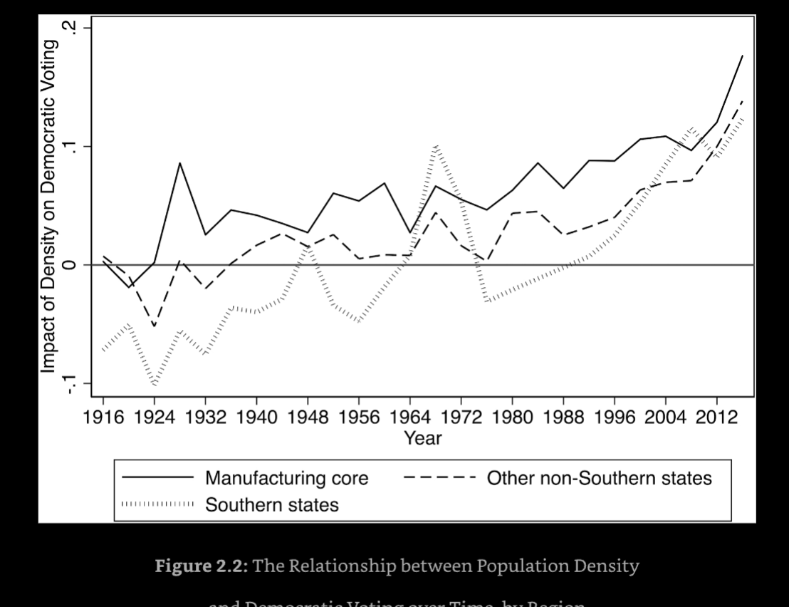
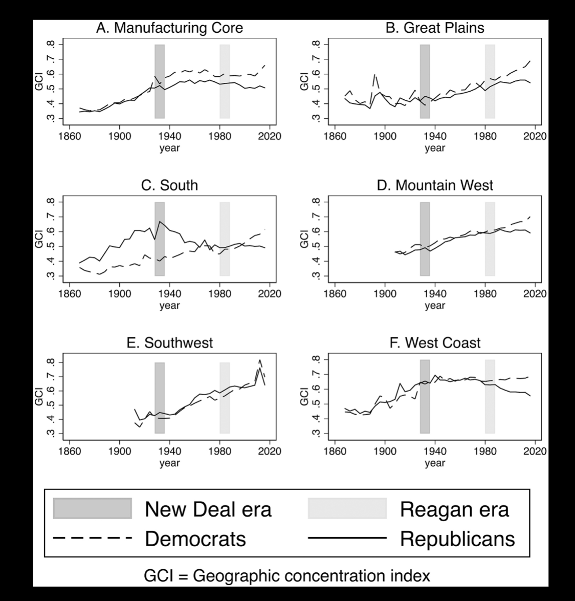
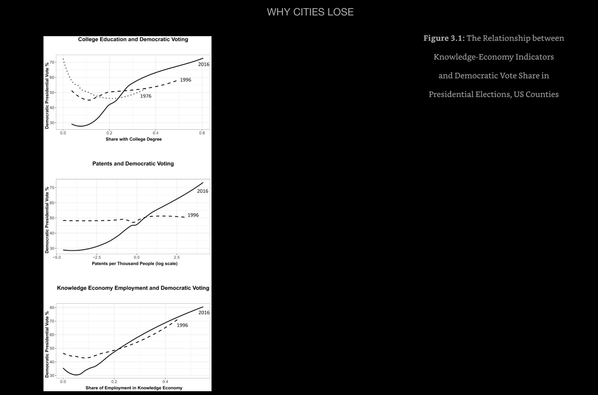
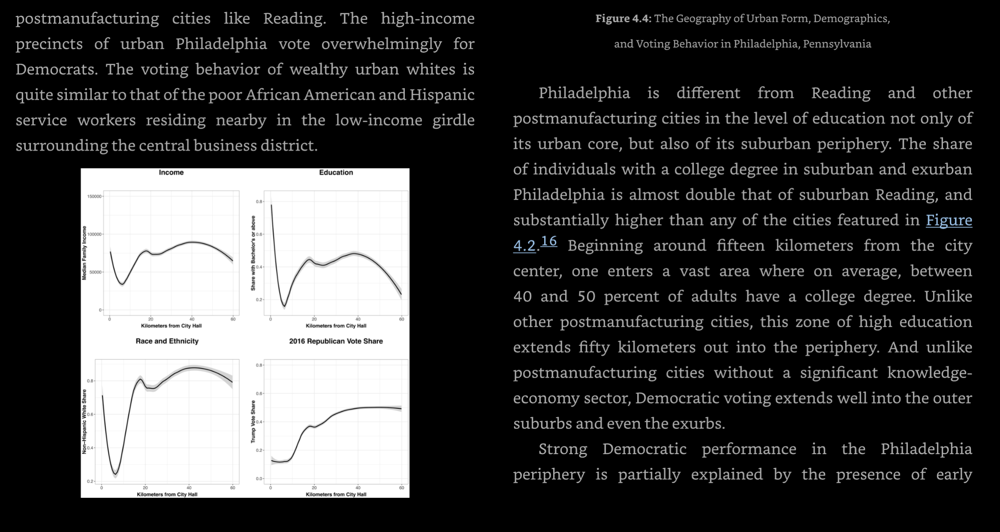
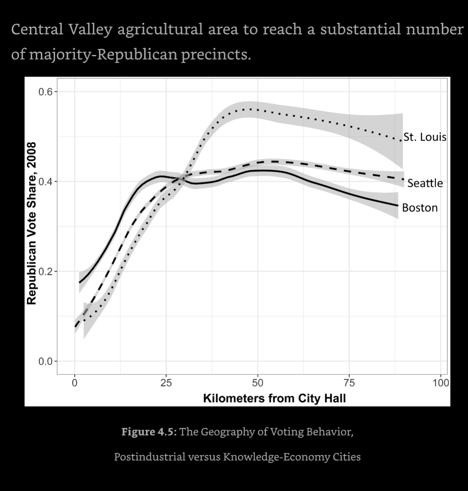
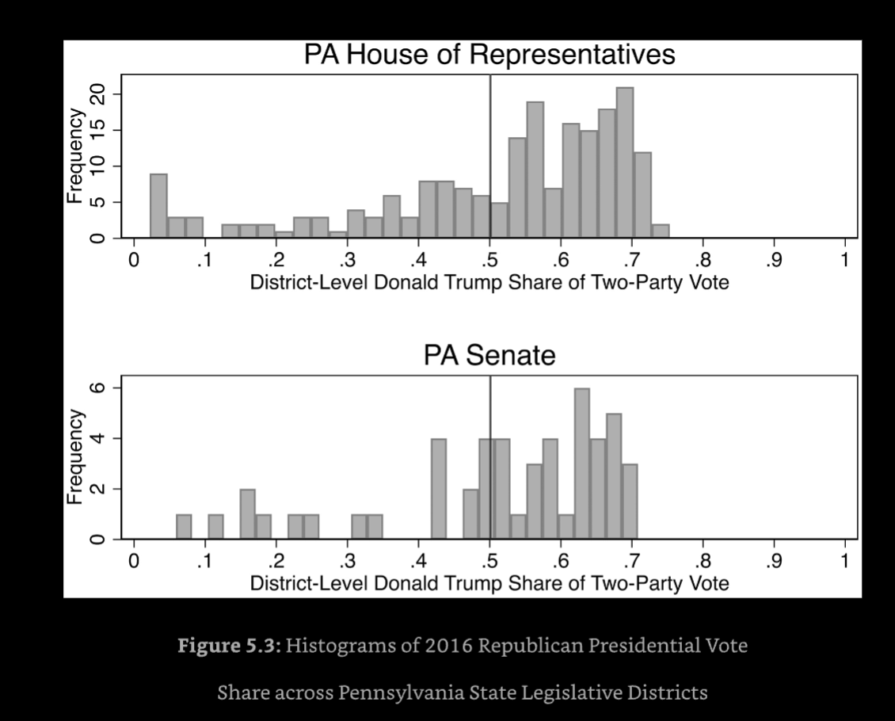
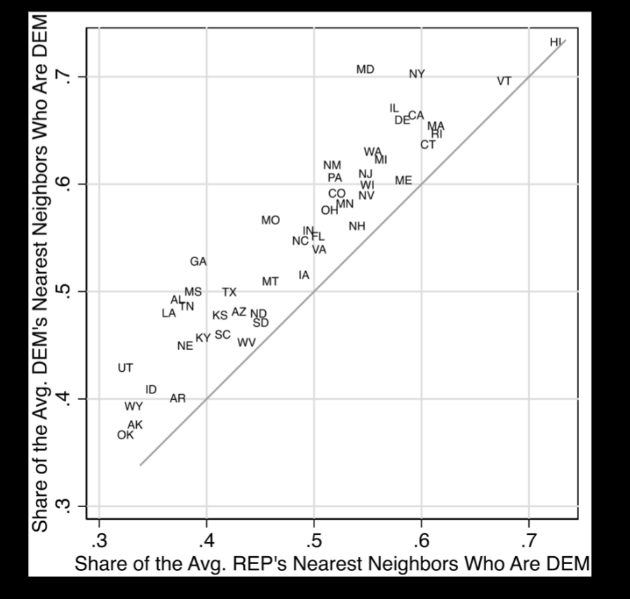
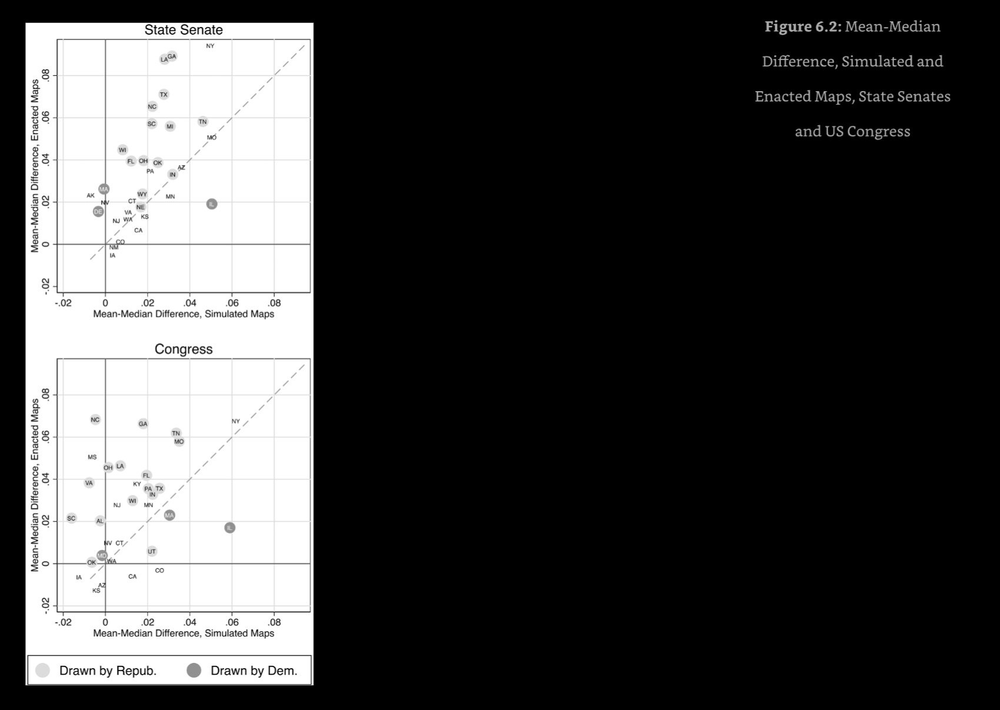
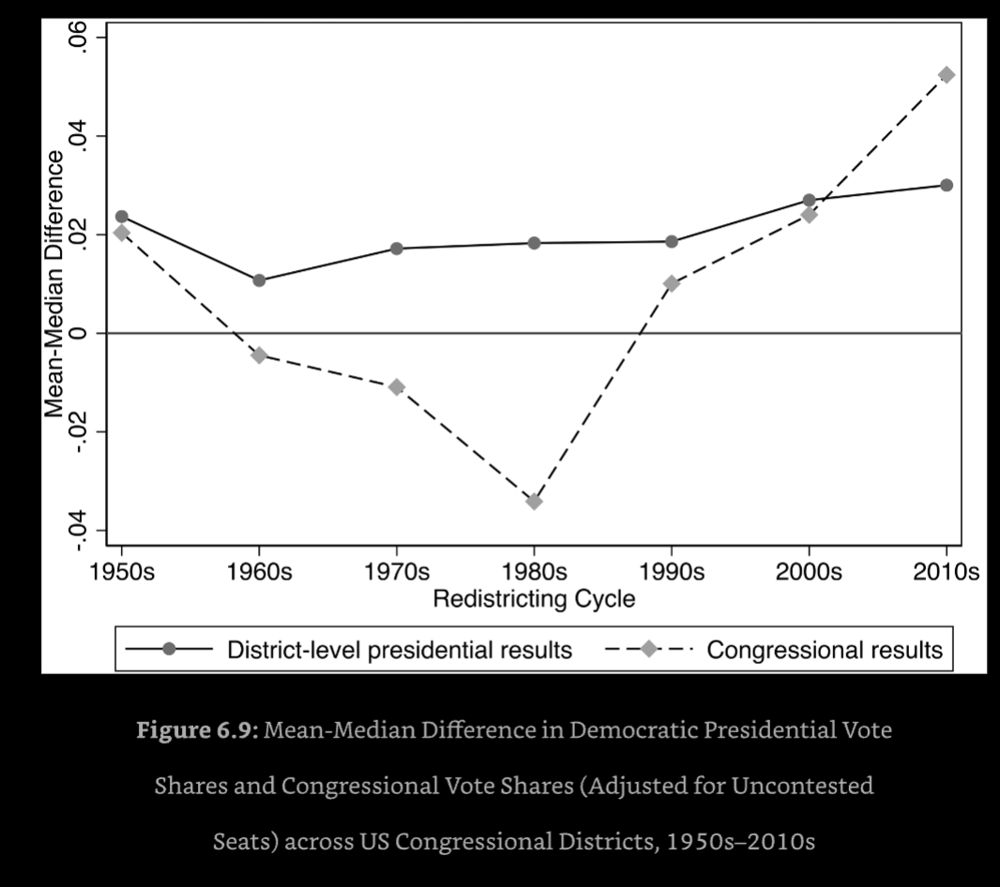

## Why Cities Lose

### Problem

The difficulty of the plurality electoral system became readily apparent for the socialist and labor parties. As they tried to expand beyond their initial districts and take over the left side of the political spectrum, they found that their seat share fell far below their vote share in almost every European country. Their support was too deeply concentrated in a handful of districts, and in many cases they were hamstrung by the need to coordinate with “bourgeois liberals,” whom many socialist leaders detested.

Consider the Social Democrats in Germany. In every election from 1890 to 1907, they won more votes than any other party, but they never won the most seats. Their main competitor on the right sometimes received twice as many seats despite receiving a million fewer votes. In the parliamentary elections of early twentieth-century Denmark, the Social Democrats routinely won the most votes while winning far fewer seats than their competitors. In 1915, the Liberal and Labor Parties in Norway won almost identical vote shares, but the Liberals received almost four times as many seats as Labor. In 1918, the Norwegian Labor Party had more votes than any other party, but the Conservative Party and Liberal Party each had twice as many seats.

PR as a solution: The adoption of PR was in some cases, as in Germany, Switzerland, and Austria, driven primarily by the agitation of the workers’ parties.

After the introduction of PR, social democratic and workers’ parties saw an immediate and sometimes dramatic increase in their legislative representation. After the transition to proportional representation in 1915, the Danish Social Democrats immediately received a seat share roughly equal to their vote share for the first time in their history. By 1924, they were at the head of a coalition government. In Norway, the Labor Party had received only 14 percent of the seats with 32 percent of the vote in 1918. After the transition to PR in 1919, it received a seat share much closer to its vote share, and by 1927 it was the largest party in parliament. After the adoption of proportional representation and the abolition of plural voting in 1919, the Belgian Workers’ Party won 38 percent of the seats in the legislature and joined a coalition government, and by 1925, it was the largest party in the Belgian Federal Parliament.16 The German Social Democrats had received 11 percent of the seats with 29 percent of the vote in 1907, and 28 percent of the seats with 35 percent of the votes in 1912. After the introduction of proportional representation in 1919, they received 38 percent of the vote and became the largest party in parliament with 39 percent of the seats.

### Dem. Transformation into Left

The Democratic political machines were rooted in ethnic politics rather than class struggle, but to fend off challenges from candidates favored by organized labor, Democrats like New York governor Al Smith increasingly embraced a pro-labor agenda. What started as an idiosyncratic local connection between urbanization and Democratic voting in New York quickly spread to the rest of the industrialized states in 1928 when the Democrats chose Al Smith, the Irish-Catholic, anti-prohibition New Yorker, as their presidential nominee. As governor of New York, Smith had fought for pensions, workers’ compensation, workplace safety, and other policies that benefited urban workers, bringing them into the fold of the Democratic Party. It was not quite the agenda of the Socialists, but it was the beginning of the Democrats’ transformation

Smith was no socialist, and much of his appeal in big cities appears to have been due to the politics of ethnicity and Catholicism. Smith only received 26 percent of the vote in heavily German (and heavily industrialized) Berks County, for instance. The Democratic Party’s full embrace of urban labor did not occur until after FDR’s election in 1932. By 1936, after the heart of the New Deal agenda had been implemented, the urban, industrialized parts of Pennsylvania, including Berks County, had become solidly Democratic.

### Density, Mfg., Know Economy Dem Vote share

### Moral/Econ. Pref.

### Distance From City Center/Dem. Vote Share

### Dems are Packed

"However, urban political geography creates a strong countervailing logic. In a number of large, politically competitive states, the Democrats might be in a better position to win statewide Senate elections than to win the median congressional district. In the long run, within relatively competitive states, we should expect to see that senators tend to exhibit more liberal voting behavior than the median member of the congressional delegation."

### Dem. Constraints

1. Partisans from the Pennsylvania or Berks County Democratic Party pushing for smaller Democratic majorities in Reading or Lancaster might find themselves up against longstanding urban incumbents. Thomas Caltagirone has represented District 127 in Reading for over forty years, and Mike Sturla has represented District 96 in Lancaster for over twenty-five years.

2. The pragmatists face a vexing challenge that animates this chapter: the distribution of voters’ ideology across districts is just as skewed as the parties’ vote shares. Like the socialists in early twentieth-century Europe, contemporary voters in urban districts are well to the left of the median suburban district.

3. Because progressive voters are concentrated in cities, the median voter in the United States as a whole is to the left of the median district.

4. In states where progressives are highly concentrated in cities, US Senate candidates are trying to appeal to a relatively progressive statewide median voter, while congressional candidates in the median district are chasing after a more conservative voter.

