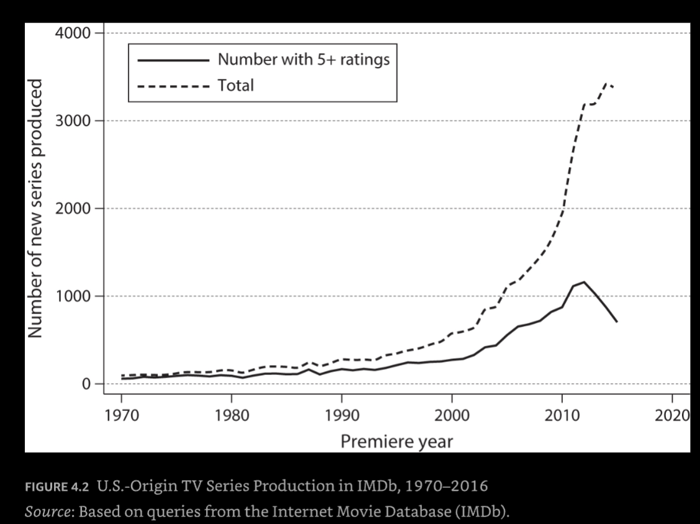

## Digital Renaissance

### Declining Cost of Production of Movies

1. Prior to 2000, movies were shot with very expensive cameras requiring film, which was costly to buy, develop, and edit. While Hollywood studios tended to rent their cameras from Panavision, sources indicate that each camera cost roughly a quarter of a million dollars. Daily rentals of a professional-quality camera averaged $1,000.

2. Between 2002 and 2005, various firms including Sony, Red, and Arri introduced digital motion-picture cameras targeted at professionals. These cameras cost roughly a quarter of what film cameras of comparable quality cost. ... In 2002, George Lucas shot the first major film in high-definition (HD) digital, Star Wars: Episode 2

3. Then, in 2008, Canon introduced the EOS 5D Mark II. While mainly a still camera, it used interchangeable lenses and was also capable of shooting professional-quality HD video. Priced at $2,000, this camera made it possible for independent filmmakers to achieve professional-quality results.

### Rise in the Number of Movies Being Produced

Sharp rise in the number of movies being produced. 

Subsetting to movies where producers created an IMDB page or a page was created. Assumes away YT, etc.

See: https://www.imdb.com/search/title/?title_type=feature&release_date=2022-01-01,2022-12-31&countries=US

Movies released by year:
2000, 5,223
2005, 7,718
2010, 12,767
2015, 17,245
2019, 18,966
2022, 20,179

* The graph in the book is already outdated as the catalog gets updated but the trend of more movies over time is clear.

Sundance submissions:
2004, 2,485  ---book
2010, 3,751 --- book
2024, 17,435 titles --- website

### Move Quality Over Time

### Rise in the Number of TV Shows Being Produced

### Rise in the Number of Quality TV Shows

### Independent TV 

### Rise in the Number of Books Published Each Year

* Books with ISBN

"According to the latest Bowker data (Publishers Weekly, February 20, 2023), 2.3 million books were self-published in the US in 2021"
"According to Bowker, just 282,500 new titles (combining self-published titles and traditionally published titles) were published in the US in 2005 (Bowker Report, April 14, 2010)."

via https://ideas.bkconnection.com/10-awful-truths-about-publishing

see also: https://wordsrated.com/number-of-books-published-per-year-2021/

