# Data Analysis and Regression

Fred Mosteller and John Tukey treat regression as a disciplined way to learn
from data. A fitted equation is one step in an iterative analysis, not the
analysis itself. The analyst must first understand the shape of the data, choose
useful representations, distinguish prediction from intervention, and check what
the model leaves unexplained.

## Regression has two meanings

The first meaning is descriptive. For each value of an explanatory variable
\(x\), calculate the mean or another local summary of \(y\). The resulting
sequence of local averages is the regression curve. It describes how the
conditional distribution of \(y\) changes with \(x\) without first imposing a
line or polynomial.

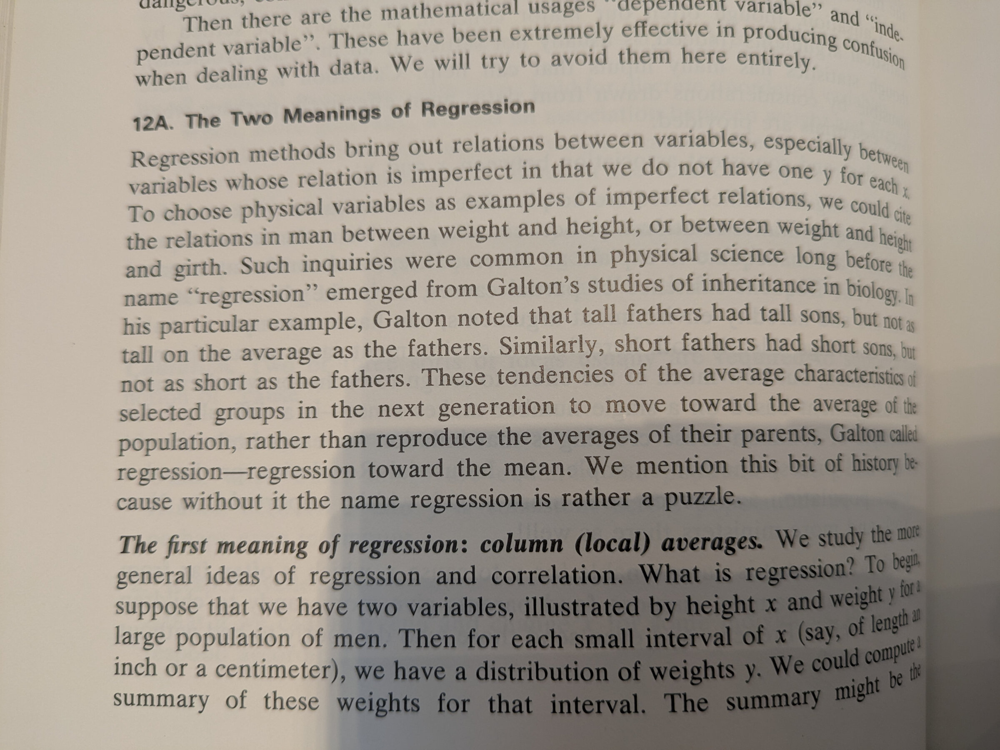

The second meaning is fitted. The analyst chooses a functional form, such as a
line, quadratic, or logarithm, and estimates its coefficients. Sparse data may
force this choice, and a smoothed plot may suggest it. But the fitted function
is only an approximation to the regression curve that much richer data might
reveal.

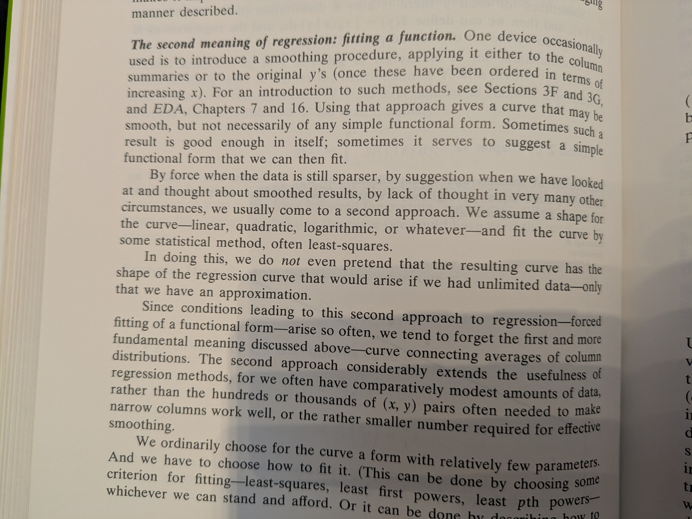

This distinction prevents a common error. A precise equation does not prove that
nature generated the data through that equation. The equation is a compact
description whose adequacy must be checked.

## Learn the shape before fitting the equation

Exploration should precede formal modeling. Mosteller and Tukey repeatedly use
three tools:

- Smooth the response to reveal broad structure. Repeated running medians can
  suppress local noise without allowing a few extreme values to control the
  result.
- Re-express \(x\), \(y\), or both when a curved relation becomes simpler on a
  different scale. Comparing slopes across parts of a curve provides a direct
  check of whether a transformation has straightened it.
- Inspect residuals after every important fit. A useful straight-line fit should
  leave residuals with roughly constant spread and should describe comparable
  subsets in a consistent way.

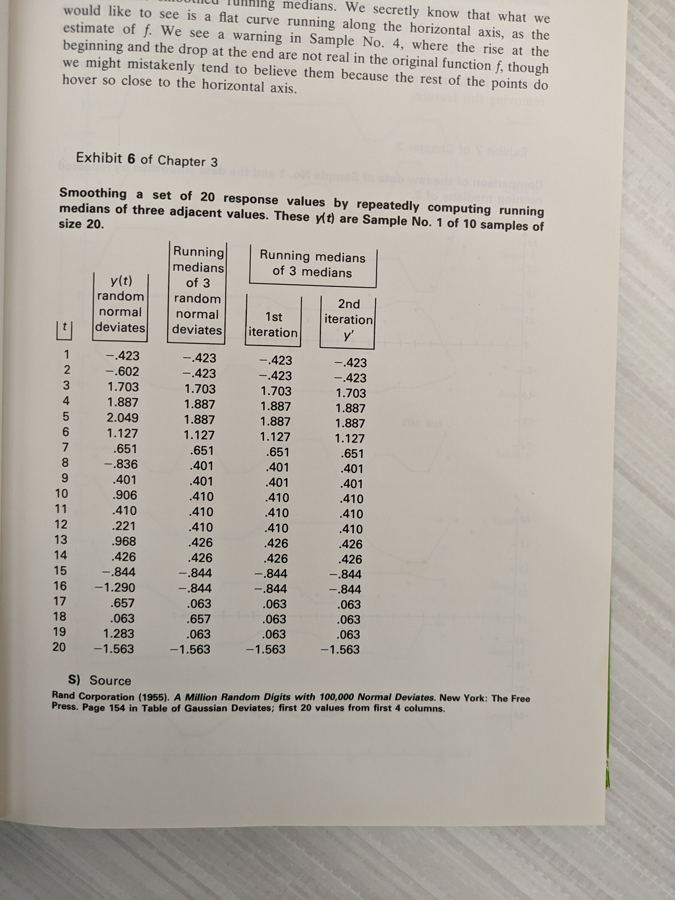

Smoothness is not just visual. A turning point occurs when the middle of three
successive observations is the largest or smallest. Random sequences contain
many turning points; a successful smooth contains fewer. The count is a rough
diagnostic, not a target to optimize mechanically, because smoothing can also
create false behavior near the ends.

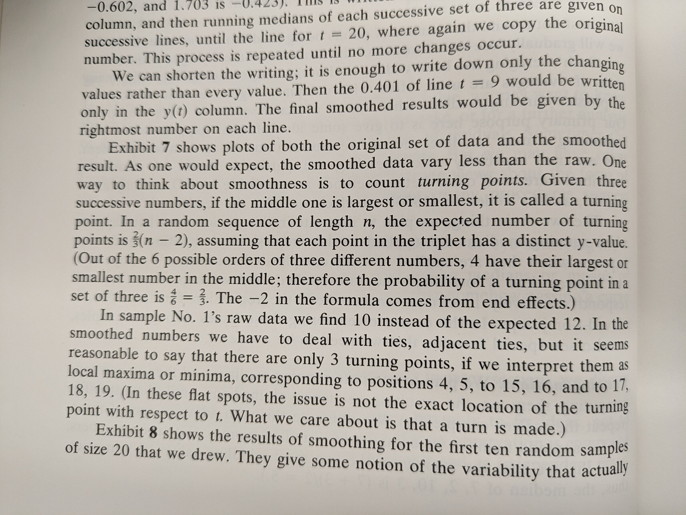

Transformation should simplify a relation rather than decorate it. In the worked
example below, cubing \(y\) makes slopes from two regions nearly equal. That
gives the transformation a visible purpose: it turns the curve into something
close to a line.

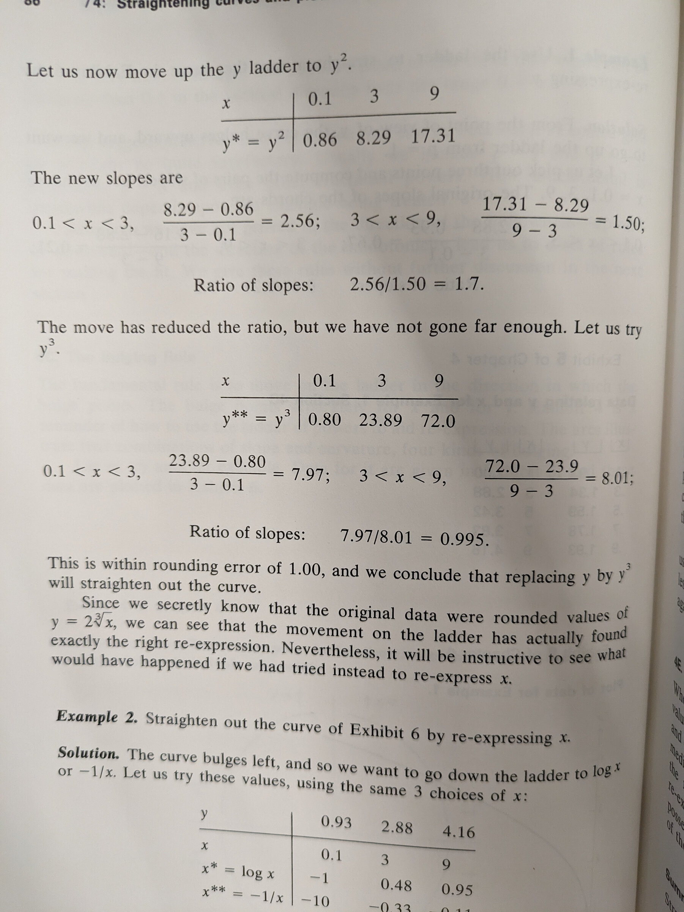

## Coefficients depend on coordinates

Polynomial regression makes this dependence easy to see. Fitting

\[ a + bx + cx^2 \]

can be numerically unstable because \(x\) and \(x^2\) are often highly
correlated. Centering \(x\) and fitting

\[ a^{\ast} + b^{\ast}(x - x_0) + c^{\ast}(x - x_0)^2 \]

describes the same curve with better-scaled predictors. When \(x\) lies on a
positive interval, its correlation with \(x^2\) can be about 0.97 even when
\(x\) is uniformly distributed. The data may determine the fitted curve well
while determining its individual coefficients poorly.

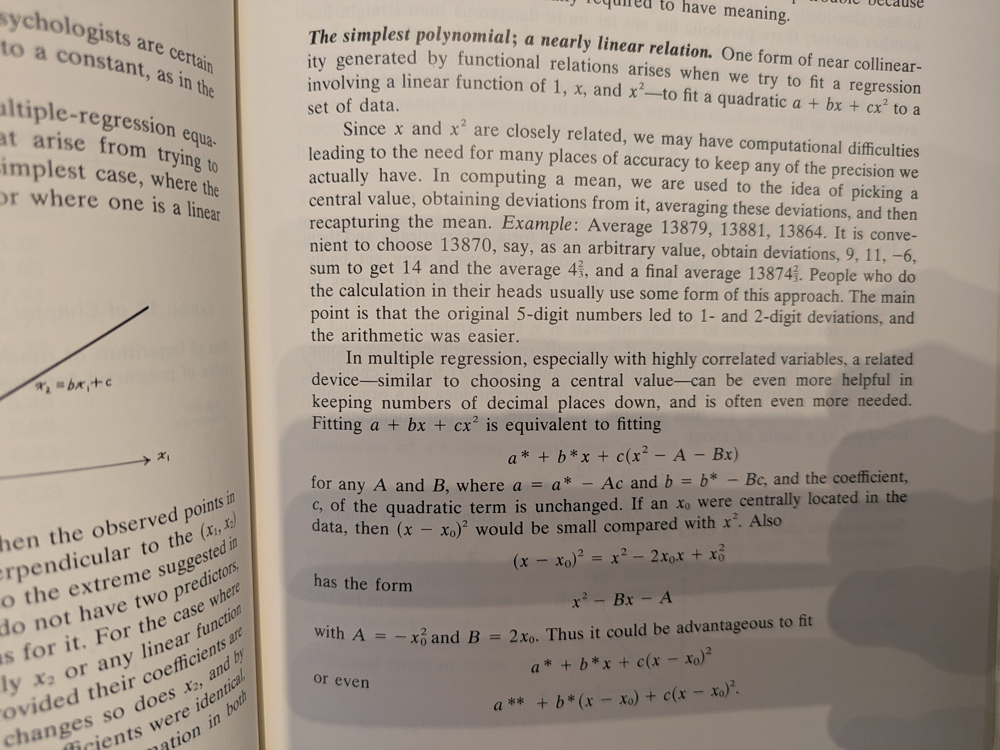

This is why polynomial coefficients rarely deserve substantive interpretation
one at a time. Plot the fitted curve, or the difference between two fitted
curves. A coefficient on \(x\) is not automatically the effect of changing \(x\)
while holding every polynomial term fixed, since those terms are functions of
the same variable.

The same warning applies to ordinary multiple regression. "Change \(x_j\) while
holding the other predictors fixed" may describe a mathematical comparison that
no feasible policy or physical intervention can produce.

## Closely related predictors do not reveal separate effects

Several variables intended to measure the same thing will often be highly
correlated. Each then acts as a proxy for the others. Their combined
contribution may be stable even when no individual coefficient is.

Mosteller and Tukey recommend using subject knowledge to condense such variables
into a composite. The analyst should choose the composite without tuning it to
the response. They can then regress each component on the composite and inspect
the residuals. A component earns a separate place in the final regression only
if its residual variation is large enough to be credible and useful rather than
routine measurement error.

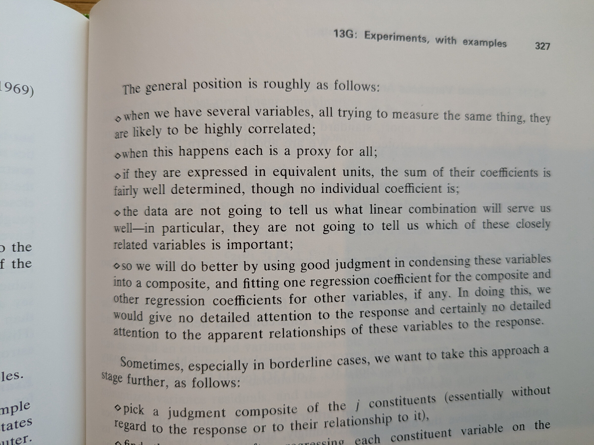

Regression cannot decide which of several near-duplicate measurements matters
independently. A coefficient can become large, small, or change sign as the
analyst swaps proxies while the fitted values barely move.

## Prediction is not intervention

Regression often appears to answer more than the data can support. An
observational coefficient describes conditional association under a chosen
model. It does not by itself say what would happen if someone changed the
predictor.

The wartime bombing example makes the problem concrete. A regression linked more
fighter opposition to smaller bombing errors, as though enemy fighters improved
accuracy. Cloud cover was missing from the model. Fighters were less likely to
appear when clouds obscured the target, and obscured targets were harder to hit.
Fighter opposition therefore served as a proxy for visibility.

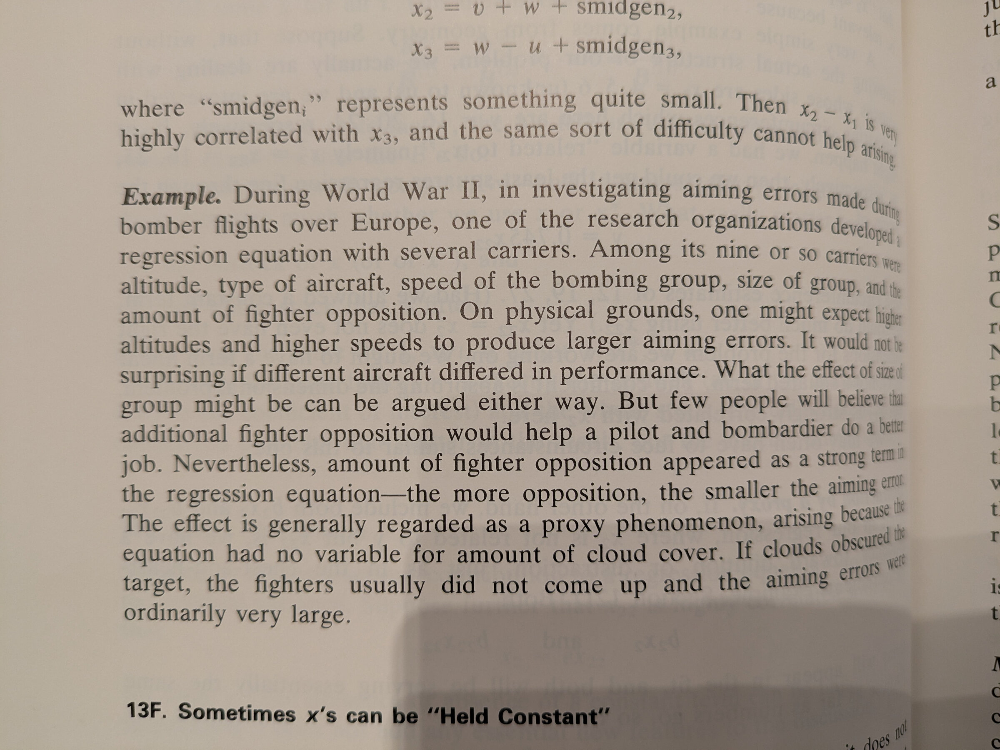

Their causal rule is direct: to learn what happens when a complex system is
disturbed, disturb it. Passive observation can still describe and predict, but
causal interpretation requires an experiment or additional assumptions that
connect the observed comparison to a possible intervention.

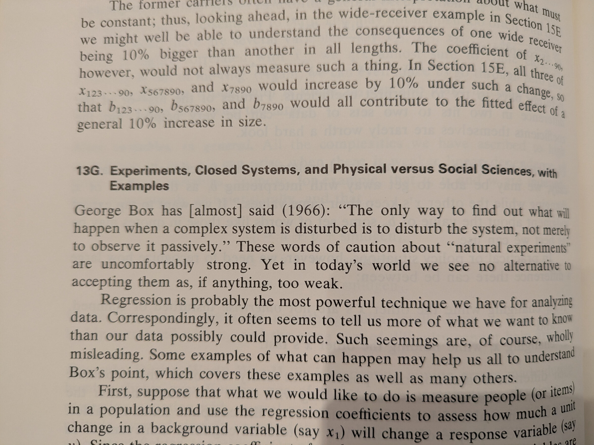

## Model building is organized judgment

Mosteller and Tukey call predictors _carriers_. When many carriers are
available, they divide them into:

- a small set of key carriers that every model should include;
- a promising set that deserves sustained comparison;
- a haystack that receives limited exploratory attention.

The workflow combines methods. First, fit the key carriers resistantly and
remove their fitted contribution from the response and remaining carriers. Next,
use an all-subsets search on the promising set. Use stepwise regression only to
search the haystack for additions, then check the chosen nonkey carriers with
another all-subsets comparison. At every stage, inspect unusual residuals and
reconsider measurements that may be wrong.

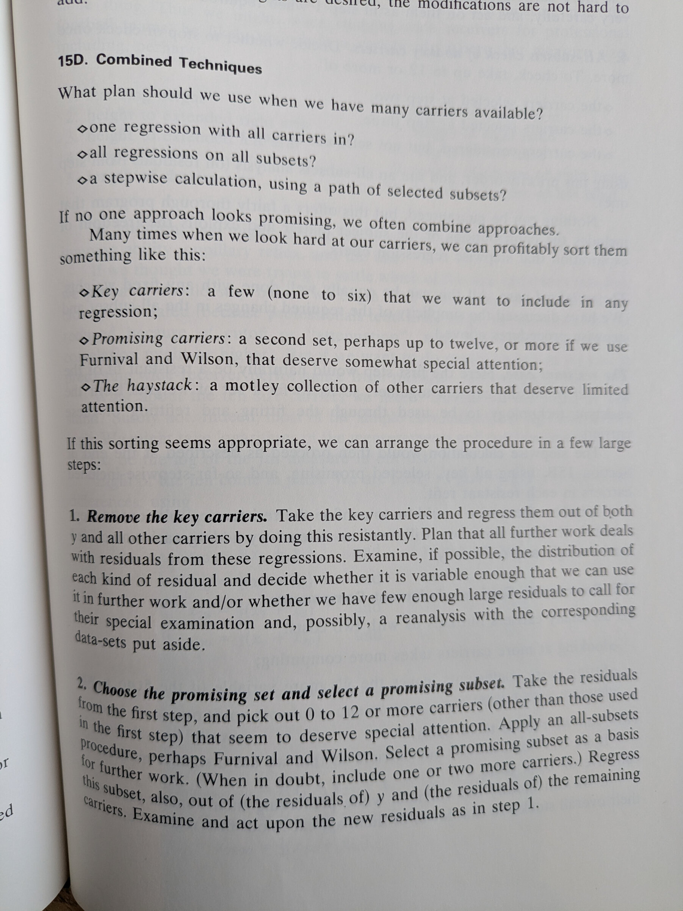

No search procedure guarantees the right model. The virtue of this scheme is
that it gives subject knowledge priority while retaining room for exploration.
For a large dataset, the authors recommend starting with the smallest useful
subsample and increasing the sample size as the analysis matures. More data do
not remove the need to look.

## Resistant fits limit leverage

Ordinary averages and least squares give distant observations great leverage.
The biweight location estimate instead gives the largest weight to observations
near a robust center, reduces the weight as distance grows, and gives zero
weight past a cutoff scaled by the interquartile range. Resistant methods do not
license automatic deletion. They show whether a conclusion depends on a few
observations and direct attention to cases worth checking.

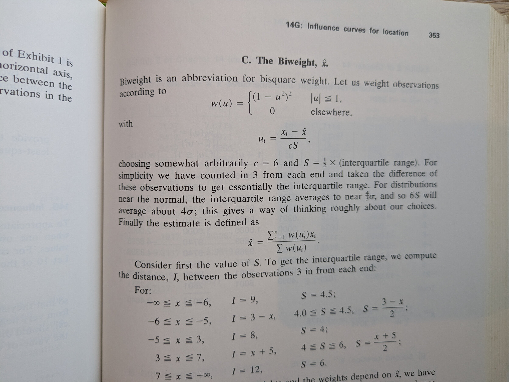

## Small samples need wider intervals

Student's \(t\) distribution calibrates uncertainty to the available degrees of
freedom. With 12 degrees of freedom, a 95 percent interval based on \(t\) is
about 11 percent longer than its normal approximation. With one degree of
freedom, it is about 6.5 times as long. The adjustment shrinks as information
accumulates. Its practical lesson is to acquire enough degrees of freedom and
report the uncertainty the data can support.

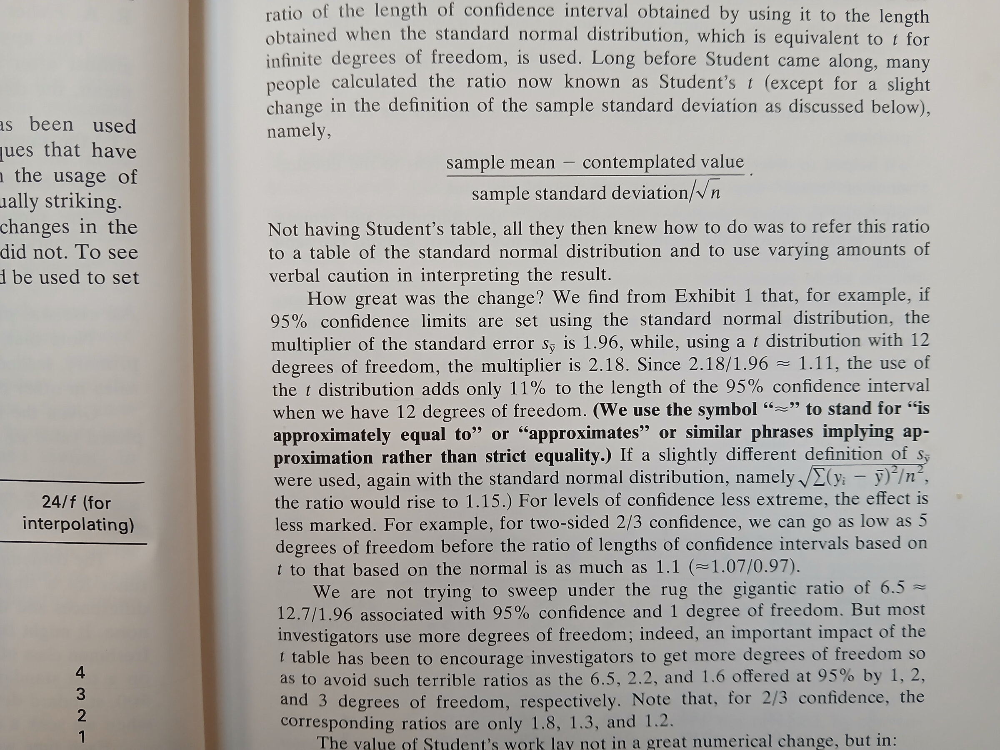
