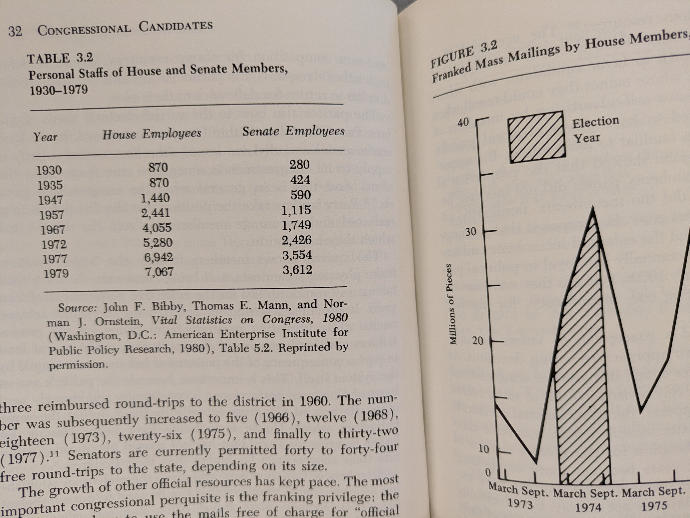
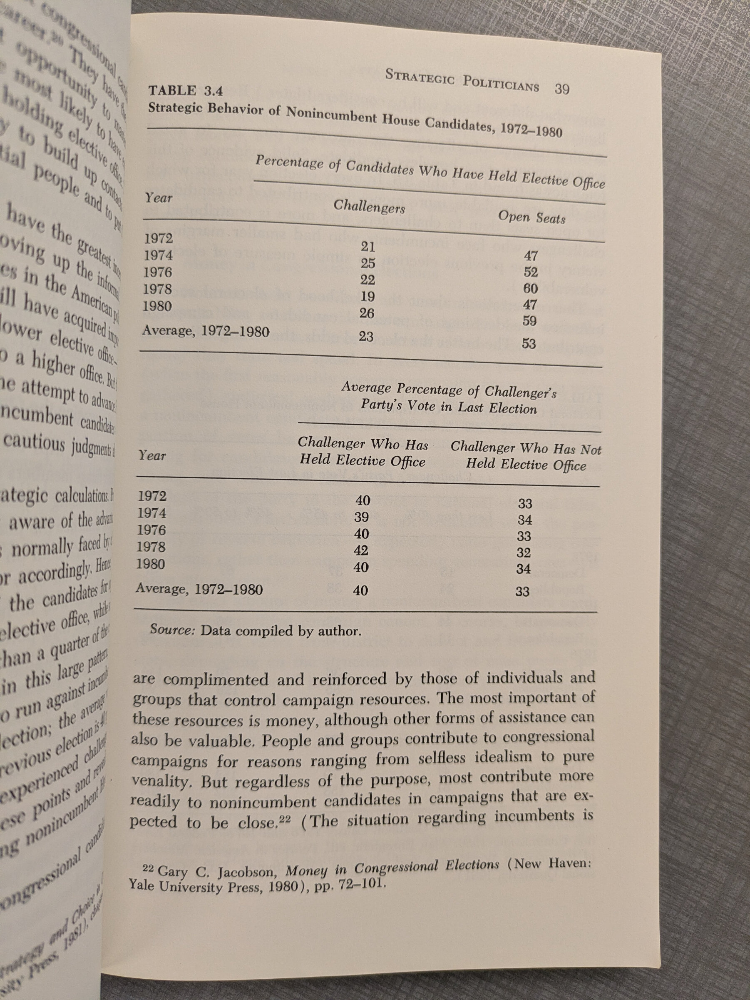
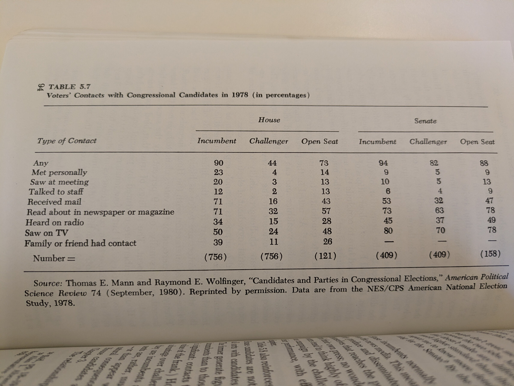

## The Politics of Congressional Elections

- **Earlier periods of rise in skepticism** Back in 1964, 76 percent of the
  American people thought the federal government could be trusted to do what was
  right most or all of the time; fourteen years later only 24 percent thought
  so. In 1964 only 29 percent thought that the government was run by a few big
  selfish inter-ests; by 1980, 77 percent were of that opinion. Forty-seven
  percent believed in 1964 that government wasted a lot of tax money; 80 percent
  believed it in 1980. The proportion feeling that people in government are
  smart and know what they are doing dropped from 69 percent to 35 percent over
  the same period! --- Miller et al. ANES

### Incumbents

- The desire to win decisively enough to discourage future opposition also leads
  incumbents to campaign a good deal harder than would seem objectively
  necessary.

- three reimbursed round-trips to the district in 1960. The number was
  subsequently increased to five (1966), twelve (1968), eighteen (1973),
  twenty-six (1975), and finally to thirty-two (1977)." Senators are currently
  permitted forty to forty-four free round-trips to the state, depending on its
  size. The growth of other official resources has kept pace. The most important
  congressional perquisite is the franking privilege: the right of members to
  use the mails free of charge for "official business," which is broadly
  interpreted to include most kinds of communications to constituents. Franked
  mail increased by more than 600 percent between 1954 and 1970. A recent
  estimate put the total cost of congressional mail for a twelve-month Period
  (1976-1977) at more than $62 million, with an average of more than $117,000
  per member

### Malapportionment + History of Congressional Districts

- Following the initial census in 1790, membership of the House was set at 105,
  with each state given one seat for each 33,000 inhabitants. Until 1911, the
  House grew as population increased and new states were added. Congress avoided
  the painful duty of reducing any state's representation in response to
  population shifts by adding seats after each decennial census. A crisis thus
  arrived with the 1920 census results. Large population shifts between 1910 and
  1920 and a fixed House membership would mean that many states -and members of
  Congress— would lose seats. Adding to the turmoil was the discovery by the
  census that, for the first time, a majority of Americans lived in urban rather
  than rural areas. Reapportionment was certain to increase the political weight
  of city dwellers and reduce that of farmers. The result was an acrimonious
  stalemate that was not resolved until 1929, when a law was passed establishing
  a permanent system for reapportioning the 435 House seats after each census;
  it would be carried out, if necessary, without additional legislation.

- At first federal law fixed only the number of representatives each state could
  elect; other important aspects of districting were left to the states. Until
  1842, single-member districts were not required by law, and a number of states
  used multi-member or at-large districts. Thereafter, apportionment legislation
  usually required that states establish contiguous single-member districts and,
  in some years, required that they be of roughly equal populations and even
  "compact" in shape. Such requirements were never, when challenged,
  successfully enforced. Single-member districts became the overwhelming norm,
  but districts composed of "contiguous and compact territory... containing as
  nearly as practicable an equal number of inhabitants," in the words of the
  1901 reapportionment act, did not.10

- Many states continued to draw districts with widely differing populations. In
  1930, for example, New York's largest district (766,425) contained nearly nine
  times as many people as its smallest (90,671). As recently as 1962, the most
  populous district in Michigan (802,994) had 4.5 times the inhabitants of its

### District Politics

Think about heterogeneity of the population ...

- Size: House districts are as small as a few city blocks (New York's 18th
  District) or as large as Alaska's 586,000 square miles ...
- Population: California's senators, who are expected to represent 23,000,000
  people
- Distance from DC: CA is 2,500 miles from Washington, D.C.
- Economic Base: Sixty percent of the workers in the 7th District of Michigan
  get their paycheck from General Moters; 38 percent of those in Maryland's 5th
  District work for the federal government; 35 percent of those in South
  Carolina's Ist District are on the military payroll. Delaware is the home of
  DuPont, with annual revenues of
  $10 billion compared to the state government's $500 million income.
- Communication: Communications. Peoria is at the center of Illinois 18th
  Dis-trict; its newspapers and television and radio stations cover the district
  so efficiently that it is a favorite test market for new products: ... c.f. to
  NYC or WY with multiple media markets

### Redistricing Politics

- Bosma's committee produced one new district that contained the homes of three
  Democratic incumbents. Two Democrats had their districts chopped up and
  redistributed to four new districts. All five of the Democrats planning to
  seek reelection had to move their place of residence to have any chance at
  all; the remaining incumbent Democrat gave up and decided to run for statewide
  office. The Democrat's six-five majority in Indiana's House delegation was
  expected to become a four-six or three-seven minority after the 1982 elections
  ...

Partisan advantage is not the only principle guiding redistrict-ing; Bosma was
careful to design a district where he would be a strong candidate should he
decide to run for Congress. 14 This is not unusual. An observer of New Jersey
politics put it this way: "You have 120 guys down there [in the state
legislature], all of whom figure they should be congressmen. Sometimes party
interests or the interests of incumbent congressmen fall by the wayside."

- Gerrymandering occasionally produces bizarrely-shaped dis-tricts; the term
  itself comes from a cartoon depicting an odd, salamander-like creature
  suggested by a district drawn under the administration of Elbridge Gerry, an
  early governor of Mas-sachusetts.

- Drawing district lines with an eye to numbers rather than to natural political
  communities increases the number of districts composed of people with nothing
  in common save residence in the district. District boundaries are even less
  likely than before to coincide with the local political divisions — cities,
  counties, state legislative districts — around which parties are organized. So
  a greater number of congressional aspirants become political or-phans, left to
  their own organizational devices.

### History of Ballots

- Prior to the 1890s, each party produced its own ballots, listing only its own
  candidates, which were handed to voters outside the polling place. The party
  ballots were readily distinguish-able; voting was thus a public act. Ballot
  forms also made it difficult for voters to split their tickets — that is, to
  vote for candidates of more than one party — for this required manipulating
  several ballots. The system invited intimidation of voters and other forms of
  corruption; it was replaced in a remarkable burst of reform between 1888 and
  1896, when about 90 percent of the states adopted what was called the
  Australian Ballot (after the country of its origin).

... But the degree of increase [in split ticket voting] depended on what kind of
Australian ballot was adopted. The "office bloc" ballot, which lists candidates
by office, encourages more ticket splitting than does the "party column" ballot,
which lists candidates by party. Beyond using the party column, the ballot can
foster straight ticket voting by allowing voters to mark a single spot (or pull
a single lever on a voting machine) to vote for all the party's candidates.

### Politics

- Lowering the voting age to eighteen has made the student vote a key factor in
  districts encompassing large university towns like Ann Arbor, Michigan, and
  Madison, Wisconsin.

### Padyatra/Media

- For example, Lawton Chiles won a surprise victory in the 1970 Florida senate
  election by walking the length of Florida, talking and listening to people
  along the way. Other candidates quickly imitated him. While it was still
  fresh, the tactic generated abundant free publicity and far more attention
  than Chiles and the other candidates could have afforded to buy. Similarly,
  Tom Harkin, challenging the Republican incumbent for Iowa's 5th District in
  1972, made news by working for a day at a time in a variety of blue-collar
  jobs, ostensibly to get close to the common experience.

## Misc.

- Separate metrics for 'recalled name', 'recognized name'
