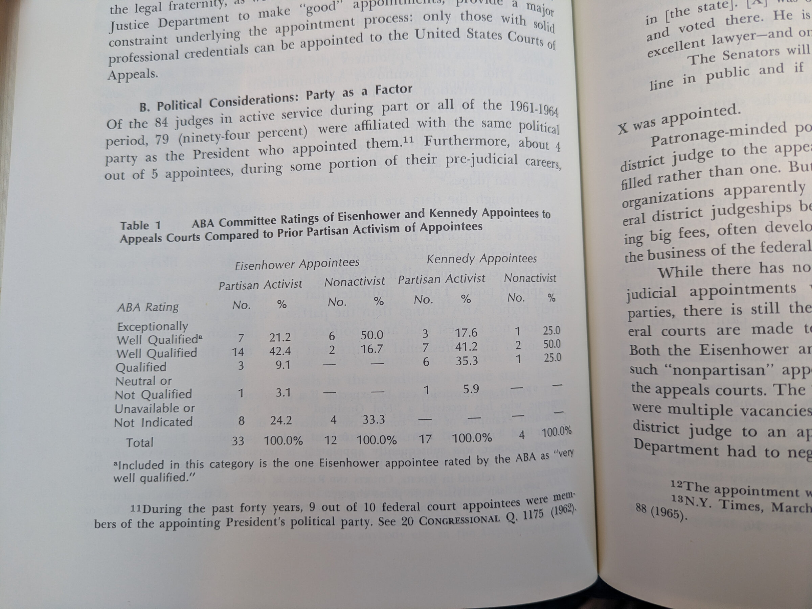
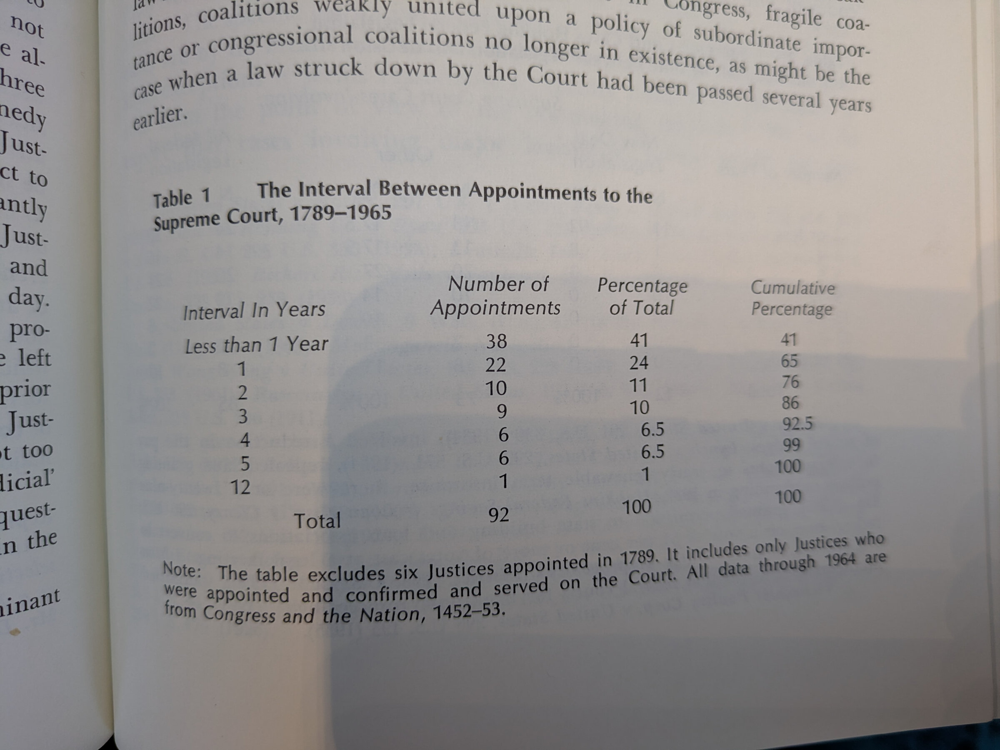
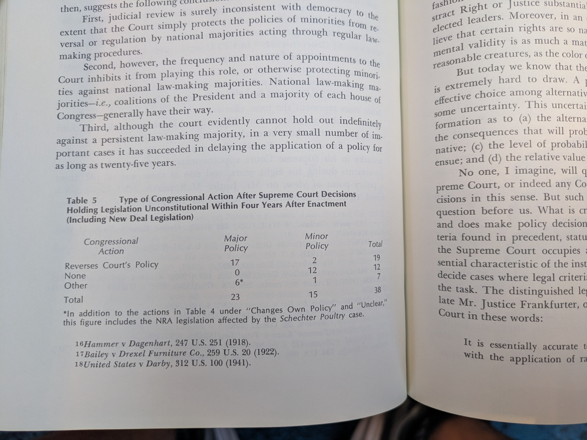
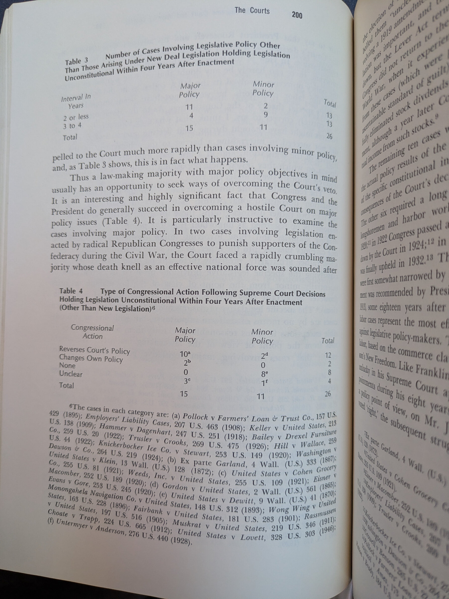

## Readings American Political Behavior

### Policy Making

- "what Schattschneider called "mutual non-interference"-"a mutuality under
  which it is proper for each to seek duties indulgences] for himself but
  improper and unfair to oppose duties [indulgences] sought by others." In the
  area of rivers and harbors, references are made to "pork barrel" and
  "log-rolling," but these colloquialisms have not been taken sufficiently
  seriously. A log-rolling coalition is not one forged of conflict, compromise,
  and tangential interest but, on the contrary, one composed of members who have
  absolutely nothing in common; and this is possible because the "pork barrel"
  is a container for unrelated items." (pg. 248)

- Since there is no real basis for discriminating between those fer who should
  and those who should not be protected [indulged], says Comman Schattschneider,
  Congress seeks political support by "giving a limited intersi protection
  [indulgence] to all interests strong enough to furnish formidable resistance."

### Issue Voting

- To begin with, the electorate's perceptions of the parties betray very little
  information about current policy issues. For the past ten years the Survey
  Research Center has opened its electoral interviews with a series of
  free-answer questions designed to gather in the positive and negative ideas
  that the public has about the parties. The answers, requiring on the average
  nearly ten minutes of conversation, are only very secondarily couched in terms
  of policy issues. In 1958, for example, more than six thousand distinct
  positive or negative comments about the parties were made by a sample of 1,700
  persons. Of these, less than 12 percent by the most generous count had to do
  with contemporary legislative issues.

### Lindblom

- "I would make the empirical generalization from my experience at RAND and
  elsewhere that operations research is the art of sub-optimizing, ie., of
  solving some lower-level problems, and that difficulties increase and our
  special competence diminishes by an order of magnitude with every level of
  decision making we attempt to ascend. The sort of simple explicit model which
  operations researchers are so proficient in using can certainly reflect most
  of the significant factors influencing traffic control on the George
  Washington Bridge, but the proportion of the relevant reality which we can
  represent by any such model or models in studying, say, a major foreign-policy
  decision, appears to be almost trivial." (Charles Hitch)

### Compliance w/ the 'law'

- ** McCollum Decision**: Some of the violations are unwitting, he wrote, but
  knowing violators include "some persons holding responsible church or school
  positions."42 Apart from such generalizations, precise estimates of
  noncompliance are not easy to make. Apparently, all or most of the programs
  run by the Virginia Council of Churches still use school rooms,43 many
  communities in Texas also, 4 and there are many reports of school room use in
  scattered places. Released time programs are conducted in school rooms in five
  Pennsylvania counties of which I am aware. Finally, Religious Education two
  years ago disclosed that a casual poll of released time programs indicated
  that 32 percent were still holding classes in school buildings, although some
  were paying token rentals of from $5 to $100 a year.45

Uncertainty about what constitutes noncompliance complicates this assessment.
The transparent ruse of "renting" community educational facilities for five
dollars a year is an obvious evasion of the Zorach rule. But what of holding
religious instruction in schools during the lunch hour?46 Or after school hours?
Or what of giving high school credit for Bible classes? Or of holding released

### Dahl

- However, since much of the legitimacy of the Court's decisions rests upon the
  belief that it is not a political institution but exclusively a legal one, to
  accept the Court as a political institution would solve one set of problems at
  the price of creating another.

