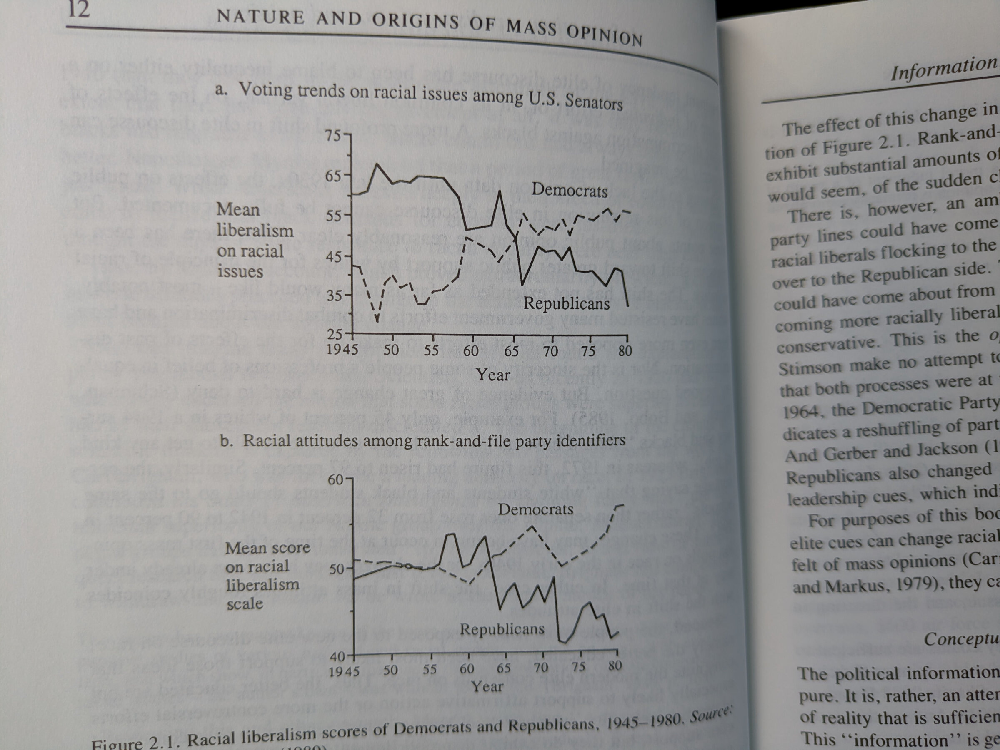
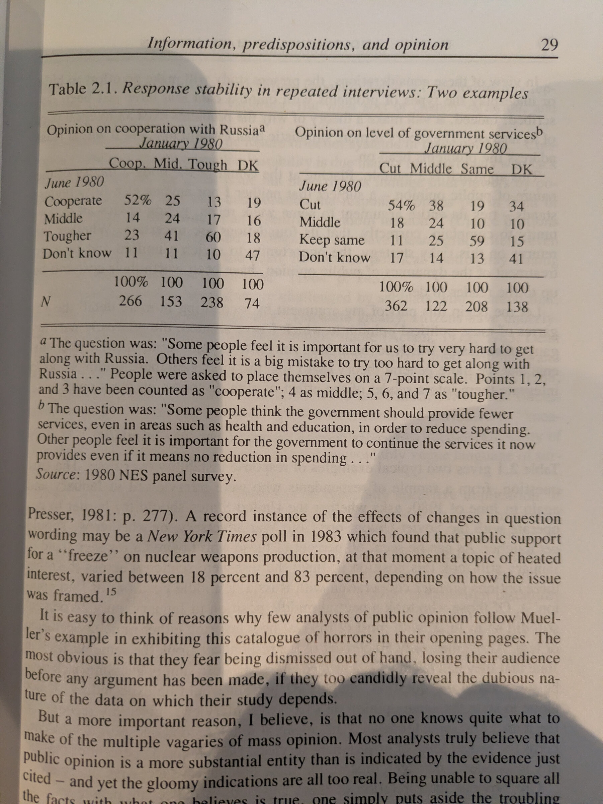
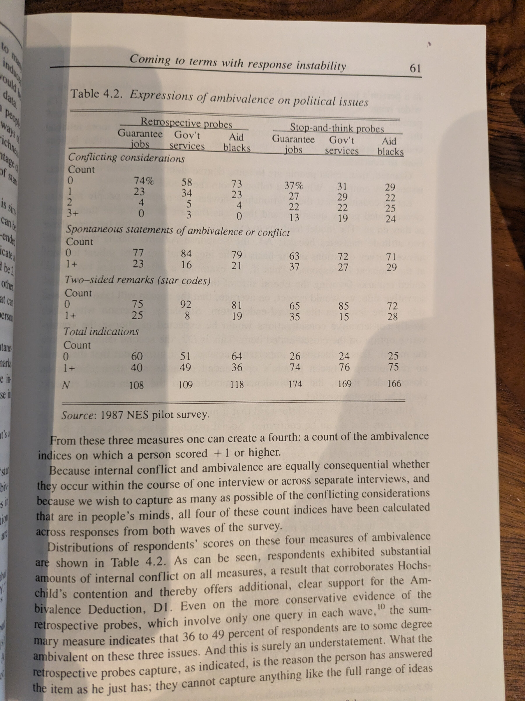
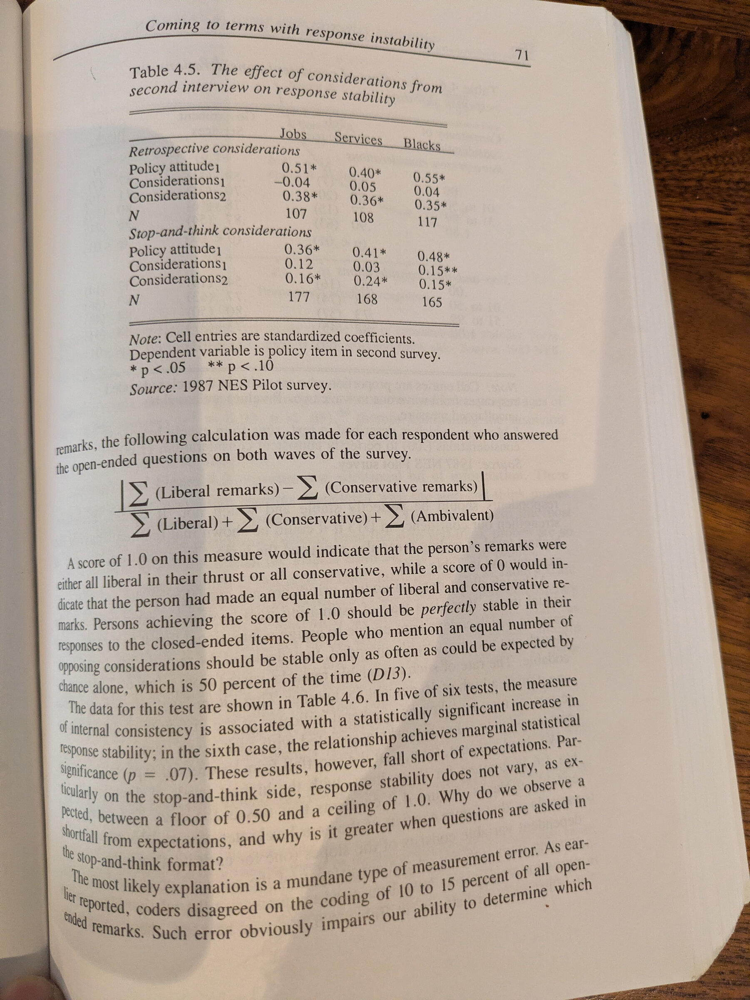
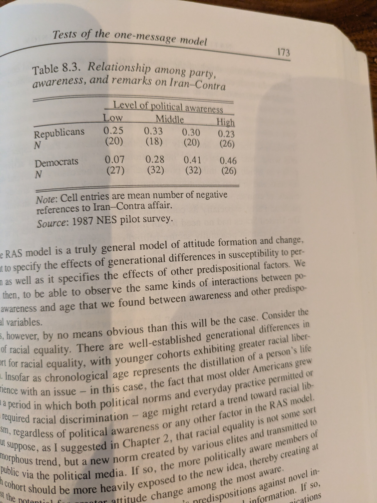
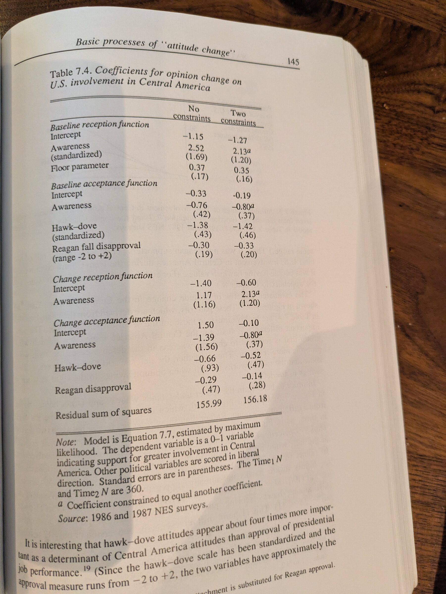
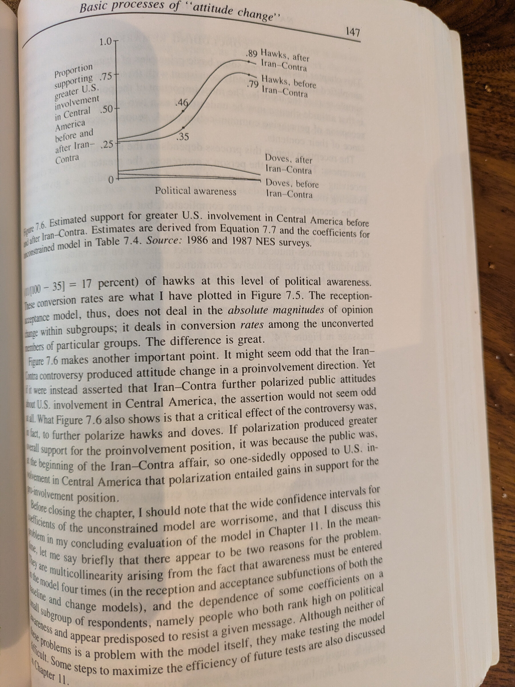
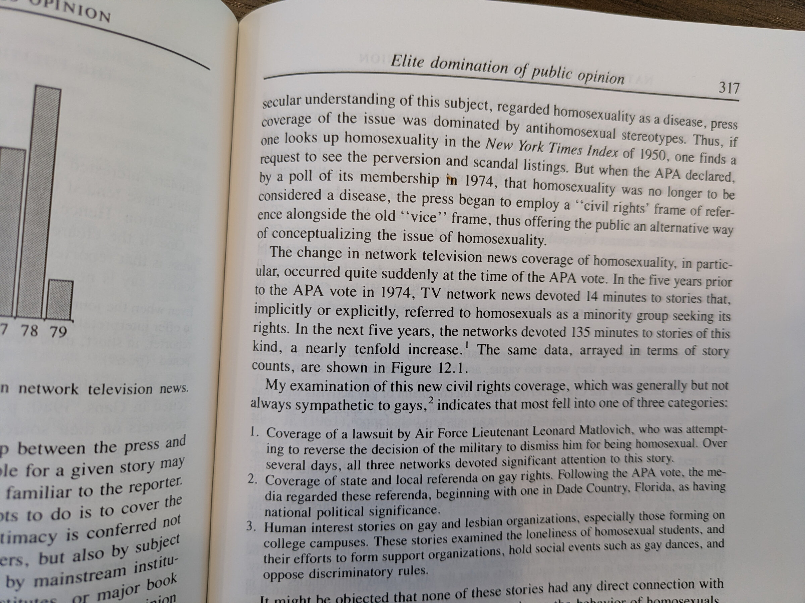

# The Nature and Origins of Mass Opinion

<!-- markdownlint-disable MD033 -->

## Information, predispositions, and opinion

Claim: People learn about national politics largely through elite discourse.
Elites determine which arguments are available; citizens’ values, interests, and
group loyalties affect which ones they accept. Mass opinion therefore reflects
both elite information and citizens’ filters.

The figure addresses partisan sorting (elite driven), not the larger rise in
racial liberalism that Zaller describes just before it. Sorting is a
'conservation of mass' kind of theory: the parties move apart as people
redistribute between them without any change in the national mean. Three
things: 1. figure is misleading as elides over the fact that the scales mean
diff. things across years, 2. what's the theory of why elites changed, and 3.
did 'values, (understanding of) interests' change?

## The Receive-Accept-Sample model

The RAS model says that people receive political messages, accept or reject them
according to their predispositions, and construct an opinion when required by
sampling the accepted considerations most accessible at that moment. The posited
rule is averaging.

One way to think: person hold a pool of considerations with a beta and sigma.
Reception and resistance shape the stored distribution. Greater political
awareness makes a person more likely to encounter and understand a message.
Predispositions then affect whether the person accepts it. An accepted message
can shift the center of the distribution and can increase or reduce its spread,
depending on how it relates to what is already stored.

Accessibility shapes the momentarily active distribution. Recently activated
considerations receive more weight, so the center and spread of what is at the
top of the person's mind can change even when the stored distribution does not.
The response axiom merely maps a sample of that active material into an observed
answer by averaging it. (Zaller is saying that there is no crystallized attitude
but some elicitation process, crystallizes it.)

Repeated answers reveal the center and spread of the internal distribution only
if the accessibility process and response rule are known and stable. The same
response instability could arise from internal conflict, changing accessibility,
or noise in the answer process. A single survey response provides almost no
leverage for separating them.

One prediction of RAS: Polarization among the politically aware.

## Response instability

Table 2.1 uses a two-wave panel of the same NES respondents interviewed in
January and June 1980. Many changed answers during those five months.

## Stop-and-think

Exp: One group answered a policy question and then explained its answer. The
other group had to consider each side separately before answering. The latter
procedure is better described as forced bilateral elaboration than as 'stop and
think.'

The treatment produces far more expressions of conflict. Many respondents can
retrieve or produce considerations on both sides when asked to search for them.
Maybe it shows(?) that an unstable answer != empty head.

But the treatment may reveal thoughts that were already accessible, retrieve
thoughts that were dormant, or induce new thoughts? It shows a capacity to
produce opposing considerations.

Aside:

Sniderman: In the stop-and-think condition, 63% of respondents on jobs, 69% on
government services, and 71% on aid to Black people produced at least one
consideration on each side. A broader measure classified roughly 75% as at least
somewhat conflicted. Zaller and Feldman call this “clear initial support” for
the ambivalence axiom. But the evidence shows only that respondents can produce
counterarguments when explicitly prompted to search both sides—not that those
arguments seriously compete. Applying a lenient criterion that classifies
respondents as substantially one-sided when one side contains at least twice as
many considerations as the other, 52.3%, 61.4%, and 61.7%, respectively, of these
nominally conflicted respondents remained substantially one-sided.

## Considerations and answers

Table 4.5 asks a simple question: is the answer given in the second interview
more closely related to considerations expressed in that same interview or to
considerations expressed earlier?

`answer2 = b0 + b1 answer1 + b2 considerations1 + b3 considerations2 + error`

Second-wave considerations predict the second-wave answer more strongly in five
of the six comparisons, but the difference is large mainly in the retrospective
condition. In the stop-and-think condition, the coefficients are close for jobs
and identical for race. Zaller interprets the general pattern as evidence that
current accessibility helps explain response instability.

But the current considerations and current answer are elicited in the same
interview. Their association may simply show that two statements made by the
same person at the same moment tend to agree. In the retrospective condition,
respondents list considerations after answering and may use them to justify the
answer they just gave. In the stop-and-think condition, they list considerations
first, but the interviewer has explicitly prompted them to construct reasons
before answering. Neither within-form association shows that an independent
change in accessibility caused the answer to change.

The weak coefficient on earlier considerations is also less revealing than
Zaller suggests. Remarks made in the first interview are an incomplete and noisy
record of what the respondent was thinking. Because the regression already
includes the earlier answer and current remarks, the coefficient measures only
whether the earlier remarks provide additional information beyond those two
measures. Its small size does not show that earlier considerations disappeared
or ceased to matter.

The analysis of response consistency has a related problem. Zaller uses
considerations reported across both interviews to explain whether answers
remained consistent across those same interviews. If remarks simply track the
answer given during each interview, stable answers will naturally be accompanied
by apparently consistent considerations, while changing answers will be
accompanied by apparently changing considerations. A cleaner test would use
considerations measured only in the first interview to predict whether the
answer changes later.

Zaller attributes the weaker results in the stop-and-think condition to coding
error. But the supporting plot contains only six issue-by-form observations, and
the two survey forms largely occupy different parts of the graph. A high fit
among six confounded aggregate points provides little evidence for that
explanation.

The basic result is therefore current answer–current consideration agreement.
That is consistent with Zaller’s accessibility theory, but it does not establish
that accessibility caused the answers or that respondents lack more durable
underlying orientations.

## Awareness and resistance

The book argues that awareness makes people better able to connect a policy
question to an ideological or partisan predisposition. In the stop-and-think
experiment, deliberation appears to strengthen the link between ideology and
policy answers among highly aware respondents but not among less aware
respondents. The evidence is suggestive, but the published analysis does not
directly test whether the treatment-by-ideology interaction differs across
awareness groups. A significant coefficient in one group and an insignificant
coefficient in another do not establish a difference between them.

Stop-and-think lowers test-retest correlations in most of the reported cells.
More thought does not simply uncover a more reliable position. It may retrieve
more considerations and change the basis of judgment. That result fits the broad
constructed-response account better than a model in which deliberation reveals a
fixed scalar attitude.

The open-ended data fit the same broad story. Highly aware respondents give more
considerations consistent with their ideology, and negative remarks about
Iran-Contra rise with awareness among Democrats but remain roughly flat among
Republicans.

These results show greater partisan organization among attentive citizens. They
do not isolate resistance. A Republican who gives no negative remark may not
have received the message, may not recall it, may reject its implication, or may
decline to mention it. Counts of remarks also rise with verbal fluency and the
amount a person says. Awareness is associated with education, interest,
ideology, and exposure, so its coefficient is not a causal effect of becoming
more aware.

## Campaign information and electoral choice

Figure 10.3 shows almost exactly the pattern Zaller describes. Moderately aware
opposition voters become more favorable toward the incumbent, while the most
aware turn back toward their party's challenger, especially in intense races.
The problem is not his reading of the plotted points. It is whether one survey
can support the orderly reception-resistance story drawn through them.

A fixed partisan preference would put in-party voters above out-party voters but
leave roughly parallel awareness slopes. Zaller needs a stronger result: party
must change the effect of awareness, and campaign intensity must magnify that
difference. Almost all the evidence for this claim comes from the fifth
awareness category. The out-party lines rise through the first four categories
and then fall sharply. Remove that endpoint and there is no reception-resistance
pattern, only increasing pro-incumbent considerations with awareness.

The decisive high-intensity, highly aware out-party cell contains about 49
respondents. Its outcome is a difference among four sparse mention counts:

`incumbent likes + challenger dislikes - incumbent dislikes - challenger likes`

A few additional incumbent dislikes or challenger likes can therefore move the
cell mean considerably. Dividing awareness into five bins adds another
researcher choice: the location and appearance of a reversal can depend on the
cut points. The book shows neither the continuous relationship nor alternative
binnings or confidence intervals. Connected lines make one abrupt endpoint look
like a psychological response function.

Campaign intensity is not randomly assigned information. The two panels contain
different races, candidates, and districts. Intense races may have better
challengers, more vulnerable incumbents, greater spending, more negative
coverage, and different electorates. Highly aware voters are precisely those
most likely to perceive these differences. The same plotted interaction can
therefore arise without a general resistance mechanism.

Figure 10.4 decomposes the same net score into its four parts. It is not an
independent validation of the mechanism. The downturn must result from some
combination of fewer incumbent likes, more incumbent dislikes, more challenger
likes, or fewer challenger dislikes. The decomposition tells us which arithmetic
terms moved, not why they moved. Figure 10.5 adds another layer of apparent
precision: its smooth "pure" effects are fitted curves from the interaction
model. Their smoothness comes from the equation, not from respondents.

The index also sits awkwardly with Part I. A respondent with one favorable
thought about the incumbent and one with five favorable and four unfavorable
thoughts can both score +1, although the second has a much richer and more
conflicted consideration set. More fundamentally, Part I treats any survey
response as a sample from whatever is accessible during the interview. Chapter
10 requires open-ended mentions to serve as a record of what campaigns placed in
memory. That move needs a measurement theory separating acquisition from
accessibility, retrieval skill, and construction during the interview. Zaller
does not provide one.

The safe conclusion is narrower. In the 1978 NES, the most aware opposition
partisans in intense House races mentioned relatively more negative things about
incumbents and positive things about challengers. The raw pattern is uncannily
consistent with selective resistance, but nearly all its theoretical force comes
from one sharp endpoint. Small cells, sparse counts, discretionary binning,
absent uncertainty, and nonrandom campaign intensity leave us unable to
distinguish a general psychological mechanism from an unusually theory-friendly
arrangement of one survey.

## Opinion change and the structural model

The Central America analysis tries to separate reception from acceptance in a
nonlinear model of support before and after Iran-Contra. Awareness enters both
latent functions, while hawkishness and approval of Reagan help determine
acceptance.

Only the final support response is observed. Reception and acceptance are not
measured separately, so low reception with high acceptance can look like high
reception with low acceptance. The decomposition rests on functional form, the
choice of predictors for each stage, and equality restrictions across periods.
The large standard errors in the unconstrained change model show how little the
outcome identifies on its own. The constraints greatly stabilize the estimates
with almost no loss of fit because they are doing much of the inferential work.

The same respondents were interviewed twice, but the model does not use their
individual transitions as the outcome. Nor is there an untreated group. The
before-after change cannot be attributed cleanly to Iran-Contra rather than to
other events, changes in elite discourse, or panel effects.

The model then converts net changes in predicted support into conversion rates
among initial nonsupporters. This makes similar absolute changes look very
different. A rise from .79 to .89 is ten percentage points, but dividing by the
.21 initially opposed yields a conversion rate near 48 percent. A rise from .35
to .46 is eleven points, but dividing by .65 yields only 17 percent. These are
not observed individual transitions. Opposing movements can cancel in the
aggregate, so the graph reports model-implied net conversion under strong
assumptions.

The predicted probabilities on their original scale are more revealing. They
show growing separation between hawks and doves, but much of the separation
comes from hawks moving while doves remain near a floor. The figure supports
divergence between groups, not symmetric movement away from the center.

## Elite discourse

The book's historical examples show that public debate changes when elites
change the available ways of understanding an issue. Vietnam was first presented
mainly as a struggle to contain communism. Once elite and media discourse opened
to a civil-war frame, attentive liberals and conservatives could follow
different elite camps. Newsweek's defense coverage moved from stories about
military weakness before the 1980 election to stories about cost overruns and
waste after Reagan took office. A civil-rights frame for homosexuality became
more common in network news during the 1970s.

These examples establish changes in the menu of public considerations. They do
not by themselves show that a single elite event caused the change in discourse
or that the discourse caused mass opinion. Historical counts need a denominator,
a comparison series, and protection against broader social changes that may
cause both elite and public movement. The strongest claim is still an important
one: political power includes the power to make some considerations common and
leave others hard to find.

## Assessment

Zaller is more convincing about the problem than about the exact machinery.
Survey responses vary with information, predispositions, accessibility, and
question context. The evidence for that claim is strong. The evidence that a
distinct Receive-Accept-Sample process generated each pattern is weaker because
different mental processes can produce the same answer.

The most useful view lies between fixed attitudes and random answers. People
appear to have more structure than their unstable responses suggest, but fewer
fixed, survey-ready answers than traditional attitude models assume. They carry
values, memories, identities, and arguments. A survey question turns some of
that material into a judgment.

A cleaner test would measure each respondent's pro and con considerations well
before the outcome, then randomly cue one of that respondent's own prior
considerations without adding new information. If a pro cue moves the answer in
one direction and a con cue moves it in the other, especially among people
already known to possess both, accessibility has a causal effect on expressed
opinion. A declining effect as the cue recedes would test the proposed memory
mechanism as well.

<!-- markdownlint-enable MD033 -->
